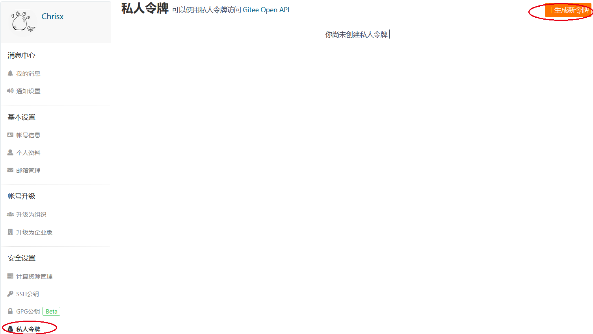
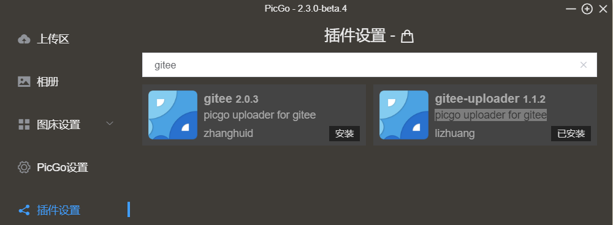
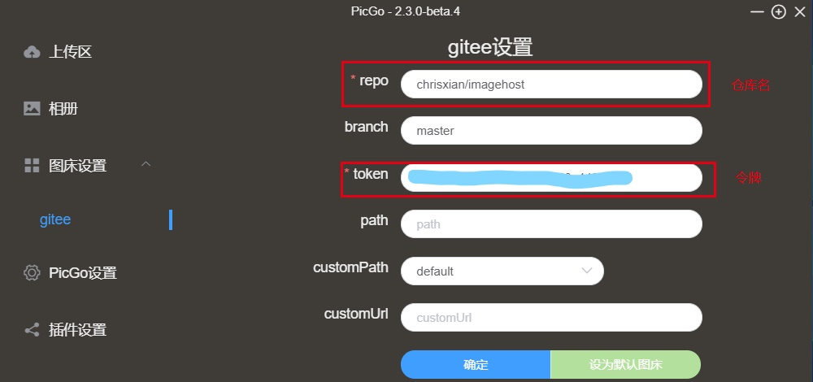
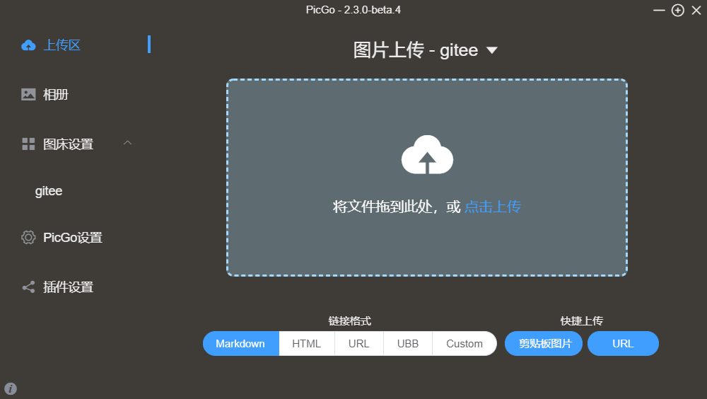
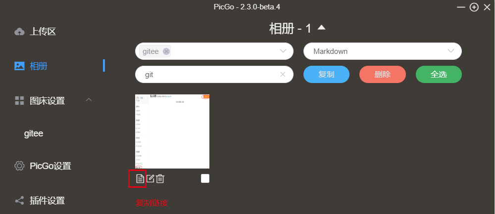

# 免费个人图床搭建-picgo+gitee

**作者**

chrisx

**日期**

2021-03-02

**内容**

免费个人图床搭建，使用picgo+gitee

------

[toc]

使用markdown文档时，总会遇到插入图片的需要，markdown中插入图片是使用的图片的链接，真实的图片可以存放在本地磁盘，也可以存储到网络上。如果将图片存放在本地，目录结构发生改变或者图片目录丢失都会造成文档中的图片无法访问。因此将图片存放在网络上会更便捷。从商业的角度说，单独图床也有很多好处，加快图片访问速速，降低你服务器的存储压力等。

将图片存储到网络，就需要一个图床。图床需要网络存储空间，存储服务器。可以自己搭建，也可使用商用图床服务器。阿里云OSS，腾讯云COS，七牛云，Imgur，又拍云，GitHub图床都可用作图床服务器，只是有的收费，有的免费。

将图片存储到网络后，还需要获取URL链接。

这样图片有了存储位置，也可以通过URL链接访问，markdown文档就可以显示插入的图片了。

GitHub图床免费的，但是服务器在境外，网络速度慢，国内可以使用相似的git，gitee作为图床

支持gitee作为图床的工具有，picgo、picuploader等，使用方式大同小异。本文使用picgo

## 准备gitee账户

1. 在[gitee](https://gitee.com)上注册登陆，创建一个仓库作为图床

git和gitee的使用不做过多介绍

2. 个人设置里，找到私人令牌

## picgo工具配置

PicGo: 一个用于快速上传图片并获取图片 URL 链接的工具

1. 下载并安装[PicGo](https://github.com/Molunerfinn/PicGo)

参考[配置手册](https://picgo.github.io/PicGo-Doc/zh/guide/)

2. 配置

默认，picgo不支持gitee。

插件设置，搜索并安装picgo uploader for gitee

图床设置，

上传区

相册

