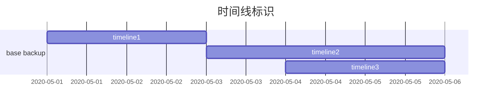

# 10基础备份与时间点恢复

[TOC]

在线数据库备份大致可分为逻辑备份和物理备份两类。各有优缺点。
逻辑备份的一个缺点即执行花费大量的时间。另一个缺点是不能讲数据恢复至故障时间点。相反，物理备份可以在相对较短的时间内备份和恢复数据。
 
在pg中，8.0版本开始提供在线全量物理备份（之前版本中只提供逻辑备份）。整个数据库聚簇（物理备份的数据）的运行时的快照被称为基础备份。8.0版本中引入了时间点恢复（Point-In-Time Recovery，PITR）,这一功能可将数据库库恢复至任意时间点。这通过基础备份和连续归档实现。

+ 基础备份
+ 时间点恢复（PITR）原理
+ 时间线与时间线历史文件
+ 时间点恢复与时间线历史文件
## 基础备份
1.发出pg_start_backup命令
2.使用你想用的归档命令获取cluster快照
3.发出pg_stop_backup命令
注意：此过程不需要获取表上的锁，所有用户都可以不受备份操作影响操作数据库。pg_basebackup底层也使用了这些命令。

**pg_start_backup>`take a snapshot(backup_label,snapshot of database cluster)`>pg_stop_backup**

### pg_start_bakup
pg_start_backup为基本备份执行准备工作。恢复工作从重做点（REDO point）开始，因此pg_start_backup必须执行**检查点**，以便为基础备份显示创建一个重做点。此外，这次检查点的位置必须保存在非pg_control的其他文件中。因为在备份期间可能会执行多次常规检查点。Pg_start_backup执行以下4个操作：

1.强制进入整页写模式（full-page wirte mode）
2.切换到当前的wal段文件
3.执行检查点
4 创建backup_label文件，该文件位于base directory（$PGDATA）顶层当中，包含基本备份本身关键信息，如检查点位置。
 
Backup_label包含以下项目
[postgres@pg data]$ cat backup_label
START WAL LOCATION: 0/38000060 (file 000000010000000000000007)
CHECKPOINT LOCATION: 0/38000098
BACKUP METHOD: pg_start_backup
BACKUP FROM: master
START TIME: 2019-12-25 19:11:55 CST
LABEL: 20191226
START TIMELINE: 1
 
START WAL LOCATION：wal开始位置-这不是给PITR用的，而是描述的流复制准备的。它被命名为start wal location，因为复制模式下的备用服务器在初始启动时只读取一次该值。
CHECKPOINT LOCATION：检查点位置-记录创建检查点的lsn位置。恢复起始位置。
BACKUP METHOD：备份方法，用于进行基本备份的方法
BACKUP FROM：备份来源-说明是从主库还是备库拉取
START TIME：开始时间，执行pg_start_backup的时间戳
LABEL：备份标签，pg_start_backup中指定的标签
START TIMELINE：备份开始的时间线，为了进行正常检查，在版本11.0被引入
 
pg从backup_label文件中取出检查点位置CHECKPOINT LOCATION，接着从归档日志中的合适位置读取检查点记录。然后从检查点记录中获取重做点的位置（REDO point），最后从REDO point开始进行恢复
 
### pg_stop_backup
pg_stop_backup执行以下5个操作以完成备份
1.如果pg_start_backup打开了整页写入，那么关闭整页写入
2.写入一条备份结束的wal记录
3.切换wal段文件
4.创建一个备份历史记录文件。此文件包含backup_label文件的内容及已执行pg_stop_backup的时间戳
5.删除backup_label文件，`从基础备份恢复需要backup_label文件`，不过一旦被复制（copy完data目录），原始的数据库聚簇cluster就不需要该文件了
 
备份历史文件的命名方法如下：
{备份开始wal段文件名}.{基础备份开始时的偏移量}.backup

> 注意1：也就是说恢复是读取了备份的data目录中的backup label文件，找到起始检查点位置进行恢复的。而不是读取的备份历史文件。
 
## 时间点恢复（PITR）的工作原理
PITR会从备份基础上重放归档日志中的wal数据。从pg_start_backup创建的重做点开始，恢复到想要的位置为止。

```bash
restore_command='cp -i /backup/zlx/db/arch/%f %p'
recovery_target_time='2018-12-27 01:30:00''
```

pg启动时，如果database cluster中存在`recovery.conf`和`backup_label`文件就会进入恢复模式

PITR与常规恢复过程一模一样，唯一的区别在以下两点
1.从哪里读取wal
- 正常恢复，读取pg_wal目录
- PITR，来自archive_command的归档目录（也就是restore_command?）
2 从哪里读取检查点位置
- 正常恢复，来自pg_control文件
- PITR，来自backup_label文件

流程如下：
1.使用函数read_backup_label从backup_label文件中读取checkpoint
2.从recovery.conf中读取参数
3 重放wal数据，执行参数restore_command，将归档日志从归档区复制到临时区域，从中读取wal。临时区域的文件会在使用后删除
4 恢复完成时会在pg_wal子目录创建时间线历史文件。如00000002.history。如果启用归档，还会在归档中创建同名文件。
**recovery_target_time设置了目标时间，pg重放wal数据时，比较目标时间和wal中的每个时间戳，如果时间戳超过目标时间，PITR就是完成**

为什么可以在数据库open的情况下做备份。
尽管数据库聚簇可能是不一致的，但恢复过程可以是数据库达成一致状态。即使基础备份是一堆不一致的文件。

## 时间线与时间线历史文件
时间线是PITR的核心概念
### 时间线标识
由initdb创建的db，其时间线表示为1.恢复完成时，时间线会累加1.


如果使用了000000010000000000000008和000000010000000000000009进行了数据库恢复，在000000010000000000000009时恢复完成，则会分配一个新的时间线标识2，pg就会从000000020000000000000009开始创建wal。
 
 
 ### 时间线历史文件
 PITR完成时，会在归档目录和pg_wal目录创建时间线历史文件00000002.history。记录了时间线分叉情况。
 文件命名规则
 
```bash
"8位数字的新时间线标识".history
```
内容由1行3项组成

```bash
 cat 00000002.history
1	1/54000000	no recovery target specified
```

- 时间线标识，曾用于恢复的时间线
- LSN，发生wal段切换的LSN位置
- 原因，时间线变化的原因解释

以上时间线文件表示，数据库基于时间线1的基础备份，在~时间之前，通过wal日志恢复到1/54000000的位置。

### 时间点恢复与时间线历史文件
时间线历史文件在第二次及后续PITR过程中起着重要作用。尝试第二次恢复我们将尝试使用它

```
restore_command='cp -i /backup/zlx/db/arch/%f %p'
recovery_target_time='2018-12-27 01:30:00''
recovery_target_timeline=2
```



基础备份以来需要跨时间线。
基础备份时间，2020-05-01
第一次PITR，2020-05-03
第二次PITR，2020-05-04

流程如下：
1.使用函数read_backup_label从backup_label文件中读取checkpoint
2.从recovery.conf中读取参数，recovery_target_time
3 读取时间线历史文件00000002.hisstory，该文件对应recovery_target_timeline
4 重放wal数据，执行参数restore_command，将归档日志从归档区复制到临时区域，从中读取wal。临时区域的文件会在使用后删除。先应用timeline1的wal，在应用timeline2的wal
4 恢复完成时会在pg_wal子目录创建时间线历史文件。如00000003.history。如果启用归档，还会在归档中创建同名文件。

**时间线历史文件不仅是数据库的历史日志，还是PITR恢复过程参考文件。**