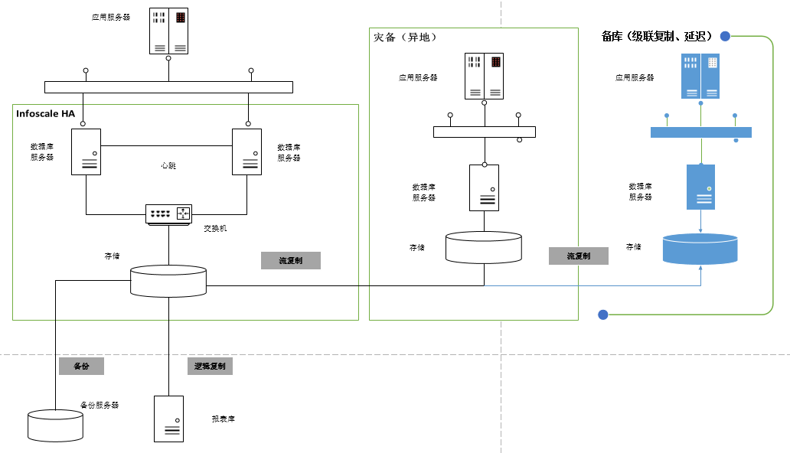

# Replication

**作者**

Chrisx

**日期**

2021-09-03

**内容**

参考官方文档[High Availability, Load Balancing, and Replication](https://www.postgresql.org/docs/13/high-availability.html)

----

[toc]

## 高可用解决方案

* high availability ：多个数据库服务器同时工作，允许两个服务器同时运行，当主服务器失败时，可以快速启用第二个服务器
* load balancing ：允许多个服务器提供相同的数据（ pg 只能实现读取 select 负载）
* Replication ：一些同步解决方案仅允许一个服务器更改数据，可以更改数据的服务器叫 master/primary, 追踪 master 数据更改的服务器叫 standby/second 。 standby 服务器不允许连接直到升级为 priamry 的叫 warm standby server ，允许连接和只读查询的叫 hot standby server.

高可用解决方案有很多种，如同步异步

* standby同步解决方案， commit 操作在所有服务器完成后，事务才会结束，这将保证故障切换后没有数据丢失，及负载连接在能够返回一致的结果！
* stnadby异步解决方案，允许 commit 在其他服务器有延迟，这样会导致故障切换后数据丢失，负载连接返回数据陈旧延迟。，异步方案通常用于解决同步方案导致性能变慢的问题。解决方案也可以按其粒度进行分类。有些解决方案只能处理整个数据库服务器 , 而另一部分则允许在每表或每数据库级别进行控制。

任何选择都必须考虑性能。功能和性能之间通常有权衡。

参考文档[Comparison of Different Solutions](https://www.postgresql.org/docs/13/different-replication-solutions.html)

高可用架构参考



## 日志传输 Log-Shipping Standby Servers

直接从一个数据库服务器移动 WAL 记录到另一台服务器通常被描述为日志传送。

:warning: 需要注意的是日志传送是异步的，即 WAL 记录是在事务提交后才被传送。正因为如此，在一个窗口期内如果主服务器发生灾难性的失效则会导致数据丢失，还没有被传送的事务将会被丢失。基于文件的日志传送中这个数据丢失窗口的尺寸可以通过使用参数archive_timeout进行限制，它可以被设置成低至数秒。但是这样低的设置大体上会增加文件传送所需的带宽。流复制（见第 26.2.5 节）允许更小的数据丢失窗口。

## 前提 Planning

* 主备服务器尽可能相似
* 非默认表空间路径相同
* 硬件可以不同
* 服务器架构必须相同（ 32bit>64bit 不支持）
* 日志传输
* pg 主版本必须一致

:warning: 注意，pg 次版本不同可能能够，但不受正式支持，建议主备服务器所有版本一致。已测试，此版本不同是支持的（pg126>pg129）
:warning: pg升级时，先更新备库再更新主库，以使备库能够从兼容之前的 wal 日志文件，继续应用日志

## 流复制

流复制是允许一台后备服务器使用基于日志传送功能，与主服务器保持数据一致的功能。在后备服务器的能力足以跟得上负载的前提下延迟通常低于一秒。

## 流复制和逻辑复制的区别

1. 流复制为物理复制，核心原理是主库将 WAL 流式发送给备库，备库接收到 WAL 日志后进行重做。逻辑复制核心原理虽然也是基于 WAL 但是稍有不同。 逻辑复制会根据预先设置好的规则解释 WAL 日 志，将 WAL 二进制文件解析成一定格式的逻辑变化信息，主库将逻辑变化信息发送给备库，备库接收到 WAL 逻     辑解析信息后再应用
2. 流复制只能针对 PG 实例级进行复制，逻辑复制能够针对数据库表级进行复制。
3. 流复制支持 DDL ；逻辑复制不支持 DDL
4. 流复制备库只读；逻辑复制备库可读写
5. 流复制要求大版本一致；逻辑复制支持跨越大版本

## 备库操作 Standby Server Operation

备库需要持续应用接收到的 WAL 日志，读取 WAL 日志可以有以下方法

* 后备服务器可以从一个 WAL 归档（restore_command）
* 过一个 TCP 连接直接从主控机（流复制）读取 WAL
* 后备服务器将也尝试恢复在后备集簇的pg_wal目录中找到的 WAL。(通常是重启后)

流复制中备库重启后恢复应用 WAL 日志顺序

```bash
wal archive 》 pg_wal 》 stream

在启动时，后备机通过恢复归档位置所有可用的 WAL 来开始，这称为restore_command。一旦它到达那里可用的 WAL 的末尾并且restore_command失败，它会尝试恢复pg_wal目录中可用的任何 WAL。如果那也失败并且流复制已被配置，后备机会尝试连接到主服务器并且从在归档或pg_wal中找到的最后一个可用记录开始流式传送 WAL。如果那失败并且没有配置流复制，或者该连接后来断开，后备机会返回到步骤 1 并且尝试再次从归档里的文件恢复。这种尝试归档、pg_wal和流复制的循环会一直重复知道服务器停止或者一个触发器文件触发了故障转移。
```

wal file 必须是连续的吗？ --是
通过 pg_ctl promote 进行 switch over failover 时， failover 之时， archive 和 pg_wal 中的 wal 都将被应用，但不会尝试连接主库进行 wal 应用

## 主库配置 Preparing the Master for Standby Servers

主库配置注意事项

* 主库的归档路径可以被备库访问，即使主库宕掉。（建议归档路径在备库上，或其他受信任的服务器上，而不是在主服务器上）

使用流复制主库需要配置

* 创建流复制用户、
* 提供流复制用户远程访问权限（ pg_hba.conf ）、
* 确保 max_wal_senders 足够大，
* 如果使用了复制槽 replication slots 确保参数 max_replication_slots 足够大

创建 base backup 用于初始化备库

## 备库配置 Setting Up a Standby Server

26.2.4. Setting Up a Standby Server
To set up the standby server, restore the base backup taken from primary server (see Section 25.3.4). Create a recovery command file recovery.conf in the standby's cluster data directory, and turn on standby_mode. Set restore_command to a simple command to copy files from the WAL archive. If you plan to have multiple standby servers for high availability purposes, set recovery_target_timeline to latest, to make the standby server follow the timeline change that occurs at failover to another standby.

创建备库恢复命令文件 recovery.conf ，使用 base backup 恢复需要配置

* standby_mode ：指定启动的 pg 作为 standby
* restore_command ：使用归档
* recovery_target_timeline = 'latest'    -- 指定要恢复的时间线， latest 指定恢复到最新时间点的备库
* 如果使用流复制需要配置 primary_conninfo

> 注意：可以使用 archive_cleanup_command = 'pg_archivecleanup -d /mnt/standby/archive %r 2>>cleanup.log' 清理备库归档日志。

```bash
pg_archivecleanup 最为一个单独的程序可用来清理所有归档日志
pg_archivecleanup -d archive 000000010000003700000010.00000020.backup
```

**如果流复制建立 , 您将在 standby 中看到一个 wal receiver 进程 , 并在 primary 中显示相应的 wal sender 进程。**

## 流复制 Streaming Replication

* 流复制允许一台后备服务器比使用基于文件的日志传送更能保持为最新的状态。后备服务器连接到主服务器，主服务器则在 WAL 记录产生时即将它们以流式传送给后备服务器而不必等到 WAL 文件被填充。

* 默认情况下流复制是异步的（见第 26.2.8 节），在这种情况下主服务器上提交一个事务与该变化在后备服务器上变得可见之间存在短暂的延迟。不过这种延迟比基于文件的日志传送方式中要小得多，在后备服务器的能力足以跟得上负载的前提下延迟通常低于一秒。在流复制中，不需要archive_timeout来缩减数据丢失窗口。 

* 通过设置wal_keep_segments为一个足够高的值来确保旧 的 WAL 段不会被太早重用或者为后备机配置一个复制槽

* 在支持 keepalive 套接字选项的系统上，设置tcp_keepalives_idle、tcp_keepalives_interval和tcp_keepalives_count有助于主服务器迅速地注意到一个断开的连接。
* 设置来自后备服务器的并发连接的最大数目（详见max_wal_senders）。 
* 当后备服务器被启动并且primary_conninfo被正确设置，后备服务器将在重放完归档中所有可用的 WAL 文件之后连接到主服务器。如果连接被成功建立，你将在后备服务器中看到一个 walreceiver 进程，并且在主服务器中有一个相应的 walsender 进程。

### 认证

后备服务器必须作为一个超级用户或一个具有REPLICATION特权的账户向主服务器认证。

主

```shell
pg_hba.conf
# TYPE  DATABASE        USER            ADDRESS                 METHOD
host    replication     foo             192.168.1.100/32        md5

```

备

```shell
# 后备机要连接到的主控机运行在主机 192.168.1.50 上，
# 端口号是 5432，连接所用的用户名是 "foo"，口令是 "foopass"。
primary_conninfo = 'host=192.168.1.50 port=5432 user=foo password=foopass'


```

### Monitoring

```sql
primary ： pg_current_wal_lsn()   --Get current write-ahead log write location
select pg_current_wal_lsn();
pg_current_wal_lsn
--------------------
0/6D000500
(1 row)
standby ： pg_last_wal_receive_lsn()    --Get last write-ahead log location received and synced to disk by streaming replication.
select pg_last_wal_receive_lsn();
pg_last_wal_receive_lsn
-------------------------
0/6D000500
(1 row)

pg_last_wal_replay_lsn()

```

ps 操作系统命令查看 wal sender / wal receiver 进程

```bash
$ ps -ef |grep ^postgres |grep -v grep
postgres  3222     1  0 Sep19 ?        00:00:08 /usr/pgsql-10/bin/postgres
postgres  3223  3222  0 Sep19 ?        00:00:00 postgres:

 process  
postgres  3225  3222  0 Sep19 ?        00:00:00 postgres: checkpointer process  
postgres  3226  3222  0 Sep19 ?        00:01:19 postgres: writer process  
postgres  3227  3222  0 Sep19 ?        00:01:22 postgres: wal writer process  
postgres  3228  3222  0 Sep19 ?        00:00:06 postgres: autovacuum launcher process  
postgres  3229  3222  0 Sep19 ?        00:00:00 postgres: archiver process  
postgres  3230  3222  0 Sep19 ?        00:00:13 postgres: stats collector process  
postgres  3231  3222  0 Sep19 ?        00:00:00 postgres: bgworker: logical replication launcher  
postgres  3563  3222  0 Sep19 ?        00:00:45 postgres: wal sender process rep 192.168.80.101(50634) streaming 0/6D000500
postgres 21082 21081  0 16:21 pts/1    00:00:00 -bash
postgres 21766 21082  0 16:47 pts/1    00:00:00 ps -ef
```

## 复制槽 Replication Slots

* 复制槽（ replication slot ）提供了一种自动化的方法 , 可确保 master 在所有 standby 接收之前不会删除 WAL 段 , 并且 master 不会删除可能导致恢复冲突的行 , 即使在断开连接时也不会。

> 注意：复制槽保证 wal segment 不删除，不重用。同时也会造成 pg_wal 空间不断增大，直到空间占满。wal_keep_segments并不能完全保证不断当。当备库停机一段时间，需要的wal超过wal_keep_segments时，就会造成断档。

* 建议配置复制槽，如果配置了复制槽可以不使用 wal_keep_segments.

Querying and manipulating replication slots,查询视图 pg_replication_slots 确认复制槽的信息

```sql
select slot_name,slot_type,database,active from pg_replication_slots;
   slot_name    | slot_type | database | active
----------------+-----------+----------+--------
192_168_80_101 | physical  |          | f
(1 row)
```

删除slot

```sql
postgres=# select pg_drop_replication_slot('pg_phy_slot');
```

> 注：复制操不能是活动的，需要先停止流复制

备库使用 slot 时，需要在 recovery.conf 中使用参数 primary_slot_name 。

```bash
standby_mode = 'on'
primary_conninfo = 'host=192.168.1.50 port=5432 user=foo password=foopass'
primary_slot_name = 'pg_ha_slot'
```

## case

配置PG stream replication

### 主端配置

1. 配置参数

```sql
-- for replication parameter(master)
alter system set wal_level = logical;
alter system set max_wal_senders= 40;
alter system set wal_keep_segments = 200;
alter system set archive_mode = on;
alter system set archive_command = 'test ! -f  /arch/%f && cp -i %p /arch/%f';

-- 主库创建流复制专用同步用户
create role repuser login replication encrypted password 'repuser';

-- 主库创建流复制使用的物理复制槽
select * from pg_create_physical_replication_slot('pslot1');

-- 查看复制槽
select * from pg_replication_slots;
```

> 注：删除复制槽语句， SELECT * FROM pg_drop_replication_slot('node_a_slot');

2. 主库网络访问控制配置

主库修改访问控制文件 pg_hba.conf ，增加replication连接权限。运行备库使用同步用户直接连接到主库

$ vim /data/postgresql/data/pg_hba.conf

```bash
# ip
#host    all             all             192.168.80.0/24         md5
# replication
host    replication     repuser         192.168.80.0/24        md5

```

<!--
[pg106@db2 ~]$ pg_basebackup -h 192.168.6.141 -p 5970 -U repuser -Fp -X stream -P -D /opt/pg106/data -v
pg_basebackup: could not connect to server: FATAL:  no pg_hba.conf entry for replication connection from host "192.168.6.142", user "repuser"
pg_basebackup: removing data directory "/opt/pg106/data"
-->

### 备端配置

1. 安装数据库软件
2. 初始化基础数据。可以直接将主库复制到备库（duplicate）。操作步骤如下

```bash
$ pg_basebackup -h 192.168.80.146 -p 5866 -U repuser -Fp -X stream -P -D /opt/hgdb/data -v 
Password:
pg_basebackup: initiating base backup, waiting for checkpoint to complete 
pg_basebackup: checkpoint completed
pg_basebackup: write-ahead log start point: 0/9000028 on timeline 1
pg_basebackup: starting background WAL receiver
pg_basebackup: created temporary replication slot "pg_basebackup_2434"
25396/25396 kB (100%), 1/1 tablespace
pg_basebackup: write-ahead log end point: 0/90000F8
pg_basebackup: waiting for background process to finish streaming ...
pg_basebackup: base backup completed

> 注意，如果包括非默认表空间，主备目录需一致，或者使用参数 -T 进行映射
  -T, --tablespace-mapping=OLDDIR=NEWDIR
                         relocate tablespace in OLDDIR to NEWDIR

pg_basebackup --help
-h ，主库主机， -p ，主库服务端口；
-U ，复制用户；
-F ， p 是默认输出格式，输出数据目录和表空间相同的布局， t 表示 tar 格式输出
-P ，同 --progress ，显示进度；
-D ，输出到指定目录；
-X ，  --wal-method=none|fetch|stream
include required WAL files with specified method
-v ,  verbose

-T, --tablespace-mapping=OLDDIR=NEWDIR
                         relocate tablespace in OLDDIR to NEWDIR

or

使用备份恢复的方式

主
select pg_start_backup('rep');
tar -czvf pg_data.tar.gz $PGDATA --exclude=$PGDATA/pg_wal
scp pg_data.tar.gz 192.168.6.17:/tmp
select pg_stop_backup();

备
tar -zxvf pg_data.tar.gz
mkdir $PGDATA/pg_wal
```

3. 配置 recovery.conf

cp ../share/postgresql/recovery.conf.sample recovery.conf

```bash
# stream replicationg
standby_mode='on'
primary_conninfo='user=repuser host=10.247.32.16 port=6432 application_name=pgrep1 keepalives_idle=60 keepalives_interval=10 keepalives_count=5'
primary_slot_name='pslot1'
recovery_target_timeline='latest'
```

> 注意： primary_conninfo 明文指出了密码，建议将密码配置在密码文件中。参考[pgpass](./pgpass.md) （备库）

**pg12及以上参考[pg12新特性-迁移recovery.conf到postgresql.conf](./pg_new_features/pg12新特性-迁移recovery.conf到postgresql.conf.md)**

pg12及以上使用以上配置会报错

```sh
2021-04-14 13:48:39.851 CST,,,6044,,607660ed.179c,1,,2021-04-14 11:26:37 CST,,0,WARNING,XX000,"could not flush dirty data: Function not implemented",,,,,,,,,""

```

pg12及以上配置步骤

```sh
touch $PGDATA/standby.signal
touch $PGDATA/recovery.signal

postgresql.conf中添加以下内容

# replication
#standby_mode='on' #被移除
primary_conninfo='user=repuser host=10.247.32.16 port=6432 application_name=pgrep1 keepalives_idle=60 keepalives_interval=10 keepalives_count=5'
primary_slot_name='pslot1'
recovery_target_timeline='latest'

```

4 启动备库，流复制搭建完成。默认是异步流复制，下面会介绍同步流复制配置

```bash
$ pg_ctl start
waiting for server to start....2018-12-27 19:42:34.160 +08 [4225] LOG:  listening on IPv4 address "0.0.0.0", port 6432
2018-12-27 19:42:34.161 +08 [4225] LOG:  listening on IPv6 address "::", port 6432
2018-12-27 19:42:34.164 +08 [4225] LOG:  listening on Unix socket "/tmp/.s.PGSQL.6432"
2018-12-27 19:42:34.481 +08 [4225] LOG:  redirecting log output to logging collector process
2018-12-27 19:42:34.481 +08 [4225] HINT:  Future log output will appear in directory "pg_log".
............................. done
server started
```

日志

```bash
2018-12-27 19:42:34.481 +08,,,4225,,5c24baaa.1081,1,,2018-12-27 19:42:34 +08,,0,LOG,00000,"ending log output to stderr",,"Future log output will go to log destination ""csvlog"".",,,,,,,""
2018-12-27 19:42:34.484 +08,,,4227,,5c24baaa.1083,1,,2018-12-27 19:42:34 +08,,0,LOG,00000,"database system was interrupted; last known up at 2018-12-27 19:09:31 +08",,,,,,,,,""
2018-12-27 19:42:34.532 +08,,,4227,,5c24baaa.1083,2,,2018-12-27 19:42:34 +08,,0,LOG,00000,"entering standby mode",,,,,,,,,""
2018-12-27 19:42:34.536 +08,,,4227,,5c24baaa.1083,3,,2018-12-27 19:42:34 +08,1/0,0,LOG,00000,"redo starts at 2A/7330E518",,,,,,,,,""
2018-12-27 19:43:03.509 +08,,,4227,,5c24baaa.1083,4,,2018-12-27 19:42:34 +08,1/0,0,LOG,00000,"consistent recovery state reached at 2B/E18304F8",,,,,,,,,""
2018-12-27 19:43:03.510 +08,,,4225,,5c24baaa.1081,2,,2018-12-27 19:42:34 +08,,0,LOG,00000,"database system is ready to accept read only connections",,,,,,,,,""
2018-12-27 19:47:55.512 +08,,,4452,,5c24bbeb.1164,1,,2018-12-27 19:47:55 +08,,0,LOG,00000,"started streaming WAL from primary at 2B/E2000000 on timeline 1",,,,,,,,,"
```

正常同步

```bash
 2018-12-28 07:22:38.330 +08,,,4361,,5c24bb6b.1109,69,,2018-12-27 19:45:47 +08,,0,LOG,00000,"recovery restart point at 2D/FEFAD5D8","last completed transaction was at log time 2018-12-28 06:35:57.33835+08",,,,,,,,""
2018-12-28 07:47:48.440 +08,,,4361,,5c24bb6b.1109,70,,2018-12-27 19:45:47 +08,,0,LOG,00000,"restartpoint starting: time",,,,,,,,,""
2018-12-28 07:50:21.827 +08,,,4361,,5c24bb6b.1109,71,,2018-12-27 19:45:47 +08,,0,LOG,00000,"restartpoint complete: wrote 1526 buffers (0.0%); 0 WAL file(s) added, 1 removed, 0 recycled; write=153.374 s, sync=0.003 s, total=153.387 s; sync files=35, longest=0.001 s, average=0.000 s; distance=16118 kB, estimate=686704 kB",,,,,,,,,""
2018-12-28 07:50:21.827 +08,,,4361,,5c24bb6b.1109,72,,2018-12-27 19:45:47 +08,,0,LOG,00000,"recovery restart point at 2D/FFF6B118","last completed transaction was at log time 2018-12-28 06:35:57.33835+08",,,,,,,,""
2018-12-28 08:17:48.928 +08,,,4361,,5c24bb6b.1109,73,,2018-12-27 19:45:47 +08,,0,LOG,00000,"restartpoint starting: time",,,,,,,,,""
2018-12-28 08:21:19.748 +08,,,4361,,5c24bb6b.1109,74,,2018-12-27 19:45:47 +08,,0,LOG,00000,"restartpoint complete: wrote 2099 buffers (0.1%); 0 WAL file(s) added, 1 removed, 0 recycled; write=210.801 s, sync=0.001 s, total=210.819 s; sync files=45, longest=0.001 s, average=0.000 s; distance=16979 kB, estimate=619732 kB",,,,,,,,,""
2018-12-28 08:21:19.748 +08,,,4361,,5c24bb6b.1109,75,,2018-12-27 19:45:47 +08,,0,LOG,00000,"recovery restart point at 2E/10000D0","last completed transaction was at log time 2018-12-28 08:24:00.208869+08",,,,,,,,""
2018-12-28 08:47:48.848 +08,,,4361,,5c24bb6b.1109,76,,2018-12-27 19:45:47 +08,,0,LOG,00000,"restartpoint starting: time",,,,,,,,,""

```

### 流复制检查

主端有 walsender 进程

```bash

[highgo@rsbdb ~]$ ps -ef |grep wal |grep post
highgo    3248  3243  0 12 月 06 ?      00:00:03 postgres: pgdb: walwriter  
highgo    3265  3243  0 12 月 06 ?      00:00:05 postgres: pgdb: walsender repuser 192.168.80.147(63244) streaming 0/13000140
```

备端有 walreceiver 进程

```bash
[highgo@rsbdbs ~]$ ps -ef |grep wal |grep post
highgo    3117  2634  0 12 月 06 ?      00:03:25 postgres: pgdb: walreceiver   streaming 0/13000140
```

用 sql 查询状态

主库执行查询

```sql
postgres=#  select * from pg_stat_replication;
-[ RECORD 1 ]----+------------------------------
pid              | 74109
usesysid         | 113680
usename          | repuser
application_name | rep1
client_addr      | 10.247.32.163
client_hostname  |
client_port      | 61834
backend_start    | 2019-04-29 15:07:21.123801+08
backend_xmin     |
state            | catchup
sent_lsn         | 2B1/1C1C0000
write_lsn        | 2B1/1C0C0000
flush_lsn        | 2B1/1C0C0000
replay_lsn       | 2B1/1C0BFFF0
write_lag        | 00:29:55.445564
flush_lag        | 00:29:55.445564
replay_lag       | 00:29:55.445564
sync_priority    | 0
sync_state       | async
```

```bash
state ： startup 表示 wal 进程正在启动中； catchup 表示备库正在追赶主库； streaming 表示备库已经追赶上主库，并且主库向备库发送 wal 日志流，这个状态是流复制常规状态； backup 表示 pg_basebackup 正在备份； stopping 表示 wal 发送进程正在关闭
sent_lsn wal 发送进程最近发送的 wal 日志位置
write_lsn 备库最近写入的 wal 日志位置，此时 wal 日志流还在备库操作系统缓存中，还没有写入备库 wal 日志文件
flush_lsn : 备库最近写入的 wal 日志位置，此时 wal 流写入备库 wal 日志文件位置
replay_lsn ：备库最近应用的 wal 日志位置
write_lag ：主库日志落盘后，等待备库接收的 wal 日志（此时 wal 日志流还没有写入备库 wal 日志文件，还在操作系统缓存中）并返回确认信息的时间
flush_lag ：主库日志落盘后，等待备库接收的 wal 日志（此时 wal 日志流已写入备库 wal 日志文件，但还没有应用 wal 日志）并返回确认信息的时间
replay_lag ：主库日志落盘后，等待备库接收的 wal 日志（此时 wal 日志流已经写入备库 wal 日志文件，并且已经应用 wal 日志）并返回确认信息的时间

```

备库查询

```sql
postgres=# select * from pg_stat_wal_receiver;
-[ RECORD 1 ]---------+-------------------------------------------------------------------------------------------------------------------------------------------------------------------------------------------------------------------------------------------------------------------------------
pid                   | 30165
status                | streaming
receive_start_lsn     | 2AE/AD000000
receive_start_tli     | 1
received_lsn          | 2B1/37400000
received_tli          | 1
last_msg_send_time    | 2019-04-29 15:38:34.197551+08
last_msg_receipt_time | 2019-04-29 15:32:09.631578+08
latest_end_lsn        | 2E5/FCB42898
latest_end_time       | 2019-04-29 15:38:33.346079+08
slot_name             | pslot1
conninfo              | user=repuser passfile=/home/postgres/.pgpass dbname=replication host=10.247.32.16 port=6432 application_name=rep1 fallback_application_name=walreceiver keepalives_idle=60 keepalives_interval=10 keepalives_count=5 sslmode=disable sslcompression=1 target_session_attrs=any
```

last_msg_send_time         备库接收到发送进程最后一个消息后，像主库发挥确认消息的发送时间
last_msg_receipt_time         备库接收到发送进程最后一个消息的接收时间

```sql
postgres=# select pg_is_in_recovery();
 pg_is_in_recovery
-------------------
 t
(1 row)

```

### 测试

1 主库添加测试表

```sql

create table test01(id int  primary key, note text);
insert into test01 values(1,'aaa');
```

2 备库查看

```sql
select * from test01;
```

## 监控

```sql
# priamry
select pid,usename,application_name,client_addr,client_port,state,replay_lsn,replay_lag,sync_state from pg_stat_replication;
select slot_name,plugin,slot_type,datoid,active,active_pid,restart_lsn,confirmed_flush_lsn from pg_replication_slots;
select * from pg_publication;
# stream standby
select * from pg_stat_wal_receiver;
# logcial standby
select * from pg_subscription;
select subname,pid,received_lsn,latest_end_lsn,latest_end_time from pg_stat_subscription;
```

延迟监控
1 、延迟时间衡量
2 、wal 日志量

-- 延迟对比

```sql
postgres=#  select *,pg_wal_lsn_diff(pg_current_wal_lsn(),replay_lsn) replay_delay from pg_stat_replication;
-[ RECORD 1 ]----+------------------------------
pid              | 2354
usesysid         | 111311
usename          | logicalrep
application_name | sub2
client_addr      | 192.168.6.13
client_hostname  |
client_port      | 40472
backend_start    | 2019-06-17 15:42:04.706217+08
backend_xmin     |
state            | catchup
sent_lsn         | 1/1D027F20
write_lsn        | 1/1D027F20
flush_lsn        | 1/1D027F20
replay_lsn       | 1/1D027F20
write_lag        |
flush_lag        |
replay_lag       |
sync_priority    | 0
sync_state       | async
replay_delay     | 0

wal 的延迟分为 write 、 flush 、 replay
replay _lag > flush_lag > write_lag
这三个是 pg10 版本新添加的，如果之前版本，可用以下方法计算。
```

-- 计算延迟时间

备库应用事务的时间！！！！！！！！！！

```sql
postgres=# select pg_last_xact_replay_timestamp();
-[ RECORD 1 ]-----------------+------------------------------
pg_last_xact_replay_timestamp | 2019-04-20 13:25:43.712254+08
```

当出现延迟时，可通过此观察此函数，监控日志追赶的时间。

通过以下计算，得到主备延迟时间

```sql
postgres=# select now() - pg_last_xact_replay_timestamp();
-[ RECORD 1 ]--------------------
?column? | 8 days 22:51:52.104928
```

主库与备库相差 8 天 22 小时

-- 计算延迟的 wal 日志数据量。两个wal日志的偏差

pg_current_wal_lsn() 显示主库 wal 写入位置

```sql
postgres=# select pg_current_wal_lsn();
-[ RECORD 1 ]------+-------------
pg_current_wal_lsn | 2E6/30B10B90
```

pg_last_wal_receive_lsn() 显示备库最近接收 wal 日志位置
pg_last_wal_replay_lsn() 显示备库最近应用 wal 日志的位置

```sql
postgres=# select pg_last_wal_receive_lsn();
-[ RECORD 1 ]-----------+-------------
pg_last_wal_receive_lsn | 2B3/EDE00000
```

pg_wal_lsn_diff() 计算 wal 日志偏移量，返回的单位为字节数

```sql

postgres=# select pg_wal_lsn_diff('2E6/30B10B90','2B3/EDE00000');
-[ RECORD 1 ]---+-------------
pg_wal_lsn_diff | 215869361040
```

主库与备库相差 215G 的 wal 数据量

也可以应用与 pg_stat_rplication 计算相关的议案吃数据量

```sql
postgres=# select pid,usename, application_name, client_addr,state,pg_wal_lsn_diff(pg_current_wal_lsn(),replay_lsn) replay_delay from pg_stat_replication;
-[ RECORD 1 ]+--------------
pid          | 74109
usename      | repuser
client_addr  | 10.247.32.163
state        | catchup
replay_delay | 212045075264

```

## hot standby

热待机是用来描述在服务器处于存档恢复或待机模式时连接到服务器和运行只读查询的能力，所有此类连接都是严格只读的 ; 即使是临时表也不能写入。
hot_standby=true ，

以上为知识点，以下为事例

## 同步流复制配置

ref [Replication_Sync](./Replication_Sync.md)

## 主备切换 promote

### 角色转换 switchover

执行 pg_ctl promote [-D datadir], 备库将停止恢复模式并切换为读写模式的主库

1 关闭主库， -m fast
2 备库执行 pg_ctl promote 命令，备库变成主库。会将 recovery.conf 变成 recovery.done
3 将老的主库变为备库，在老主库 $PGDATA 目录下创建 recovery.conf 文件，配置和老备库一样，只是 primary_conninfo 参数中的 IP 换成对端 IP
4 启动老的主库，观察主备是否正常。正常则表示切换成功

> 注意：需要配置 .pgpass 、 pg_hba.conf ，以防止切换后出现问题。新主库需要创建使用的复制槽。 SELECT * FROM pg_create_physical_replication_slot('slot1');

### 故障转移 failover

主服务器出现故障，启动备用服务器情况下。此时是一种 failover 切换。此时新主库没有可用的备库。当老主库故障修复后，由于断档问题导致灾备同步中断，此时可以借助 pg_rewind 工具将老主库快速部署为新备库。如无法使用 pg_rewind ，只能重新搭建备库。
使用 pg_rewind

pg _rewind 需要在切换前开启。

条件：
1 postgresql.conf 配置文件 wal_log_hints=on         -- 需要重启数据库
or
2 initdb 使用 --data-checksums on

主备库配置 wal_log_hints=on

alter system set wal_log_hints=on;
pg_ctl restart

测试：

1 不关闭主库
2 备库执行 pg_ctl promote 命令，备库变成主库。会将 recovery.conf 变成 recovery.done
3 老主库修复后，如果因断档导致灾备中断。可以使用 pg_rewind ，增量同步数据，快速部署新备库。如果不能使用 pg_rewind ，则需要重新部署备库

使用 pg_rewind
将老的主库变为备库，在老主库 $PGDATA 目录下创建 recovery.conf 文件，配置和老备库一样，只是 primary_conninfo 参数中的 IP 换成对端 IP
mv recovery.done recovery.conf

启动备库
pg_ctl start
备库报错
2018-12-30 20:09:55.460 CST,,,24320,,5c28b593.5f00,1,,2018-12-30 20:09:55 CST,,0,FATAL,XX000,"could not start WAL streaming: ERROR:  requested starting point 0/66000000 on timeline 2 is not in this server's history
DETAIL:  This server's history forked from timeline 2 at 0/65000108.",,,,,,,,,""

4 使用 pg_rewind 增量同步主库数据

reference [pg_rewind](./pg_rewind.md)

关闭新备库

```bash
pg_ctl stop -m fast
```

```bash
[postgres@pg2 ~]$ pg_rewind --target-pgdata $PGDATA --source-server='host=192.168.6.12 port=5432 user=pg password=pg dbname=postgres' -P
connected to server
servers diverged at WAL location 0/65000108 on timeline 2
rewinding from last common checkpoint at 0/65000028 on timeline 2
reading source file list
reading target file list
reading WAL in target
need to copy 169 MB (total source directory size is 188 MB)
173438/173438 kB (100%) copied
creating backup label and updating control file
syncing target data directory
Done!
```

> 注意： user 为 superuser

5 修改 recovery.conf

pg_rewind 会将 recovery.conf 修改为 recovery.done

重新生成 recovery.conf
mv recovery.done recovery.conf
修改连接信息 primary_conninfo 中 host 为新主库地址
cat recovery.conf

```bash
standby_mode = 'on'
primary_conninfo = 'user=repuser host=192.168.6.12 port=5432 application_name=pg_rep1 keepalives_idle=60 keepalives_interval=10 keepalives_count=5'
primary_slot_name = 'slot1'
recovery_target_timeline = 'latest'
```

> 注意：此时如果没有使用 recovery.conf 启动备库，则需要重做备库，因为备库已被启动为正常读写的数据库后，不能再作为备库。

6 启动备库
pg_ctl start

主库查看同步状态

```sql
postgres=# select pid,usename,application_name,client_addr,state,sync_state from pg_stat_replication;
 pid  | usename | application_name | client_addr  |   state   | sync_state
------+---------+------------------+--------------+-----------+------------
 1959 | repuser | pg_rep1          | 192.168.6.12 | streaming | async
(1 row)
```

replay_lag可查看延迟状态

## 级联复制

级联复制特性允许一台后备服务器接收复制连接并且把 WAL 记录流式传送给其他后备服务器，就像一个转发器一样。这可以被用来减小对于主控机的直接连接数并且使得站点间的带宽开销最小化。

* 级联复制目前是异步的。
* 如果一台上游后备服务器被提升为新的主控机，且下游服务器的recovery_target_timeline被设置成'latest'，下游服务器将继续从新的主控机得到流。
* 要使用级联复制，要建立级联后备服务器让它能够接受复制连接（即设置max_wal_senders和hot_standby，并且配置基于主机的认证）。你还将需要设置下游后备服务器中的primary_conninfo指向级联后备服务器。

第二个备机初始化数据，-h指定第一个备机地址，-D指定第二个备机的data目录

```bash
[highgo@db2 pg106b]$ pg_basebackup -h 192.168.6.142 -p 5970 -U repuser -Fp -X stream -P -D /home/highgo/pg106b/data -v
Password:
pg_basebackup: initiating base backup, waiting for checkpoint to complete
pg_basebackup: checkpoint completed
pg_basebackup: write-ahead log start point: 0/B000028 on timeline 1
pg_basebackup: starting background WAL receiver
23666/23666 kB (100%), 1/1 tablespace
pg_basebackup: write-ahead log end point: 0/B0000D0
pg_basebackup: waiting for background process to finish streaming ...
pg_basebackup: base backup completed
[highgo@db2 pg106b]$

```

第二个备机创建复制槽（如果需要的话）（备机居然可以创建复制槽）

```sql
select * from pg_create_physical_replication_slot('pslot_142');

```

第二个备机设置recovery.conf

```bash
standby_mode = 'on'
primary_conninfo = 'user=repuser host=192.168.6.13 port=5432 application_name=pg_rep1 keepalives_idle=60 keepalives_interval=10 keepalives_count=5'
primary_slot_name = 'pslot_142'
recovery_target_timeline = 'latest'

```

## 连续归档应用

ref [Continuous archiving in standby](./replication_continuous_archiveing_in_standby.md)

## 延迟流复制

ref [replication_delay](./replication_delay.md)

## troubleshooting

启动备库报错,备库 Csv log

```bash
2019-04-30 11:19:35.502 +08,,,53166,,5cc7bec7.cfae,1,,2019-04-30 11:19:35 +08,,0,LOG,00000,"ending log output to stderr",,"Future log output will go to log destination ""csvlog"".",,,,,,,""
2019-04-30 11:19:35.506 +08,,,53168,,5cc7bec7.cfb0,1,,2019-04-30 11:19:35 +08,,0,LOG,00000,"database system was interrupted while in recovery at log time 2019-04-27 11:22:25 +08",,"If this has occurred more than once some data might be corrupted and you might need to choose an earlier recovery target.",,,,,,,""
2019-04-30 11:19:35.680 +08,,,53168,,5cc7bec7.cfb0,2,,2019-04-30 11:19:35 +08,,0,LOG,00000,"entering standby mode",,,,,,,,,""
2019-04-30 11:19:35.692 +08,,,53168,,5cc7bec7.cfb0,3,,2019-04-30 11:19:35 +08,1/0,0,LOG,00000,"redo starts at 2D8/CF5AC7E8",,,,,,,,,""
2019-04-30 11:20:46.255 +08,,,53172,,5cc7bec7.cfb4,1,,2019-04-30 11:19:35 +08,,0,LOG,00000,"restartpoint starting: xlog",,,,,,,,,""
2019-04-30 11:21:04.666 +08,,,53168,,5cc7bec7.cfb0,4,,2019-04-30 11:19:35 +08,1/0,0,LOG,00000,"consistent recovery state reached at 2DC/EB73EBF8",,,,,,,,,""
2019-04-30 11:21:04.667 +08,,,53166,,5cc7bec7.cfae,2,,2019-04-30 11:19:35 +08,,0,LOG,00000,"database system is ready to accept read only connections",,,,,,,,,""
2019-04-30 11:21:04.883 +08,,,55388,,5cc7bf20.d85c,1,,2019-04-30 11:21:04 +08,,0,LOG,00000,"started streaming WAL from primary at 2DC/EC000000 on timeline 1",,,,,,,,,""
2019-04-30 11:21:05.861 +08,,,55391,"[local]",5cc7bf21.d85f,1,"",2019-04-30 11:21:05 +08,,0,LOG,00000,"connection received: host=[local]",,,,,,,,,""
2019-04-30 11:21:05.872 +08,"postgres","postgres",55391,"[local]",5cc7bf21.d85f,2,"authentication",2019-04-30 11:21:05 +08,2/1,0,LOG,00000,"connection authorized: user=postgres database=postgres",,,,,,,,,""
2019-04-30 11:21:20.468 +08,"postgres","postgres",55391,"[local]",5cc7bf21.d85f,3,"idle",2019-04-30 11:21:05 +08,,0,LOG,00000,"disconnection: session time: 0:00:14.607 user=postgres database=postgres host=[local]",,,,,,,,,"psql"
2019-04-30 11:27:24.181 +08,,,58948,"[local]",5cc7c09c.e644,1,"",2019-04-30 11:27:24 +08,,0,LOG,00000,"connection received: host=[local]",,,,,,,,,""
```

备库log

```bash
2019-04-30 11:19:35.502 +08 [53166] LOG:  ending log output to stderr
2019-04-30 11:19:35.502 +08 [53166] HINT:  Future log output will go to log destination "csvlog".
cp: cannot stat ‘/db/arch/00000002.history’: No such file or directory
cp: cannot stat ‘/db/arch/00000001000002D8000000E9’: No such file or directory
cp: cannot stat ‘/db/arch/00000001000002D8000000CF’: No such file or directory
cp: cannot stat ‘/db/arch/00000001000002D8000000D0’: No such file or directory
cp: cannot stat ‘/db/arch/00000001000002D8000000D1’: No such file or directory
cp: cannot stat ‘/db/arch/00000001000002D8000000D2’: No such file or directory
```

备库的 recover.conf 配置

```bash
standby_mode = 'on'
primary_conninfo = 'user=repuser host=10.247.32.16 port=6432 application_name=rep1 keepalives_idle=60 keepalives_interval=10 keepalives_count=5'
primary_slot_name = 'pslot1'
recovery_target_timeline = 'latest'
restore_command = 'cp /db/arch/%f %p'
```

主库的pg _wal 里有 restore_command 找不到的日志

```sql
[postgres@cntpncp-cdb02 pg_wal]$ ls -atl 00000001000002D8000000E9
-rw------- 1 postgres postgres 16777216 4 月   27 11:55 00000001000002D8000000E9
[postgres@cntpncp-cdb02 pg_wal]$
```

以上可知
1 备库应用日志的顺序 wal archive 》 pg_wal 》 stream ， restore_command 找不到归档路径下的日志，自动找 pg_wal 里找
2 复制槽保证了pg _wal中的 wal segment 在备库没有接收前，不重用，不删除。随着备库不断接收、应用日志，主库的 pg_wal 空间使用不断减小

In standby mode, the server continuously applies WAL received from the master server. The standby server can read WAL from a WAL archive (see   restore_command ) or directly from the master over a TCP connection (streaming replication). The standby server will also attempt to restore any WAL found in the standby cluster's   pg_wal   directory. That typically happens after a server restart, when the standby replays again WAL that was streamed from the master before the restart, but you can also manually copy files to   pg_wal   at any time to have them replayed.
At startup, the standby begins by restoring all WAL available in the archive location, calling   restore_command . Once it reaches the end of WAL available there and   restore_command   fails, it tries to restore any WAL available in the   pg_wal   directory. If that fails, and streaming replication has been configured, the standby tries to connect to the primary server and start streaming WAL from the last valid record found in archive or   pg_wal . If that fails or streaming replication is not configured, or if the connection is later disconnected, the standby goes back to step 1 and tries to restore the file from the archive again. This loop of retries from the archive,   pg_wal , and via streaming replication goes on until the server is stopped or failover is triggered by a trigger file.
Standby mode is exited and the server switches to normal operation when   pg_ctl promote   is run or a trigger file is found ( trigger_file ). Before failover, any WAL immediately available in the archive or in   pg_wal   will be restored, but no attempt is made to connect to the master.

From <https://www.postgresql.org/docs/10/warm-standby.html>

## 删除流复制

### 删除归档配置

```sql
alter system set archive_command=' 去掉 scp 命令 ';
pg_ctl reload
```

### 删除复制操

```sql
select pg_drop_replication_slot('rep1');
```

> 注意： rep1 是物理复制槽，且的状态是不活动的。使用以下语句查看状态.select slot_name,plugin,slot_type,datoid,active,active_pid,restart_lsn,confirmed_flush_lsn from pg_replication_slots;

## 主库启动归档2，进一步保证流复制的稳定

### 描述

经与客户讨论，增加异机归档路径。这样数据库有两个份归档，最大程度保证数据恢复。
异机归档路径配置在容灾备机上，10.247.32.163:/db/arch
主机环境infoscale HA， 10.247.32.28/29

### 配置

1 查看当前配置

```sql
postgres=# select name,setting from pg_settings where name like '%arch%';
            name            |                   setting                   
----------------------------+---------------------------------------------
 archive_command            | test ! -f  /db/arch/%f && cp %p /db/arch/%f
 archive_mode               | on
 archive_timeout            | 0
 default_text_search_config | pg_catalog.english
 gin_fuzzy_search_limit     | 0
 max_standby_archive_delay  | 30000
 search_path                | "$user", public
(7 rows)
```

2 配置postgres用户ssh互信

```sql
1 主机和备机获取获取ssh密钥
10.247.32.28/29/163 三台机器执行以下命令
ssh-keygen -t rsa

10.247.32.163的公共密钥
cat id_rsa.pub
ssh-rsa AAAAB3NzaC1yc2EAAAADAQABAAABAQCkimfVIm8yCZJmXbfD4COgfhhW5DNWPFOYZaQcJjd88tWBzLkgK4tnj4Zf6yMarT/64iaZdiONmsv4jfum+zAf8veuCjk2M7LeuhTiMfwavLvIJ2m7QbXvHJoaXdqjX02FipctMuj5OrliTOfpPKf/PtXgGQlNqS+G+BewEMuJdoUEqtfXvA5Usx6F1EQQEUg6gplb8oXn8aRuH2ZHBBttSc+osVFUr+I1fs2DdDEe3n8QX2lnRCQpgxSf/xQms1TrJSMesNAT9MkA1TcbEAkwga5mq5khnzGT347otFSi2ZJBzfc+2vgqHsSFy0PsdkxyEdXob9fTRpyDQCheRLab postgres@cntpncdr-cdb01

10.247.32.29的公共密钥
cat id_rsa.pub
ssh-rsa AAAAB3NzaC1yc2EAAAADAQABAAABAQDWhCK+1FcXKQqxrNp3PydRGucHQ0TEW85xz6JQmQYv6DfNxsJ3szpNkpuPbZtOX2fGawLt1pb7ao5f8qdEHUo5TnvL2vPoJQDg3sKNc9aOjME9OBo6miG9GoOb2+Sr3JCUAyOFEFtGfmrtO/CNahs0SaHtvgamWdaKM4yCS4dEgdkfYOvCXEbgL+R11cr14xq82XkDzLo9P0t43/BhJuC2KFfmssSL3MQmXDemQTXeBuII/09Ca7diM7VEqg6rbcfE5ck27G3tJQ0G8+86a8ZtZ+64zM3GNwY6FjkCpRgwwnilFC/sYa0wvEk7WSZRPsYAJ9BElwZLshVFUdcP9Hm5 postgres@cntpncp-cdb02

2 将公共密钥拷贝到对方节点的authorized_keys中

将10.247.32.29公共密钥写入10.247.32.163的 authorized_keys中
将10.247.32.163公共密钥写入10.247.32.29的authorized_keys中

验证10.247.32.29和10.247.32.163互信成功

将10.247.32.29 ssh配置拷贝到10.247.32.28
scp 10.247.32.29:~/.ssh/* ~/.ssh/

验证10.247.32.28和10.247.32.163互信成功
```

3 修改归档路径

```sql
alter system set archive_command='cp %p /db/arch/%f && scp /db/arch/%f 10.247.32.163:/db/arch';
```

执行reload 生效
pg_ctl reload

4 验证
查看10.247.32.163归档位置，已经产生归档，归档成功。

```sql
[postgres@cntpncdr-cdb01 arch]$ ls -atl
total 32768
drwxrwxr-x. 8 postgres postgres      102 Dec 28 18:24 ..
-rw-------. 1 postgres postgres 16777216 Dec 28 18:24 00000001000000300000001C
drwxr-x---. 2 postgres postgres       70 Dec 28 18:24 .
-rw-------. 1 postgres postgres 16777216 Dec 28 18:24 00000001000000300000001B
[postgres@cntpncdr-cdb01 arch]$
```

5 归档删除
后期客户部署归档删除脚本

## 对比

| 复制模式 | 主备同步特性 | **系统性能** | **高可用性** |
| -------- | ------------ | ------------ | ------------ |
| 异步复制 | 不受复制限制 | 最高         | 可能丢失事务 |
| 同步复制 | 接到日志即返 | 中等         | 不会丢失事务 |
| 同步复制 | 数据落盘才返 | 最差         | 不会丢失事务 |
