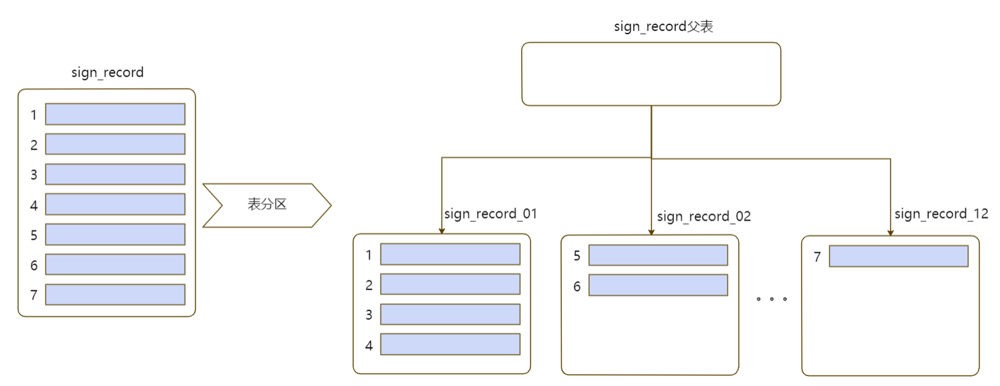

# table_partition1

**作者**

chrisx

**时间**

2021-04-15

**内容**

表分区的使用

ref [Table Partitioning](https://www.postgresql.org/docs/13/ddl-partitioning.html)

---

[toc]

## 表分区介绍



划分指的是将逻辑上的一个大表分成一些小的物理上的片。划分有很多益处：

在某些情况下查询性能能够显著提升，特别是当那些访问压力大的行在一个分区或者少数几个分区时。划分可以取代索引的主导列、减小索引尺寸以及使索引中访问压力大的部分更有可能被放在内存中。

当查询或更新访问一个分区的大部分行时，可以通过该分区上的一个顺序扫描来取代分散到整个表上的索引和随机访问，这样可以改善性能。

如果批量操作的需求是在分区设计时就规划好的，则批量装载和删除可以通过增加或者去除分区来完成。执行ALTER TABLE DETACH PARTITION或者使用DROP TABLE删除一个分区远快于批量操作。这些命令也完全避免了批量DELETE导致的VACUUM开销。

很少使用的数据可以被迁移到便宜且较慢的存储介质上。

当一个表非常大时，划分所带来的好处是非常值得的。一个表何种情况下会从划分获益取决于应用，一个经验法则是当表的尺寸超过了数据库服务器物理内存时，划分会为表带来好处。

PostgreSQL对下列分区形式提供了内建支持：

* 范围划分
表被根据一个关键列或一组列划分为“范围”，不同的分区的范围之间没有重叠。例如，我们可以根据日期范围划分，或者根据特定业务对象的标识符划分。

* 列表划分
通过显式地列出每一个分区中出现的键值来划分表。

* 哈希分区
通过为每个分区指定模数和余数来对表进行分区。每个分区所持有的行都满足：分区键的值除以为其指定的模数将产生为其指定的余数。

如果你的应用需要使用上面所列之外的分区形式，可以使用诸如继承和UNION ALL视图之类的替代方法。这些方法很灵活，但是却缺少内建声明式分区的一些性能优势。

## 范围分区

```sql
create table t_range(id int,name varchar(100),i_time timestamp not null) partition by range(id);
postgres=# \d+ t_range
 
create table t_range_1 partition of t_range for values from (1) to (1000);
create table t_range_2 partition of t_range for values from (1000) to (3000);
create table t_range_3 partition of t_range for values from (3000) to (5000);
create table t_range_4 partition of t_range for values from (5000) to (8000);
create table t_range_5 partition of t_range for values from (8000) to (10000);
 
postgres=# \d+ t_range
 
insert into t_range select id,md5(random()::text),current_date - id from generate_series(1,10001) t(id);
postgres=> insert into t_range select id,md5(random()::text),current_date - id from generate_series(1,10001) t(id);
ERROR:  no partition of relation "t_range" found for row
DETAIL:  Partition key of the failing row contains (id) = (10000).
postgres=>
 
INSERT INTO t_range SELECT generate_series(1,9999),md5(random()::text),clock_timestamp();
 
 
select count(*) from t_range_1;
select count(*) from t_range_5;
select count(*) from only t_range;

```

不允许分区字段修改后跨越分区
 
postgres=# update t_range set id=2000 where id=500;
ERROR:  new row for relation "t_range_1" violates partition constraint
DETAIL:  Failing row contains (2000, 7ed9bf07d00e369c74997bee774cea69, 2017-03-24 00:00:00).
postgres=# update t_range set id=200 where id=500;
UPDATE 1

非分区字段的字段修改操作会下发到子表上。
truncate主表

postgres=# truncate table t_range;
TRUNCATE TABLE
postgres=# select count(*) from t_range_5;
 count
-------
     0
(1 row)
 
会清除所有子表的数据。

## list 分区

```sql
创建主表
create table t_list (id int,name varchar(100),region varchar(50) ) partition by list (region);
 
创建子表
create table t_list_1 partition of t_list for values in ('beijing');
create table t_list_2 partition of t_list for values in ('nanjing');
create table t_list_3 partition of t_list for values in ('shanghai');
create table t_list_4 partition of t_list for values in ('chongqing');
create table t_list_5 partition of t_list for values in ('hangzhou');
 
postgres=# \d+ t_list
 
insert into t_list values (1,'a','beijing');
insert into t_list values (2,'b','nanjing');
insert into t_list values (3,'c','chongqing');
insert into t_list values (4,'d','hangzhou');
insert into t_list values (5,'e','shanghai');
insert into t_list values (6,'f','chongqing');
 insert into t_list values (7,'g','nanjing');
insert into t_list values (8,'h','beijing');
 
 
postgres=> select * from t_list_2;
 id | name | region 
----+------+---------
  2 | b    | nanjing
  7 | g    | nanjing
(2 rows)
 
通过执行计划，查看分区使用
postgres=# explain select * from t_list where region='nanjing';

```

## 添加删除分区

添加分区
create table t_list_6  (like t_list);
alter table t_list attach partition t_list_6 for values in ('guangzhou');
 
分区离线
alter table t_range detach partition t_range_5;
postgres=> select * from t_range where id=9001;
 id | name | i_time
----+------+--------
(0 rows)
postgres=> select * from t_range_5 where id=9001;
  id  |               name               |           i_time          
------+----------------------------------+----------------------------
 9001 | 2ff1f5c36a0ef69b1b5d283a2312f019 | 2019-03-20 09:47:14.304022
(1 row)
 
alter table t_list detach partition t_list_6;
select * from t_list where region='guangzhou';
select * from t_list_6;
 
detach后，表还是存在的，成为独立的表。
 