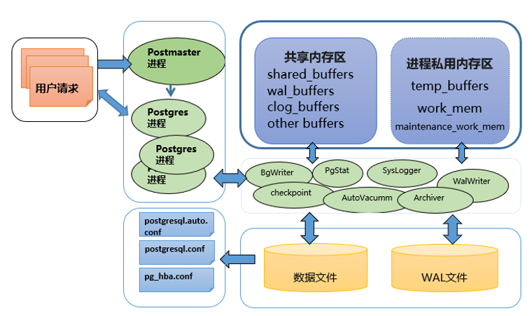
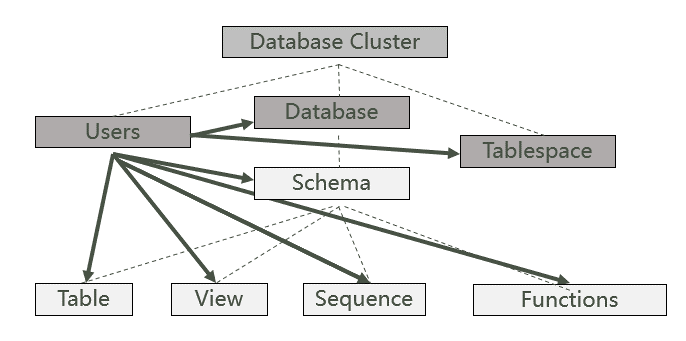
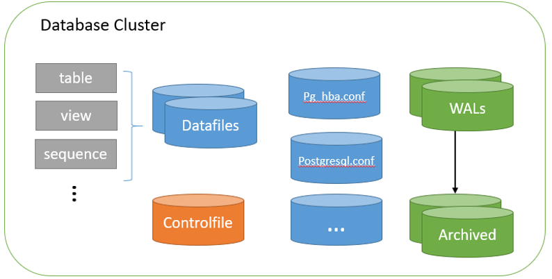
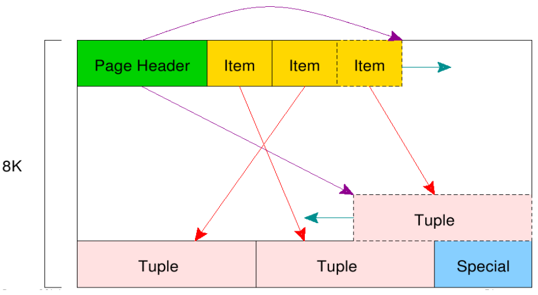
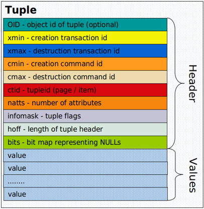
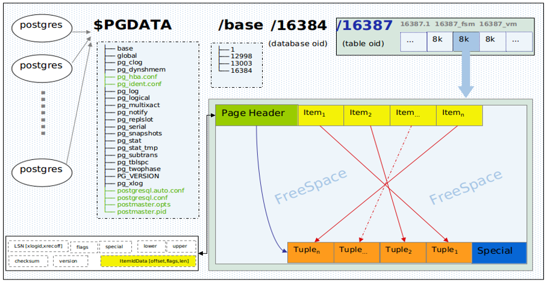

# cluster_storage_Structure

**作者**

chrisx

**日期**

2021-03-02

**内容**

PostgreSQL数据库体系结构-存储结构

----

[TOC]

认识数据库



## 1. 逻辑存储结构（Logical Structure of Database Cluster）



* `database cluster` --数据库聚簇，是一组数据库的集合，而不是多个数据库服务器

* 一个操作系统（OS）中，可以有一个或者多个Database Cluster不同的Database Cluster是以port （端口号）作为区分的

* `database` --数据库，是一组数据库对象的集合
* `database object` --数据库对象，是一种数据结构，用于存储查询数据

* Schema是一组对象的集合
* User是一个具有登陆访问数据库权限的角色
* Tablespace是服务器上一个指定的存储位置，所有的对象物理上都存储在这个空间

* `object identifiers (OIDs)` --对象标识，OIDs存储在system catalog。不同对象类型的OID存储在不同的catalog中。database的OID存储在pg_database中；table的OID存储在pg_class中

:warning: 逻辑对象user、database、tablespace是使用与被使用的关系，不是隶属关系

```sql
postgres=# select oid,datname,dattablespace from pg_database;
oid | datname | dattablespace
-------+-----------+---------------
13212 | postgres | 1663
1 | template1 | 1663
13211 | template0 | 1663
(3 rows)
postgres=# select oid,relname,relowner from pg_class where relname='test_rep';
oid | relname | relowner
-------+----------+----------
57362 | test_rep | 49156
(1 row)
```

:warning: OID是伪列

## 2. 物理结构（Physical Structure of Database Cluster）



Database Cluster物理上是一个 base directory（PGDATA），包括一些子目录和文件

```sql
--查看命令：
show data_directory;
select name,setting from pg_settings where category='File Locations';

```

``` bash
tree -L 3 $PGDATA

/opt/HighGo5.6.5/data
├── base                                #存放数据库的子目录
│   ├── 1
│   ├── 13863                                        
│   ├── 13864                           #数据库目录名以OIDs命名
│   └── 41162
│       ├── 112
│       ├── 1247                        #对象数据文件，表或索引的filenode number（pg_class.relfilenode）
│       ├── 1247_fsm                    #数据文件对应的FSM(free space map)件，用map方式来标识哪些block是空闲的
│       ├── 1247_vm                     #数据文件对应的VM(visibility map)，用来提高VACUUM执行效率
├── global                              #存储cluster级的系统表,如pg_database
│   ├── 1136                            
│   ├── 1136_fsm
│   ├── 1136_vm
...
│   ├── pg_control                      #控制文件，用于存储全局控制信息
│   ├── pg_filenode.map                 #系统表的OID与具体文件名进行硬编映射
│   └── pg_internal.init                #缓存系统文件，加快系统表读取速度
...
├── hgdb_log                            #默认错误日志输出位置
│   └── startup.log
├── pg_hba.conf                         #客户端网络访问控制配置文件
├── pg_logical                          #配置逻辑复制时，存储逻辑解码的数据状态
│   ├── mappings
│   ├── replorigin_checkpoint
│   └── snapshots
├── pg_tblspc                           #存放非默认表空间路径，软连接的形式
│   └── 41167 -> /home/hgdb565/tbs      #非默认表空间
├── pg_wal                              #wal日志路径
│   ├── 000000010000000000000007
│   ├── 000000010000000000000008
│   ├── 000000010000000000000009
│   └── archive_status
├── postgresql.auto.conf                #参数配置文件（alter system），优先级高于postgresql.conf
├── postgresql.conf                     #参数配置文件
├── postmaster.opts                     #录上次启动服务器时使用的命令行选项的文件
└── postmaster.pid

...
```

详细描述参[考官方文档](https://www.postgresql.org/docs/current/storage-file-layout.html)

**查看控制文件记录**

``` bash
[pg@pg global]$ pg_controldata
pg_control version number: 1002
Catalog version number: 201707211
Database system identifier: 6577238410286647636
Database cluster state: in production
pg_control last modified: Wed 16 Jan 2019 01:52:26 PM CST
Latest checkpoint location: 0/77271BC0
Prior checkpoint location: 0/77271B18
Latest checkpoint's REDO location: 0/77271BC0
Latest checkpoint's REDO WAL file: 000000090000000000000077
Latest checkpoint's TimeLineID: 9
Latest checkpoint's PrevTimeLineID: 9
Latest checkpoint's full_page_writes: on
Latest checkpoint's NextXID: 0:681
Latest checkpoint's NextOID: 81960
Latest checkpoint's NextMultiXactId: 1
Latest checkpoint's NextMultiOffset: 0
Latest checkpoint's oldestXID: 548
Latest checkpoint's oldestXID's DB: 1
Latest checkpoint's oldestActiveXID: 0
Latest checkpoint's oldestMultiXid: 1
Latest checkpoint's oldestMulti's DB: 1
Latest checkpoint's oldestCommitTsXid:0
Latest checkpoint's newestCommitTsXid:0
Time of latest checkpoint: Wed 16 Jan 2019 01:52:26 PM CST
Fake LSN counter for unlogged rels: 0/1
Minimum recovery ending location: 0/0
Min recovery ending locs timeline: 0
Backup start location: 0/0
Backup end location: 0/0
End-of-backup record required: no
wal_level setting: replica
wal_log_hints setting: on
max_connections setting: 100
max_worker_processes setting: 8
max_prepared_xacts setting: 0
max_locks_per_xact setting: 64
track_commit_timestamp setting: off
Maximum data alignment: 8
Database block size: 8192
Blocks per segment of large relation: 131072
WAL block size: 8192
Bytes per WAL segment: 16777216
Maximum length of identifiers: 64
Maximum columns in an index: 32
Maximum size of a TOAST chunk: 1996
Size of a large-object chunk: 2048
Date/time type storage: 64-bit integers
Float4 argument passing: by value
Float8 argument passing: by value
Data page checksum version: 0
Mock authentication nonce: d689960231e71d87b4ea9a8324398a84ce89709786d3c2cb1a18bbede989b1db
```

**查看pg_filenode.map记录**

``` bash
[pg@pg global]$ hexdump pg_filenode.map
0000000 2717 0059 0023 0000 04ee 0000 04ee 0000
0000010 0b94 0000 0b94 0000 04bd 0000 04bd 0000
0000020 0470 0000 0470 0000 04ec 0000 04ec 0000
0000030 04ed 0000 04ed 0000 04be 0000 04be 0000
0000040 095c 0000 095c 0000 1770 0000 1770 0000
0000050 0e08 0000 0e08 0000 17d4 0000 17d4 0000
0000060 0b1e 0000 0b1e 0000 0b1f 0000 0b1f 0000
0000070 0b96 0000 0b96 0000 0b97 0000 0b97 0000
0000080 0fdc 0000 0fdc 0000 0fdd 0000 0fdd 0000
0000090 0a74 0000 0a74 0000 0a75 0000 0a75 0000
00000a0 0a86 0000 0a86 0000 0a87 0000 0a87 0000
00000b0 0a6f 0000 0a6f 0000 0a70 0000 0a70 0000
00000c0 095d 0000 095d 0000 0471 0000 0471 0000
00000d0 04d0 0000 04d0 0000 04d1 0000 04d1 0000
00000e0 0a89 0000 0a89 0000 0a8a 0000 0a8a 0000
00000f0 0b95 0000 0b95 0000 0e09 0000 0e09 0000
0000100 1771 0000 1771 0000 1772 0000 1772 0000
0000110 17e2 0000 17e2 0000 17e3 0000 17e3 0000
0000120 0000 0000 0000 0000 0000 0000 0000 0000
*
00001f0 0000 0000 0000 0000 9ee5 3d9a 0000 0000
0000200
```

## 数据布局结构

* 目录结构
默认表空间的数据文件存放在base目录
在pg_wal保存WAL日志，只能通过软链改变它的位置
* Relation
每一个表和索引都存放到单独的数据文件中
文件名是表或索引的文件结点(filenode)编号
如果表或索引超过 1 GB 就会被分割为多个段
第一个段以文件结点(filenode)编号命名，第二个以及之后的段以filenode.1, filenode.2形式命名
* Page(Block)和Buffer
在磁盘中称为page,内存中称为buffer
默认为8k,可以在编译时指定block_size参数改变大小
* Tuple（row）表中的行

### 目录结构

目录结构与表空间息息相关

* 表空间路径在CREATE TABLESPACE 时，其目录下会自动创建子目录，格式为PG_'Major version'_'Catalogue version number'
* 表空间的类型有，默认表空间pg_default，系统共享表空间pg_global，自定义表空间
* 所有的自定义表空间目录，都会在$PGDATA/pg_tblspc中创建符号链接，链接名与该表空间的OID相同
* 数据库中的表可以存放在不同的表空间中，表空间下创建一个与数据库oid相同名字的一个目录，然后将数据文件放在此目录下

```shell
/opt/HighGo5.6.5/data
├── base                 
│   ├── 1
│   ├── 13863            
│   ├── 13864            
│   └── 41162	#database oid
├── pg_tblspc                     
│   └── 41167 -> /home/hgdb565/tbs #41167 tablespace oid

/home/hgdb565/tbs
└── PG_10_201707211
    └── 41162	 #database oid

数据库41162在默认表空间（pg_default）和自定义表空间（41167）中都有表

```

### Relation

* OID和relfilenode

OID
对象标识符（OID）被用来在内部作为多个系统表的主键。
oid不会添加到 用户自己创建的表里，除非指定 WITH OIDS 或者 default_with_oids 打开
oid类型目前被实现为一个无符号4字节整数，不推荐在用户表中使用。
所有数据库对象都由各自的对象标识符(Object Identifier)
数据库和堆表的OID分别存储在pg_database和pg_class中
oid2name可以获取数据库、对象的OID
relfilenode
标识对象物理位置的数字标号，会随数据存放的位置变化而变化
函数pg_relation_filenode() 可以获得对象的relfilenode
通过relfilenode可以找到其物理位置


OID 与relfilenode的关系
oid – 内部管理，指定relation内部标识
refilenode – 外部管理，指定relation在磁盘上的名字
表和索引的relfilenode值基本上并不总是与各自的OID匹配
truncate、vacuum full、删除重建表操作都会导致refilenode变化

``` sql
--查看pg_class获取relfilenode和oid信息
postgres=# select relname,relfilenode,oid,relnamespace from pg_class where relname='test_table';
relname | relfilenode | oid | relnamespace
------------+-------------+-------+--------------
test_table | 81961 | 81961 | 81960
(1 row)
postgres=> truncate table test_table;
postgres=> select relname,relfilenode,oid,relnamespace from pg_class where relname='test_table';
relname | relfilenode | oid | relnamespace
------------+-------------+-------+--------------
test_table | 81967 | 81961 | 81960
(1 row)
```

查看物理文件

``` sql
--通过内置函数pg_relation_filepath(relation regclass)可以找到对应的物理文件
postgres=> SELECT pg_relation_filepath('test_table');
pg_relation_filepath
----------------------
base/13212/81967
(1 row)

[pg@pg ~]$ ls -atl $PGDATA/base/13212/81967
-rw------- 1 pg pg 0 Jan 24 14:01 /opt/postgres/data/base/13212/81967

查询模式下所有对象的路径
select relname,'$PGDATA/'||pg_relation_filepath(relname::regclass) from pg_class c,pg_namespace n where c.relnamespace=n.oid and c.relkind='r' and n.nspname='public';

```

系统表的物理位置在哪里呢？其对应的oid是什么？

``` sql
PG对于这些catalog表，放到一个文件中去管理，将oid与relfileno做映射。这个文件就是著名的‘pg_filenode.map’。

SELECT pg_relation_filepath('pg_class');
 pg_relation_filepath
----------------------
 base/14000/1259
(1 row)

1259

[highgo@dbrs 14000]$ hexdump pg_filenode.map
0000000 2717 0059 000f 0000 04eb 0000 04eb 0000
0000010 04e1 0000 04e1 0000 04e7 0000 04e7 0000
0000020 04df 0000 04df 0000 0b14 0000 0b14 0000
0000030 0b15 0000 0b15 0000 0a62 0000 0a62 0000
0000040 0a63 0000 0a63 0000 0a66 0000 0a66 0000
0000050 0a67 0000 0a67 0000 0d7f 0000 0d7f 0000
0000060 0a82 0000 0a82 0000 0a83 0000 0a83 0000
0000070 0a8f 0000 0a8f 0000 0a90 0000 0a90 0000
0000080 0000 0000 0000 0000 0000 0000 0000 0000
*
00001f0 0000 0000 0000 0000 9965 3aa5 0000 0000
0000200
[highgo@dbrs 14000]$
04eb =1259
```

### 数据文件大小

* 当一个表或索引超过 1 GB 时, 它被划分为G大小的段，文件命名为relfilenode、relfilenode.1、relfilenode.2......

**注意：The maximum file size of tables and indexes can be changed using the configuration, option --with-segsize when building PostgreSQL.**

* 每个数据文件都有两个相关后缀文件，'_fsm' and '_vm', 分别对应free space map and visibility map，索引的数据文件只有'_fsm'。
* Unlogged tables and indexes have a third fork, known as the initialization fork, which is stored in a fork with the suffix _init

**查看**

``` sql
postgres=# create unlogged table test_unlog(a int);
CREATE TABLE
postgres=# insert into test_unlog select generate_series(1,1000);
INSERT 0 1000
postgres=# SELECT pg_relation_filepath('test_unlog');
pg_relation_filepath
----------------------
base/13212/102776
(1 row)
[pg@pg 13212]$ ls -atl 102776*
-rw------- 1 pg pg 40960 Mar 20 17:35 102776
-rw------- 1 pg pg 24576 Mar 20 17:35 102776_fsm
-rw------- 1 pg pg 0 Mar 20 17:35 102776_init
```

**物理文件空间大小**

``` sql
pg_total_relation_size(regclass)
bigint
Total disk space used by the specified table, including all indexes and TOAST data
pg_table_size(regclass)
bigint
Disk space used by the specified table, excluding indexes (but including TOAST, free space map, and visibility map)
pg_indexes_size(regclass)
bigint
Total disk space used by indexes attached to the specified table
pg_relation_size(relation regclass, fork text)
bigint
Disk space used by the specified fork ('main', 'fsm', 'vm', or 'init') of the specified table or index

postgres=> select pg_size_pretty(pg_table_size('test_toast'));
pg_size_pretty
----------------
4016 kB
(1 row)
```

### oid2name

`oid2name` — resolve OIDs and file nodes in a PostgreSQL data directory

Options:
  -f, --filenode=FILENODE    show info for table with given file node

使用

```shell
[hgdb565@db ~]$ oid2name -d highgo -x
From database "highgo":
  Filenode     Table Name    Oid    Schema  Tablespace
------------------------------------------------------
     16418          pdrdb  16418  _pg_pdr_  pg_default
     16412         pdrsql  16412  _pg_pdr_  pg_default
     16424       pdrtable  16424  _pg_pdr_  pg_default
     16427        pdrwait  16427  _pg_pdr_  pg_default
     16552        product  16552    public  pg_default
     16507        test_lr  16507    public  pg_default
     16467  test_parallel  16467    public  pg_default
     13497   utl_file_dir  13497  utl_file  pg_default

```

## 3. 存储结构-page



* `page` --数据库中最小的存储单元。在数据文件（堆表、索引、free space map and visibility map）内部，空间被分配成固定长度的pages使用，默认大小8192 byte (8 KB)
* `block numbers` --每个page都是从0开始按顺序编号使用（编号叫block numbers），如果page已被填满，PostgreSQL会在文件末尾添加一个新的空页，以增加文件大小。

| block0              |                       |                |              |
| ------------------- | --------------------- | -------------- | ------------ |
| header_data(24byte) | pg_lsn                | xxx            | xxx          |
| xxx                 | pg_lower              | pg_upper       | xxx          |
|                     | line_pointer_1(4byte) | line_pointer_2 | xxx          |
|                     | freespace             |                |              |
|                     |                       | freespace      |              |
|                     | xxx                   | heap_tuple_2   | heap_tuple_1 |

page结构包括3部分

* `header data` --在page头部，24个字节长度，记录page的元数据信息

> `pg_lsn` --存储page最新更改时，wal日志的lsn信息
> `pg_checksum` --存储page的校验值
> `pg_lower, pg_upper` --pd_lower指向line pointer尾部; pd_upper指向最新heap tuple的头部
> `pd_special` --主要用于索引，在表中，指向最后一个page

* `line pointer(s)` --在header data之后。行指针的长度为4个字节，用于保存指向每个heap tuple的指针，是heap tuple的索引。每存放一个tuple就会有一个line pointer
* `heap tuple(s)` --用来存放数据，从page底部开始使用（行数据）

> `tuple identifier (TID)` --为了在表中标识元组，在内部使用了元组标识符（tid）。tid包含一对值，包含tuple的page的block numbers，以及指向该tuple的line pointer的偏移编号。这是一个典型的索引用法，用来查找tuple数据。此外，heap tuple总大小超过2KB（约1/4 8KB），使用一种TOAST (The Oversized-Attribute Storage Technique)的方式进行管理

* **以上可知，line pointer的末尾到最新heap tuple的头部，这中间的部分叫 free space**

## tuple结构



参考[再谈mvcc与vacuum](./再谈mvcc与vacuum)

## 4. tuple的读写方法



数据库是如何进行读写操作的呢？下文给出一个简单的描述，后期结合相关内容会有更详细的描述
*假设一个表只包含一个page，一个page只包括一个heap tuple*

### 写（write）

当前情况下，结构如下
| block24             |                       |           |              |
| ------------------- | --------------------- | --------- | ------------ |
| header_data(24byte) | pg_lsn                | xxx       | xxx          |
| xxx                 | pg_lower              | pg_upper  |              |
|                     | line_pointer_1(4byte) |           |              |
|                     | freespace             |           |              |
|                     |                       | freespace |              |
|                     |                       |           | heap_tuple_1 |

如图所示，分配一个序号为block 24的page（8192字节），

* page的前24字节存储header data，之后的4字节存储line pointer 1，中间空间为free space，page末尾存放第一个heap tuple 1
* line pointer 1指向heap tuple 1
* pg_lower指向line pointer 1
* pg_upper指向heap tuple 1

现在插入一行数据, 结构如下
| block24             |                       |                |              |
| ------------------- | --------------------- | -------------- | ------------ |
| header_data(24byte) | pg_lsn                | xxx            | xxx          |
| xxx                 | pg_lower              | pg_upper       | xxx          |
|                     | line_pointer_1(4byte) | line_pointer_2 | xxx          |
|                     | freespace             |                |              |
|                     |                       | freespace      |              |
|                     | xxx                   | heap_tuple_2   | heap_tuple_1 |

* 在line pointer 1之后分配新4字节存放line pointer 2，在heap tuple 1之前存放最新的heap tuple 2
* line pointer 1指向heap tuple 1
* line pointer 2指向heap tuple 2
* pg_lower指向line pointer 2
* pg_upper指向heap tuple 2

### 4.2读（read）：分为两种，顺序读和索引读

* 1顺序读（Sequential scan）
* 2索引读（B-tree index scan） --TID value of the obtained index tuple is '(block = 24, Offset = 2)'

#### 4.2.1顺序读：Sequential scan

结构如下
| block24             |                       |                |              |
| ------------------- | --------------------- | -------------- | ------------ |
| header_data(24byte) | pg_lsn                | xxx            | xxx          |
| xxx                 | pg_lower              | pg_upper       | xxx          |
|                     | line_pointer_1(4byte) | line_pointer_2 | xxx          |
|                     | freespace             |                |              |
|                     |                       | freespace      |              |
|                     | xxx                   | heap_tuple_2   | heap_tuple_1 |

``` 
select * from test_table;
```

此时

* 扫描block 1 的page，扫描line pointer 1...line pointer n
* 扫描block 2 的page，扫描line pointer 1...line pointer n
* ......
* 扫描block 24 的page，扫描line pointer 1找到需要的数据heap tuple1

#### 4.2.2索引读：B-tree index scan

结构如下
| block24             |                       |                |              |
| ------------------- | --------------------- | -------------- | ------------ |
| header_data(24byte) | pg_lsn                | xxx            | xxx          |
| xxx                 | pg_lower              | pg_upper       | xxx          |
|                     | line_pointer_1(4byte) | line_pointer_2 | xxx          |
|                     | freespace             |                |              |
|                     |                       | freespace      |              |
|                     | xxx                   | heap_tuple_2   | heap_tuple_1 |

``` sql
select * from test_table where id=244;
```

此时
直接通过索引tuple记录'(block = 24, Offset = 2)'，找到block 24的page，读取line pointer 2，找到需要的heap tuple 2

## 参考

* pgstattuple模块提供多种函数来获得元组层的统计信息。
* pageinspect 模块提供函数让你从低层次观察数据库页面的内容
* [官方文档](https://www.postgresql.org/docs/10/pageinspect.html)
