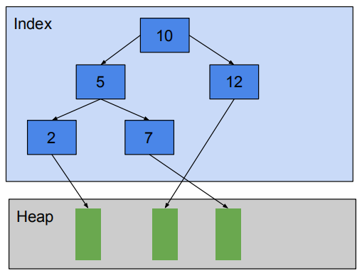
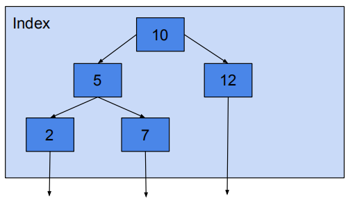
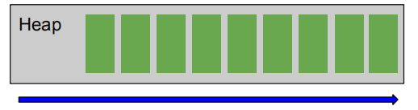
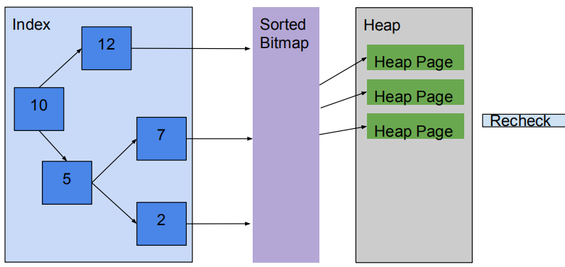

# explain

**作者**

Chrisx

**日期**

2021-08-03

**内容**

pg执行计划解析

ref [explain](https://www.postgresql.org/docs/13/sql-explain.html)

----

[toc]

## sql执行

sql需要经过以下执行过程

1. 解析器(parse)，根据sql语句生成一个语法解析树（parse tree）
Splits simple and complex query，Takes Raw Parse tree as input
2. 分析器(analyzer)，对语法解析树进行语义分析，生成一颗查询树（query tree）
Meaning of the query
● Relations are identified
● columns, datatype, collation etc are considered
● Transform a Parse tree into a Query tree
3. 重写器(rewrite)，按照规则系统中存在的规则对查询树进行改写
● Set of Rules are applied
● transform the query
● between parser and the planner/optimizer
● custom rules stored in pg_rules

A `Query Tree` is the logical Represenation of the query with reference to actual database objects with object id
4. 计划器(planner)，基于查询树生成一颗执行效率最高的计划数树（plan tree）
SQL query / Query tree can be actually executed in a wide variety of different ways
● planner / optimizer create an optimal execution plan
● Cost Based
● Data structure - Paths.
○ Paths are cut-down versions of Plans
● Cheapest path is selected
● Full-fledged Plan will be prepared.
5. 执行器(executor)，按照计划树种的顺序访问表和索引，执行响应查询
● Plan nodes are executed recursively
● top level node returns the result to client

## Explain 子句可以获取执行计划

客户端接收输出结果

```sql

语法如下：
EXPLAIN [ ( option [, ...] ) ] statement
EXPLAIN [ ANALYZE ] [ VERBOSE ] statement
 where option can be one of:
  EXPLAIN：显示SQL的执行计划
  ANALYZE [ boolean ]：通过实际执行来获取相应的执行计划 【FALSE】 
  VERBOSE [ boolean ]：显示执行计划的附加信息 【FALSE】 
  COSTS [ boolean ]：每个节点的启动成本和总成本，以及估计行数和每行的宽度。【TRUE】
  BUFFERS [ boolean ]：显示关于缓冲区使用的信息 【FALSE】 
  TIMING [ boolean ]：实际启动时间以及在每个结点中花掉的时间【TRUE】
  FORMAT { TEXT | XML | JSON | YAML }：指定输出格式  【TEXT】
```

* EXPLAIN --得到优化器预估计划，没有实际执行
* ANALYZE --得到执行计划，且实际执行sql，较准确

执行命令并且显示实际的运行时间和其他统计信息。这个参数默认被设置为 FALSE 。

analyze获得了执行计划的更多信息，实际的启动时间（actual time=0.089毫秒）、返回所有行的时间（0.089毫秒）、实际返回的行数（rows=1）、过滤条件（Filter: (empno = 7369)）、过滤掉的行数（Rows Removed by Filter: 13）、计划执行时间（Planning time: 0.074 ms）、实际执行时间（Execution time: 0.112 ms）。

* VERBOSE

显示额外信息。特别是：计划树中每个结点的输出列列表、模式限定的表和函数名、总是把表达式中的变量标上它们的范围表别名，以及总是打印统计信息被显示的每个触发器的名称。默认值为 FALSE 。

* COSTS

包括每一个计划结点的估计启动和总代价，以及估计的行数和每行的宽度。默认值为 TRUE 。

* BUFFERS

包括缓冲区使用的信息。包含共享块命中、读取、标记为脏和写入的次数、本地块命中、读取、标记为脏和写入的次数、以及临时块读取和写入的次数。一次命中表示避免了一次读取，因为需要的块已经在缓存中找到了。共享块包含着来自于常规表和索引的数据，本地块包含着来自于临时表和索引的数据，而临时块包含着在排序、哈希、物化计划结点和类似情况中使用的短期工作数据。脏块的数量表示被这个查询改变的之前未被修改块的数量，而写入块的数量表示这个后台在查询处理期间从缓存中替换出去的脏块的数量。为一个较高层结点显示的块数包括它的所有子结点所用到的块数。在文本格式中，只会打印非零值。只有当 ANALYZE 也被启用时，这个参数才能使用。默认值为 FALSE 。

可通过实际执行SQL查看实际的代价和缓冲区命中的情况
“Buffers: shared hit=1”，表示从磁盘中读取了1个数据块。

* TIMING
输出实际启动时间以及在每个结点中花掉的时间。当 ANALYZE 被启用时，这个参数才能使用。默认值为 TRUE 
数据库执行 SQL 语句的步骤
服务端生成后端进程读取sql语句

## 读懂执行计划

1. cost

含义：这个计划节点的预计的启动开销和总开销 
详细描述：启动开销是指一个计划节点在返回结果之前花费的开销，如果是在一个排序节点里，那就是指执行排序花费的开销。 总开销是指一个计划节点从开始到运行完成，即所有可用行被检索完后，总共花费的开销。实际上，一个节点的父节点可能会在子节点返回一部分结果后，停止继续读取剩余的行，如Limit节点。

2. rows 

含义：这个计划节点的预计输出行数
详细描述：在带有ANALYZE选项时，SQL语句会实际运行，这时一个计划节点的代价输出会包含两部分，前面部分是预计的代价，后面部分是实际的代价。前面部分中rows是指预计输出行数，后面部分是指实际输出行数。如果中间节点返回的数据量过大，最终返回的数据量很小，或许可以考虑将中间节点以下的查询修改成物化视图的形式。

3. width

含义：这个计划节点返回行的预计平均宽度(以字节计算)
详细描述：如果一个扫描节点返回行的平均宽度明显小于子节点返回行的平均宽度，说明从子节点读取的大部分数据是无用的，或许应该考虑一下调整SQL语句或表的相关设计，比如让执行计划尽量选择Index Only Scan，或者对表进行垂直拆分。

4. actual time

含义：这个计划节点的实际启动时间和总运行时间(milliseconds)
详细描述：启动时间是指一个计划节点在返回第一行记录之前花费的时间。 总运行时间是指一个计划节点从开始到运行完成，即所有可用行被检索完后，总共花费的时间。

5. loops

含义：这个计划节点的实际重启次数
详细描述：如果一个计划节点在运行过程中，它的相关参数值（如绑定变量）发生了变化，就需要重新运行这个计划节点。

6. Filter

含义：这个扫描节点的过滤条件
详细描述：对于一个表的扫描节点，如果相关的条件表达式不能对应到表上的某个索引，可能需要分析一下具体的原因和影响，比如该表相关的字段在表达式中需要进行隐式类型转换，那么即使在该字段上存在索引，也不可能被使用到。如：((b.intcol)::numeric > 99.0)

7. Index Cond

含义：这个索引扫描节点的索引匹配条件
详细描述：说明用到了表上的某个索引。

8. Rows Removed by Filter

含义：这个扫描节点通过过滤条件过滤掉的行数
详细描述：如果一个扫描节点的实际输出行数明显小于通过过滤条件过滤掉的行数，说明这个计划节点在运行过程中的大量计算是无用的，或者说是没有实际产出的，那么这个SQL语句或者表的相关设计可能不是特别好。

### 示例

:warning: 注意：对于DML语句，为避免影响业务，可把DML放在事务中。

```sql
begin;
explain analyze update prod_1209.test_dump set name='ttt' where id=1;
rollback;
```

以下语句显示了更详细的计划

```sql

explain (analyze on, timing on, verbose on, buffers on)
select s.shop_name,p.product_name,p.sale_price from shopproduct s,product p where s.product_id=p.product_id and p.sale_price >=3000 order by sale_price desc;

                                                           QUERY PLAN
--------------------------------------------------------------------------------------------------------------------------------
 Sort  (cost=27.21..27.34 rows=53 width=640) (actual time=0.021..0.022 rows=5 loops=1)
   Output: s.shop_name, p.product_name, p.sale_price
   Sort Key: p.sale_price DESC
   Sort Method: quicksort  Memory: 25kB
   Buffers: shared hit=2
   ->  Hash Join  (cost=13.66..25.69 rows=53 width=640) (actual time=0.015..0.017 rows=5 loops=1)
         Output: s.shop_name, p.product_name, p.sale_price
         Inner Unique: true
         Hash Cond: (s.product_id = p.product_id)
         Buffers: shared hit=2
         ->  Seq Scan on public.shopproduct s  (cost=0.00..11.60 rows=160 width=438) (actual time=0.004..0.005 rows=13 loops=1)
               Output: s.shop_id, s.shop_name, s.product_id, s.quantity
               Buffers: shared hit=1
         ->  Hash  (cost=12.75..12.75 rows=73 width=242) (actual time=0.006..0.007 rows=3 loops=1)
               Output: p.product_name, p.sale_price, p.product_id
               Buckets: 1024  Batches: 1  Memory Usage: 9kB
               Buffers: shared hit=1
               ->  Seq Scan on public.product p  (cost=0.00..12.75 rows=73 width=242) (actual time=0.003..0.004 rows=3 loops=1) 
                     Output: p.product_name, p.sale_price, p.product_id
                     Filter: (p.sale_price >= 3000)
                     Rows Removed by Filter: 5
                     Buffers: shared hit=1
 Planning Time: 0.065 ms
 Execution Time: 0.041 ms
(24 rows)


```

* 构筑节点，整个计划构建了一个规划节点的树结构。原则,从内到外。从最内层子节点（->）开始看，一直到根节点（没有标识），每一个表示了节点运算信息（类型、成本等）

```sql
 Sort
   ->  Hash Join
         ->  Seq Scan on public.shopproduct s
         ->  Hash
               ->  Seq Scan on public.product p
```

* 运行时间

```sql
 Planning Time: 0.065 ms    <<<查询计划（优化器预估）时间>>>
 Execution Time: 0.041 ms   <<<实际执行时间>>>

```

* 第一个操作是Seq Scan on public.product p

```sql
->  Seq Scan on public.product p  (cost=0.00..12.75 rows=73 width=242) (actual time=0.003..0.004 rows=3 loops=1) 
      Output: p.product_name, p.sale_price, p.product_id
      Filter: (p.sale_price >= 3000)
      Rows Removed by Filter: 5
      Buffers: shared hit=1
```

在表public.product p上执行顺序扫描。
(cost=0.00..12.75 rows=73 width=242)是预估开销成本，0.00 子节点启动代价,它表示该节点在产生第一个输出行之前估计要做的工作量。本例中这个值为零，是因为Seq Scan会立即返回行。而排序操作是需要花费一些时间才能够返回第一行。12.75是启动后到运算完成的代价
rows表示预估返回记录条数，width预估每条记录的平均长度（以字节为单位）。
(actual time=0.003..0.004 rows=3 loops=1)是实际开销成本。0.003 实际启动代价并非正好为零，它消耗了一小段时间来开始产生输出。0.004是实际完成的代价为0.004ms。rows是实际返回的行数。loops一些节点（比如执行连接的节点）执行将超过一次。此时，loops值大于1，并且，显示的实际执行时间和行值都是针对每一次循环而非整个节点，想要得到整个节点的值，需要乘以循环的次数。
Output: p.product_name, p.sale_price, p.product_id是查询的列信息
Filter: (p.sale_price >= 3000)是过滤条件（where）
Rows Removed by Filter: 5，过滤掉5行数据
Buffers: shared hit=1，缓存命中一行

* 第二个操作是Hash

表扫描的结果将在读取时被插入到内存的哈希表中。正如我们从成本中看到的那样，这基本不需要时间。

```sql
->  Hash  (cost=12.75..12.75 rows=73 width=242) (actual time=0.006..0.007 rows=3 loops=1)
      Output: p.product_name, p.sale_price, p.product_id
      Buckets: 1024  Batches: 1  Memory Usage: 9kB
      Buffers: shared hit=1
```

哈希节点包括散列桶(hash buckets)和批次数(batches)相关的信息，以及内存使用峰值情况。如果批次> 1，则还会包括未显示的磁盘使用信息。

* 第三个操作是Seq Scan on public.shopproduct s

```sql
->  Seq Scan on public.shopproduct s  (cost=0.00..11.60 rows=160 width=438) (actual time=0.004..0.005 rows=13 loops=1)
      Output: s.shop_id, s.shop_name, s.product_id, s.quantity
      Buffers: shared hit=1
```

从表public.shopproduct s中顺序读取所有的行,并根据内存的哈希表检查匹配

* 第四个操作是Hash Join

```sql
->  Hash Join  (cost=13.66..25.69 rows=53 width=640) (actual time=0.015..0.017 rows=5 loops=1)
      Output: s.shop_name, p.product_name, p.sale_price
      Inner Unique: true
      Hash Cond: (s.product_id = p.product_id)
      Buffers: shared hit=2
```

散列连接意味着将较小的表根据Join Key在内存中建立散列表，之后扫描较大的表，并根据散列表探测其值以进行匹配。可以看到“匹配”的条件，Hash Cond: (s.product_id = p.product_id)

* 第五个操作是Sort

```sql
 Sort  (cost=27.21..27.34 rows=53 width=640) (actual time=0.021..0.022 rows=5 loops=1)
   Output: s.shop_name, p.product_name, p.sale_price
   Sort Key: p.sale_price DESC
   Sort Method: quicksort  Memory: 25kB
   Buffers: shared hit=2
```

返回了满足条件的所有行，可以对结果集进行排序Sort Key: p.sale_price DESC。Sort节点包含排序算法quicksort。排序是在内存中完成，排序所需的内存量为25KB。如果内存不够还需要在磁盘上完成（这将极大地影响速度）。

## 执行计划--常见运算类型

执行计划运算类型  操作说明  是否有启动时间

* Seq Scan  扫描表 无启动时间
* Index Scan  索引扫描  无启动时间
* Bitmap Index Scan 索引扫描  有启动时间
* Bitmap Heap Scan  索引扫描  有启动时间
* Subquery Scan 子查询 无启动时间
* Tid Scan  ctid = …条件  无启动时间
* Function Scan 函数扫描  无启动时间
* Nested Loop 循环结合  无启动时间
* Merge Join  合并结合  有启动时间
* Hash Join 哈希结合  有启动时间
* Sort  排序，ORDER BY操作 有启动时间
* Hash  哈希运算  有启动时间
* Result  函数扫描，和具体的表无关  无启动时间
* Unique  DISTINCT，UNION操作  有启动时间
* Limit LIMIT，OFFSET操作  有启动时间
* Aggregate count, sum, avg, stddev集约函数  有启动时间
* Group GROUP BY分组操作  有启动时间
* Append  UNION操作 无启动时间
* Materialize 子查询 有启动时间
* SetOp INTERCECT，EXCEPT  有启动时间

### Index scan

Fetch one tuple-pointer at a time from the index
● Immediately visits that tuple in the table



### Index Only Scan

Read Index Tree, But Don’t Read Heap Pages



### Sequential Scan

Scans the tuples from one end to another end discarding all unmatched rows



### Bitmap Index or Heap Scan

Bitmap scans are good compromise / middle ground between Sequential Scan and Index scan

1. A bitmap scan fetches all the tuple-pointers from the index in one go
2. Sorts them using an in-memory "bitmap" data structure
3. Then visits the table tuples in physical tuple-location order.
4. Recheck for filtering condition



好处++
The bitmap scan improves locality of reference to the table
坏处--
bookkeeping overhead to manage the "bitmap" data structure
data is no longer retrieved in index order

https://yq.aliyun.com/articles/662100

传统的index scan每次从索引中去取一个tuple的指针，然后立马去表中取数据，每一次会造成一次随机io。如果数据量较多的情况下，会比较低效。而bitmap scan一次性将符合条件的tuple-pointers全部取出来，然后在内存中进行地址（tuple-location）排序，然后去取出数据，这时的读取数据由于进行的地址排序，读取时就变成了顺序的读。其实就是一个随机读转化为顺序读取的过程，但是取出的数据由于进行了地址的排序，就没有顺序。同时，对于limit这种sql，bitmap index scan这种就不适合，因为它一次会取出所有数据。

### ANALYZE

● AUTOVACUUM
● pg_statistic and pg_stats
● default_statistics_target

### Statistics

● Autovacuum worker
● Asynchronous
 ++
 Better Execution Plan
 Cost based Plan
 --
 Statistics collection overhead
 More data to analyze for arriving at execution plan

### Nested loop join

Right relation is scanned once for every row found in the left
relation
● Good strategy if index scan is possible on Right relation

一个大表一个小表

### Hash Joins

● Equi Joins
● In memory
● Generally the fastest

优化器使用两个表中较小（相对较小）的表利用Join Key在内存中建立散列表，然后扫描较大的表并探测散列表，找出与Hash表匹配的行。这种方式适用于较小的表完全可以放于内存中的情况。
这种方式适用于较小的表完全可以放于内存中的情况，这样总成本就是访问两个表的成本之和。但是在表很大的情况下并不能完全放入内存，这时优化器会将它分割成若干不同的分区，不能放入内存的部分就把该分区写入磁盘的临时段，此时要求有较大的临时段从而尽量提高I/O 的性能。它能够很好的工作于没有索引的大表和并行查询的环境中，并提供最好的性能。大多数人都说它是Join的重型升降机。Hash Join只能应用于等值连接(如WHERE A.COL3 = B.COL4)，这是由Hash的特点决定的。

### Merge Joins

● Relations are Sorted on the join attributes
● Equi-Join
● If data to join is too big to fit in memory

通常情况下Hash Join的效果都比排序合并连接要好，然而如果两表已经被排过序，在执行排序合并连接时不需要再排序了，这时Merge Join的性能会优于Hash Join。Merge join的操作通常分三步：
　　1. 对连接的每个表做table access full;
　　2. 对table access full的结果进行排序。
　　3. 进行merge join对排序结果进行合并。
在全表扫描比索引范围扫描再进行表访问更可取的情况下，Merge Join会比Nested Loop性能更佳。当表特别小或特别巨大的时候，实行全表访问可能会比索引范围扫描更有效。Merge Join的性能开销几乎都在前两步。Merge Join可适于于非等值Join（>，<，>=，<=，但是不包含!=，也即<>）

Nested Loop，Hash JOin，Merge Join对比

类别	Nested Loop	Hash Join	Merge Join
使用条件	任何条件	等值连接（=）	等值或非等值连接(>，<，=，>=，<=)，‘<>’除外
相关资源	CPU、磁盘I/O	内存、临时空间	内存、临时空间
特点	当有高选择性索引或进行限制性搜索时效率比较高，能够快速返回第一次的搜索结果。	当缺乏索引或者索引条件模糊时，Hash Join比Nested Loop有效。通常比Merge Join快。在数据仓库环境下，如果表的纪录数多，效率高。	当缺乏索引或者索引条件模糊时，Merge Join比Nested Loop有效。非等值连接时，Merge Join比Hash Join更有效
缺点	当索引丢失或者查询条件限制不够时，效率很低；当表的纪录数多时，效率低。	为建立哈希表，需要大量内存。第一次的结果返回较慢。	所有的表都需要排序。它为最优化的吞吐量而设计，并且在结果没有全部找到前不返回数据。

### Cost

更多请参考[Deeper_Understanding_Of_Execution_Planner](./script/Deeper_Understanding_Of_Execution_Planner.pdf)

## 强制改变执行计划

有时候我们不想用系统默认的执行计划。这时候就需要自己 强制控制 执行计划。
禁止某种运算的SQL语法： SET enable_运算 类型 = off;    //或者=false
开启某种运算的SQL语法：SET enable_运算 = on;    //或者=true
执行计划可以改变的运算方法如下
– enable_bitmapscan
– enable_hashagg
– enable_hashjoin
– enable_indexscan
– enable_mergejoin
– enable_nestloop
– enable_seqscan
– enable_sort
– enable_tidscan
如果我们只想改变当前要执行的 SQL的 执行计划，而不想影响其他的 SQL的 话。在设置 SQL里面加一个关 键字 session即可。
例子： set session enable_hashjoin=false   //禁止使用哈希结合算法

通过 查看 执行计划，我们就能够找到SQL中的哪部分比较慢，或者说花费时间多。然后重点分析哪部分的逻辑，比如减少循环查询，或者强制改变执行计划。