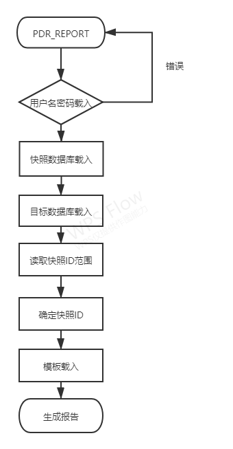
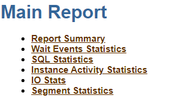

# hg_pdr

**作者**

Chrisx

**日期**

2021-09-17

**内容**

HG_PDR使用

----

[toc]

## PDR介绍

瀚高企业版数据库提供了瀚高数据库性能监控与诊断组件, Performance Diagnosis Report，简称PDR。PDR实现了周期性的收集、处理、持久化和维护性能统计数据，主要用于数据库性能问题的诊断与解决。另外，PDR可以生成简单明了、信息丰富和分类清晰的HTML格式性能诊断报告，以方便数据库管理者阅读。（类似Oracle数据库的AWR报告）

Postmaster负责fork出若干辅助进程，用于支持postgresql的运行。pdr进程也是postmasterfork出来的。pdr进程包括pg_wait_sampling collector，performance diagnosis collector。这些进程使用SPI接口，对数据库内核进行直接访问，实现信息采集和存储。所有信息保存在一个_pg_pdr_模式中。同时，还提供一个pdr_report工具，用于生成性能分析报告。Pdr_report工具会连接数据库，将用户指定的时间段内的数据库信息取出，再结合报告模板，生成一份HTML格式的报告。

默认情况下，每隔一个小时，pdr会采集一次信息，将这些信息存入_pg_pdr_模式的四个表里。每一条信息都带有一个快照id，用以识别采集的数据属于哪个时间段。这些数据，Database基本信息和Table基本信息，来自于postgres自带的PgStat进程，pdr直接从共享内存中将这部分数据读取出来，并存入_pg_pdr_的表中。SQL执行信息来自pg_stat_statements插件，这部分信息也是保存在共享内存中的，可以通过相关函数直接读出。等待事件目前使用了pg_wait_sampling插件，对pg_stat_activity视图进行高频采样，将等待事件进行保存。_pg_pdr_中保存的统计信息，默认保留7天，超过7天的信息会被清理，以节约存储空间。

当使用pdr_report工具时，用户需要指定生成的数据库名，快照id的起止范围，生成报告的文件名。Pdr_report工具会根据这些信息，从数据库中把用户指定的信息读取出来，填写到pdr_report.html模板中，最终生成pdr报告。

## PDR安装

hgdb版本自带 PDR 插件，并会在启动数据库时自动安装。

数据库安装完毕后，查看扩展插件。

```sql
highgo=# \dx
                                                           List of installed extensions
        Name        | Version |       Schema       |                                          Description
--------------------+---------+--------------------+-----------------------------------------------------------------------------------------------
...
 worker_pg_pdr      | 1.0     | public             | Sample background worker
...

highgo=#

```

PDR插件worker_pg_pdr已安装完成。

## PDR配置

PDR配置参数

* shared_preload_libraries= worker_pg_pdr,pg_stat_statements,pg_wait_sampling
PDR 的正常使用需要加载这三个库文件
* pg_pdr.naptime=60
PDR 快照的产生间隔，单位为分钟，默认为 60 分钟产生一次快照。Naptime=0时，代表不启用 PDR 功能。
* pg_pdr.naplife=7
PDR 快照的保存时间，单位为天，默认保存最近 7 天的快照。超过 naplife的快照，会自动删除。
* pg_pdr.napdb=highgo
用于保存 PDR 快照数据表的数据库，默认设置为 highgo 数据库。

参数配置完成后，重启数据库，即可启用PDR功能

启动后查看进程

```bash
$ ps -ef |grep post
......
hgdb602    579   571  0 15:56 ?        00:00:00 postgres: pg_wait_sampling collector
hgdb602    581   571  0 15:56 ?        00:00:00 postgres: performance diagnosis collector
......

```

pdr进程已存在。

## PDR使用

初次安装和使用 PDR 功能时，采集的第一个快照 id 是 0，用户可以用于生成性能分析报告的快照 id 是从 1 开始的。每拍一次快照，id 加 1。生成快照的时机有两种，一是计划时间到期（默认 1 小时），自动拍摄快照。二是用户使用 pg_pdr_new_snap()函数手工拍快照。

* 自动快照
在数据库启动 1 分钟后自动产生一次快照，然后根据配置文件中的pg_pdr.naptime 自动产生后续快照，无需操作。
* 手动快照
在 psql 中输入 select pg_pdr_new_snap() 即可产生一次快照。
Psql 返回 t，表示生成快照成功。
Psql 返回 f，表示生成快照失败。

```sql
highgo=# select pg_pdr_new_snap(); 
 pg_pdr_new_snap
-----------------
 t
```

:warning: 注意事项：

1. 手动生成快照不影响自动快照的生成时间间隔。
2. 若用户修改了系统时间，将时间改为了比已有快照时间更早的时间，此时会带来时间上的混乱，PDR 会停止快照的采集，直到系统时间因流逝或被人为调整到合理时间，PDR 才会继续工作。
3. 若用户修改了系统时间，将时间增大，使得生成快照时的时间距上次采集快照的时间大于 naptime+60 分钟，此时 PDR 会停止快照的采集，直到重启数据库或人为调整时间，PDR 才会继续工作。
4. 若用户修改了系统时间，将时间稍微减小但并不比已有快照时间更早，并且立即使用了手动生成快照，此时会出现一次自动快照的时间间隔略有差异，但并不影响后续的自动快照。

* PDR 保存快照的数据表存储在_pg_pdr_模式中，一共有四个表

```sql
_pg_pdr_.pdrdb      --Database基本信息
_pg_pdr_.pdrtable   --Table基本信息
_pg_pdr_.pdrsql     --SQL执行信息
_pg_pdr_.pdrwait    --等待事件信息
```

这四个数据表不可修改表结构，不可修改删除数据，否则将导致无法生成性能分析报告或者生成的性能分析报告不准确。如果因意外情况导致这四个数据表的数据被修改，无法生成准确的性能分析报告，可删除这四张数据表并重启数据库，由快照 id=0 开始生新生成快照。

## 生成性能报告

Pdr_report工具会要求用户依次输入，用户名，密码，数据库名，开始快照id，结束快照id，报告文件名。然后依据这些信息，去数据库读取和计算指定时间段内的数据，然后填入模板文件，最终生成一份报告。模板文件pg_pdr.html存放在share目录下，模板文件的样式可以进行修改，不会影响到报告的生成。



PDR 生成的快照存储在 napdb 配置的数据库中，快照包含整个数据集簇中所有数据库的性能信息。

```bash
[hgdb565@db ~]$ pdr_report
================================================================================
-----------------------------welcome to pdr report------------------------------
================================================================================
please input system user name:
highgo      #输入数据库用户名
please input password for highgo:
            #数据库用户密码
please input the database where the snapshot is stored:
highgo      #快照存储数据库名
please input which database you want to be reported:
highgo      #报告目标数据库名
--------------------------------------------------------------------------------
......
snap_id = 292, snap_ts = 2021-01-13 17:56:48
snap_id = 293, snap_ts = 2021-01-13 18:56:48
snap_id = 294, snap_ts = 2021-01-18 11:01:22
snap_id = 295, snap_ts = 2021-01-18 12:01:22
snap_id = 296, snap_ts = 2021-01-18 13:01:23
snap_id = 297, snap_ts = 2021-01-18 14:01:23
snap_id = 298, snap_ts = 2021-01-18 15:01:23
you can make report from 286(2021-01-11 17:49:21) to 298(2021-01-18 15:01:23)
--------------------------------------------------------------------------------
please input begin snapid(from 286):
297         #开始快照 id
snap_begin=[297]
please input end snapid(up to 298):
298         #结束快照 id
snap_end=[298]
please input html file name for this report(***.html):
highgo_report.html      #性能分析报告为 html 网页格式，可在浏览器中打开。
report ./highgo_report.html has been successfully created.
[hgdb565@db ~]$

```

:warning: 注意事项：

1. 若开始快照与结束快照期间发生过数据库重启，将无法生成性能分析报告。
2. 使用 pdr_report 命令时，会分屏列出当前快照存储数据库和报告目标数据库拥有的所有快照 id，此时可使用 Enter 键显示下一行快照 id，可使用空格键显示下一屏快照 id，可使用 q 键停止显示剩余的快照 id。
3. 当使用pdr_report工具时，用户需要指定生成的数据库名，快照id的起止范围，生成报告的文件名。Pdr_report工具会根据这些信息，从数据库中把用户指定的信息读取出来，填写到pdr_report.html模板中，最终生成pdr报告。
4. 模板文件pg_pdr.html存放在share目录下，模板文件的样式可以进行修改，不会影响到报告的生成。

通常报告的使用会结合基线PDR进行对比。建议优先创建基线PDR.

## 阅读报告分析

### 主要报告内容



基本信息部分，包括数据库、硬件环境、报告生成时间等基础信息。

### 1.报告概览

（1）负载概要，主要显示数据库的主要负载情况。
（2）前台事件等待top 10 的情况。

### 2.等待事件统计信息

首先是HGDB的三种锁spinlock,lwlock和lock的等待情况。

LWLock是一种基于spinlock机制实现的轻量级的锁，有互斥、共享、WAIT UNTIL FREE三种锁模式；
Lock是和Oracle enqueue类似的普通锁，用于操作HGDB中的数据对象的。从Lock锁的等待情况中可以分析HGDB的锁的争用情况，从而用于优化HGDB配置与应用程序。
BufferPin wait状态可以用于辅助分析热块争用与缓冲池的效率，该锁是保护内存结构用的(和Oraclelatch类似)，采用硬件和操作系统提供的test and set原子操作来实现。

接下来是client、extension、IPC三个等待状态。客户端等待状态可以用于分析客户端或者应用的性能与负载情况，extension等待可以用于分析数据文件的扩展情况。IPC Wait可以用于分析数据库中的进程间通讯是否正常。

然后是用于分析数据库中的超时以及IO等待统计。

### 3.实例统计信息

### 4.SQL统计信息

SQL统计，统计了耗时SQL以及5类top SQL：CPU占用、IO占用、缓存命中、物理读和执行次数。

接下来的信息显示了top sql语句的完整的文本内容。

### 5.IO统计信息

IO统计信息，分别按照功能、缓冲区、对象进行统计。

### 6.段统计信息

Segment统计，分别按照逻辑读、物理读、全表扫描进行统计。

HGDB的pdr功能主要作用是收集数据库和操作系统相关信息，为HGDB在运行过程中产生的性能问题提供诊断信息。

<!--
有一定理论基础+实验操作+500份pdr

ref [详解瀚高数据库PDR性能诊断报告](https://mp.weixin.qq.com/s/czfk2hwXae-xC0h5wU5g6w)
-->
