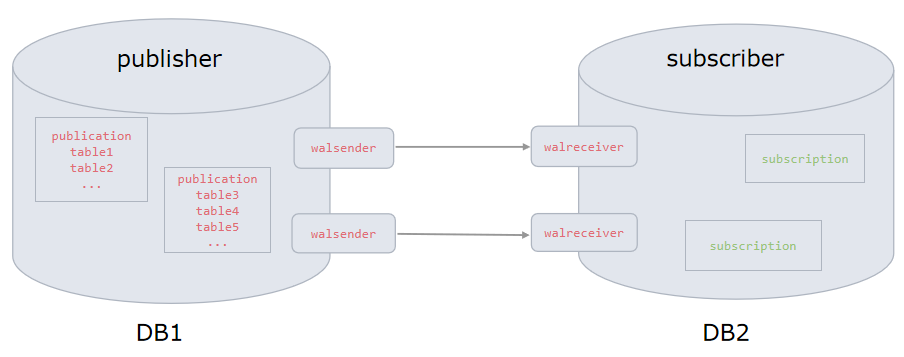
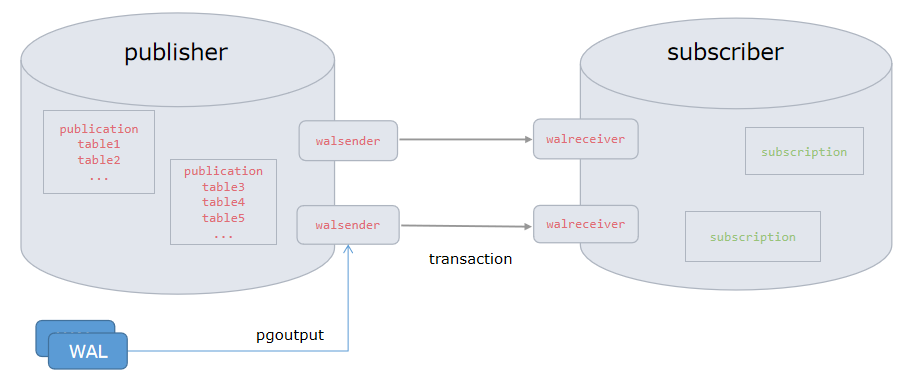

# Logical_Replication

**作者**

Chrisx

**日期**

2021-04-28

**内容**

逻辑复制 Logical Replication

ref [Logical Replication](https://www.postgresql.org/docs/13/logical-replication.html)

---

[toc]

## 1逻辑复制介绍

类似于流复制，逻辑复制也用于实现数据的同步。两者都是基于WAL日志实现。但又有一些区别。下面我们就来看一逻辑复制的实现方式。

逻辑复制是一种根据数据对象的复制标识（通常是主键）复制数据对象及其更改的方法。逻辑复制是 Postgresql10 引入的新特性( 内核 )。不同于流复制，逻辑复制允许对数据复制和安全性进行细粒度控制，如实现部分表复制；同时逻辑备库支持读写操作。 Postgresql 可同时支持物理复制和逻辑复制。

逻辑复制使用发布`publication`和订阅`subscription`模型,数据库中可以创建多个发布或订阅对象。一个订阅者可订阅多个发布。一个发布者也可以对应不同的订阅。订阅者从他们订阅的发布中提取数据,实现数据同步。订阅者也可以重新发布数据,以允许级联复制或更复杂的配置



## 2适用场景

基于逻辑复制实现方式，其能够适用于更广泛的场景。如下是一些典型场景应用

* 细粒度同步。可细粒度控制表及表上的DML操作。
* 数据集中。可将多个数据库的数据集中到一个数据库中
* 数据分发。可将一个数据库的数据分发到多个数据库中
* 跨大版本升级。
* 实现跨平台同步。
* 快速初始化基础数据

## 3发布（ publication ）和发布者（ publisher ）

<!--A publication can be defined on any physical replication master. The node where a publication is defined is referred to as publisher-->

可以在任何物理复制主节点上定义发布，定义发布的节点称为发布者。发布是从一个表或者一组表生成的change的集合。也就是同步表的集合。

* 发布可以选择 INSERT, UPDATE, and DELETE 任意组合，默认是所有操作类型
* 发布的表必须配置 'replica identity'通常是主键！也可以是唯一索引，如果没有合适的 key ，复制标识可以设置为 'full' 这意味着整个行是 key ，但这样效率非常低。
* 发布者配置了 ‘replica identity', 订阅者也需要配置相同的复制标识。如果没有 ‘replica identity’ ， update ， delete 会受到影响，但 insert 不会
* 发布有相关字典视图pg_catalog.pg_publication

:warning: 注意，一个发布者可以有多个发布，但是要确保发布对象不重叠

发布使用以下命令创建

```sql
CREATE PUBLICATION
or
CREATE PUBLICATION for table test_t1;
```

* for table 关键字指定加入到发布的表列表，仅支持普通表，临时表，外部表，视图，物化视图分区表暂不支持，如果想将分区表添加到发布中，需逐个添加分区表分区到发布
* for all tables ，发布包括全库，包括之后新建的表

表可以使用以下语句动态的添加和删除

```sql
ALTER PUBLICATION NAME ADD TABLE/ DROP TABLE
```

## 4订阅（ Subscription ）和订阅者（ subscriber ）

<!--A subscription is the downstream side of logical replication. The node where a subscription is defined is referred to as the subscriber.-->

订阅是逻辑复制的下游端。定义订阅的节点称为订阅者。

* 订阅者也可以作为发布者，级联发布。行为和发布者一样
* 每个订阅都需要一个 replication slot 接收 数据变化（change） ，初始化数据时需要额外的临时复制槽

:warning: 注意，通常，复制槽是在使用CREATE SUBSCRIPTION创建订阅是自动创建的，并且在使用DROP SUBSCRIPTION删除订阅时，复制槽也会自动被删除。特殊情况可以考虑将订阅与复制槽分开创建或删除。如果订阅被单独删除，复制槽应该被手动删除。否则它将会继续保留WAL并且最终可能会导致磁盘被填满。

* 逻辑复制可以作为同步流复制的 standby 端（但相比流复制，逻辑复制的性能较低）
* 订阅被删除并且重建时，数据需要重新同步
* 模式对象的定义（schema）无法被复制，需要提前创建创建模式对象
* 发布的表结构必须在订阅端已存在，只能用于复制常规表，无法复制其他对象，如视图
* 发布和订阅的表名必须相同
* 列的名字必须相同，列顺序可以不同，但列类型必须相同，目标端可以有额外的列，它们将被默认值填充

:warning: 注意，一个订阅者可以有多个订阅，但是要确保订阅对象不重叠

订阅使用以下的语句创建

```sql
CREATE SUBSCRIPTION
```

订阅停止使用 / 重用可使用以下的语句

```sql
ALTER SUBSCRIPTION
```

移除使用以下的语句

```sql
DROP SUBSCRIPTION.
```

## 5体系结构



逻辑复制的过程如下

1. 初始化快照

* 发布表的初始数据会被快照到订阅端。初始化快照过程会创建临时复制槽使用。
* 快照的过程是自动的，是一种类似`copy`的方式，支持多表并行。
* 数据拷贝完成后，进入同步模式。

2. 同步模式

* 发布端walsender process从WAL（REDO）日志中逻辑解码，此处会加载标准逻辑解码插件 `pgoutput`，pgoutput 把从WAL中读取的更改进行转换，根据发布定义的表以及过滤条件（ INSERT\UPDATE\DELETE ）过滤数据，按事务组装复制的数据。组装的事务通过流复制协议传输到备端。
* applyapply process 会按照事务的先后顺序应用更改到对应的表。

理解逻辑解码

逻辑解码是一种将对数据库表的所有持久更改抽取成一种清晰、易于理解的格式的处理方法。

1. 查看逻辑解码的内容
ref [49.1. Logical Decoding Examples](https://www.postgresql.org/docs/14/logicaldecoding-example.html)

```sql
postgres=# SELECT * FROM pg_logical_slot_get_changes('regression_slot', NULL, NULL);
    lsn    |  xid  |                          data                           
-----------+-------+---------------------------------------------------------
 0/BA5A688 | 10298 | BEGIN 10298
 0/BA5A6F0 | 10298 | table public.data: INSERT: id[integer]:1 data[text]:'1'
 0/BA5A7F8 | 10298 | table public.data: INSERT: id[integer]:2 data[text]:'2'
 0/BA5A8A8 | 10298 | COMMIT 10298
(4 rows)

```

2. 逻辑解码使用复制槽

* 在逻辑复制的环境下，一个槽表示一个更改流。逻辑解码生成的数据更改都会放在逻辑复制槽中。
* 只有在检查点时才会持久化每一个槽的当前位置，因此如果发生崩溃，槽可能会回到一个较早的 LSN，这会导致服务器重启时再次发送最近的更改。 逻辑解码客户端负责避免多次处理同一消息导致的副作用。
* 逻辑复制槽完全不知道接收者的状态，复制槽中的更改会一直保留，直到有客户端读取消费更改。复制槽一直保留数据会大量占用磁盘空间，且对应的数据不能被vacuum可能造成事务回卷数据库被关闭的风险，因此，不需要复制槽时，应该删除它。
* 复制槽重建后，目标端会按照新的复制槽开始数据复制，这样会导致中间有事务的缺失。


## 6冲突 Conflicts

同步的数据违反约束逻辑复制将会停止，这叫做冲突（conflict）。发生冲突时需要人工介入可以通过更改订阅服务器上的数据, 使其不会与传入的更改冲突；也可跳过与现有数据冲突的事务。通过调用 pg_replication_origin_advance () 函数与订阅名称对应的 node_name 和位置 , 可以跳过该事务。

冲突解决方法

1. 通过修改订阅端的数据，解决冲突。例如 insert 违反了唯一约束时，可以删除订阅端造成唯一约束冲突的记录先 DELETE 掉。然后使用 ALTER SUBSCRIPTION name ENABLE 让订阅继续。
2. 在订阅端调用 pg_replication_origin_advance(node_name text, pos pg_lsn) 函数跳过事务。node_name对应订阅的名字，pos对应开始一个lsn位置。
当前lsn位置可以在pg_replication_origin_status系统视图中查看。

<!--
The transaction can be skipped by calling the pg_replication_origin_advance() function with a node_name corresponding to the subscription name, and a position. The current position of origins can be seen in the pg_replication_origin_status system view.

```sql
select * from pg_replication_origin_status;
select pg_replication_origin_advance('p1_slot_sub', '0/A024830');

```

node_name是复制源的名字？
-->

## 7限制 Restrictions

1. 不支持数据库模式（schema）和DDL命令。
2. 序列数据未被复制
3. 不支持TRUNCATE命令。（pg11及以上版本开始支持truncate。Replication of TRUNCATE commands is supported）
4. 不支持复制大型对象
5. 只能从基表复制到基表。

## 8监控 Monitoring

* 逻辑复制使用的是流复制协议，与流复制监控类似，在主库可查询视图`pg_stat_replication`。.每一个订阅（subcription） 都有一条记录。
* 逻辑复制在备库可以查询视图`from pg_stat_subscription`、`pg_subscription_rel`，监控订阅信息。
* 复制源的重放进度可以在视图`pg_replication_origin_status`中看到，使用延迟复制时，需要查询此视图监控重放进度。

订阅节点执行以下语句，监控延迟。

```sql
postgres=# select *,pg_wal_lsn_diff(latest_end_lsn,received_lsn) replay_delay from pg_stat_subscription;
-[ RECORD 1 ]---------+------------------------------
subid                 | 16392
subname               | sub1
pid                   | 1018
relid                 |
received_lsn          | 1/1D000A70
last_msg_send_time    | 2019-06-17 10:49:14.346386+08
last_msg_receipt_time | 2019-06-17 10:49:14.354379+08
latest_end_lsn        | 1/1D000A70
latest_end_time       | 2019-06-17 10:49:14.346386+08
replay_delay          | 0   《《《《《《《《《《《表示 WAL 日志应用延迟，单位为字节。 0 表示无延迟
```

发布节点执行以下语句，监控延迟

```sql
postgres=#  select *,pg_wal_lsn_diff(pg_current_wal_lsn(),replay_lsn) replay_delay from pg_stat_replication;
-[ RECORD 1 ]----+------------------------------
pid              | 1133
usesysid         | 111311
usename          | logicalrep
application_name | sub1
client_addr      | 192.168.6.13
client_hostname  |
client_port      | 40378
backend_start    | 2019-06-17 09:29:22.810877+08
backend_xmin     |
state            | streaming 《《《《《《《《复制状态正常
sent_lsn         | 1/1D000A70
write_lsn        | 1/1D000A70
flush_lsn        | 1/1D000A70
replay_lsn       | 1/1D000A70
write_lag        |
flush_lag        |
replay_lag       |
sync_priority    | 0
sync_state       | async
replay_delay     | 0 《《《《《《《《《《《表示 WAL 日志应用延迟，单位为字节。 0 表示无延迟
```

## 9安全和权限 Security

1. 用于复制数据的角色必须具有复制权限（或是超级用户）。角色的访问权限必须在pg_hba.conf中配置，并且必须具有LOGIN权限。
2. 发布端 wal_level 必须设置为 logical ，以支持逻辑复制
3. 发布端角色需要有发布表的 select 权限
4. 使用某个用户在某个数据库中创建 publication ，这个用户必须对该数据库具备create权限。

## 10配置设置 Configuration Settings

ref [logical_replication_case](./logical_replication_case.md)