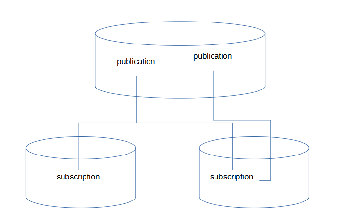

# Logical Replication

**作者**

Chrisx

**日期**

2021-04-28

**内容**

Logical Replication

ref [Logical Replication](https://www.postgresql.org/docs/13/logical-replication.html)

---

[toc]

## 1逻辑复制介绍

逻辑复制是一种根据数据对象的复制标识（通常是主键）复制数据对象及其更改的方法。我们通常使用流复制同步数据，物理复制使用精确的块地址和逐字节复制。与物理复制不同，逻辑复制允许对数据复制和安全性进行细粒度控制。

逻辑复制是 Postgresql10 引入的新特性( 内核 )。逻辑复制一种根据数据对象的复制标识 ( 通常是主键 ) 复制数据对象及其更改的方法。不同于物理复制，逻辑复制允许对数据复制和安全性进行细粒度控制，如实现部分表复制；同时逻辑备库支持读写操作。 Postgresql 可同时支持物理复制和逻辑复制。
逻辑复制使用`发布（ publication ）`和` 订阅（ subscription ） `模型 , 其中一个或多个订阅者订阅发布者节点上的一个或多个发布。订阅者从他们订阅的发布中提取数据 , 然后可能重新发布数据 , 以允许级联复制或更复杂的配置。



## 2适用场景

- 对单个数据库或部分表进行增量同步复制
- 多库数据数据采集、集中
- 跨大版本同步，跨版本升级
- 实现跨平台同步
- 不支持 ddl ，只支持基本表
- 往一个数据库中批量导入部分表！

## 3发布（ publication ）和发布者（ publisher ）

<!--A publication can be defined on any physical replication master. The node where a publication is defined is referred to as publisher-->

**可以在任何物理复制主节点上定义发布，定义发布的节点称为发布者。发布是从一个表或者一组表生成的改变的集合**

- 发布可以选择 INSERT, UPDATE, and DELETE 任意组合，默认是所有操作类型

> 注意，PG11开始支持truncate操作类型。

- 发布的表必须配置 'replica identity'通常是主键！也可以是唯一索引，如果没有合适的 key ，复制标识可以设置为 'full' 这意味着整个行是 key ，但这样效率非常低。
- 发布者配置了 ‘replica identity', 订阅者也需要配置相同的复制标识。如果没有 ‘replica identity’ ， update ， delete 会受到影响，但 insert 不会
- 发布有相关字典视图pg_catalog.pg_publication

> 注意，一个发布者可以有多个发布，但是要确保发布对象不重叠

发布使用以下命令创建

```sql
CREATE PUBLICATION
or
CREATE PUBLICATION for table test_t1;
```

for table 关键字制定加入到发布的表列表，仅支持普通表，临时表，外部表，视图，物化视图分区表暂不支持，如果想将分区表添加到发布中，需逐个添加分区表分区到发布
for all tables ，发布包括全库，包括新建表

表可以使用以下语句动态的添加和删除

```sql
ALTER PUBLICATION NAME ADD TABLE/ DROP TABLE
```

## 4订阅（ Subscription ）和订阅者（ subscriber ）

<!--A subscription is the downstream side of logical replication. The node where a subscription is defined is referred to as the subscriber.-->

**订阅是逻辑复制的下游端。定义订阅的节点称为订阅者。**

- 订阅者也可以作为发布者，级联发布。行为和发布者一样
- 每个订阅都需要一个 replication slot 接收 change ，初始化数据时需要额外的临时复制槽

> 注意，通常，远程复制槽是在使用CREATE SUBSCRIPTION创建订阅是自动创建的，并且在使用DROP SUBSCRIPTION删除订阅时，复制槽也会自动被删除。特殊情况可以考虑将订阅与复制槽分开创建或删除。如果订阅被单独删除，复制槽应该被手动删除。否则它将会继续保留WAL并且最终可能会导致磁盘被填满。

- 逻辑复制可以作为同步流复制的 standby 端（但相比流复制，逻辑复制的性能较低）
- 订阅被删除并且重建时，数据需要重新同步
- 模式对象的定义（schema）无法被复制，需要提前创建创建模式对象
- 发布的表结构必须在订阅端已存在，只能用于复制常规表，如无法复制其他对象，如视图 view
- 发布和订阅的表名必须相同
- 列的名字必须相同，列顺序可以不同，但列类型必须相同，目标端可以有额外的列，它们将被默认值填充

> 注意，一个订阅者可以有多个订阅，但是要确保订阅对象不重叠

订阅使用以下的语句创建

```sql
CREATE SUBSCRIPTION
```

订阅停止使用 / 重用可使用以下的语句

```sql
ALTER SUBSCRIPTION
```

移除使用以下的语句

```sql
DROP SUBSCRIPTION.
```

## 5冲突 Conflicts

逻辑复制就是普通的 dml 操作，违反约束逻辑复制将会停止，这叫做 conflict 。
可以通过更改订阅服务器上的数据来完成该解决方案 , 使其不会与传入的更改冲突 , 也可跳过与现有数据冲突的事务。通过调用 pg_replication_origin_advance () 函数与订阅名称对应的 node_name 和位置 , 可以跳过该事务。

冲突修复方法,发生冲突人为手动解决，删除或者修改冲突数据，忽略该冲突。

1. 通过修改订阅端的数据，解决冲突。例如 insert 违反了唯一约束时，可以删除订阅端造成唯一约束冲突的记录先 DELETE 掉。然后使用 ALTER SUBSCRIPTION name ENABLE 让订阅继续。
2. 在订阅端调用 pg_replication_origin_advance(node_name text, pos pg_lsn) 函数跳过事务。

```sql
pg_replication_origin_advance(node_name text, lsn pg_lsn)

```

node_name 就是 subscription name ， pos 指重新开始的 LSN ，从而跳过有冲突的事务。

The transaction can be skipped by calling the pg_replication_origin_advance() function with a node_name corresponding to the subscription name, and a position. The current position of origins can be seen in the pg_replication_origin_status system view.

查看当前数据的位置

```sql
select * from pg_replication_origin_status;
```

## 6限制 Restrictions

- 1 The database schema and DDL commands are not replicated.
- 2 Sequence data is not replicated
- 3 TRUNCATE commands are not replicated.（pg11及以上版本开始支持truncate。Replication of TRUNCATE commands is supported）
- 4 large objects are not replicated
- 5 Replication is only possible from base tables to base tables.

## 7体系架构 Architecture

- 创建subscription后,先在发布端初始化快照数据，订阅端接收完快照后，发布端会从快照的这个 LSN 开始同步数据库操作。
- 发布端walsender process从WAL（REDO）日志中逻辑解码，此处会加载标准逻辑解码插件 `pgoutput` pgoutput 把从WAL中读取的更改进行转换，根据发布定义的表以及过滤条件（ INSERT\UPDATE\DELETE ）过滤数据，按事务组装复制的消息包。数据通过流复制协议传输到备端， applyapply process 会按照事务的先后顺序应用更改到对应的表。

> 注意,PostgreSQL 已支持逻辑复制，同时对逻辑复制增加了一个初始同步的增强功能，支持通过wal receiver协议跑`COPY`命令（已封装在逻辑复制的内核代码中），支持多表并行。也就是说，你可以使用PostgreSQL的逻辑复制，快速的（流式、并行）将一个实例迁移到另一个实例。

<!--
发布端修改订阅表时，在事务提交时，发布端依次发送下面的消息到订阅端

B(BEGIN)
R(RELATION)
I(INSERT)
C(COMMIT)
更新复制源 pg_replication_origin_status 中的 remote_lsn 和 local_lsn ，该位点对应于每个订阅表最后一次事务提交的位置。
k(KEEPALIVE)
k(KEEPALIVE) 2 个 keepalive 消息，会更新统计表中的位置
发布端 pg_stat_replication:write_lsn,flush_lsn,replay_lsn
发布端 pg_get_replication_slots():confirmed_flush_lsn
订阅端更新 pg_stat_subscription:latest_end_lsn
-->

## 8监控 Monitoring

The monitoring information about subscription is visible in `pg_stat_subscription` .
每一个 subcription 有一条记录，一个订阅可能有多个 active subscription workers 。

对于 pg 逻辑复制监控，可查询视图 pg_stat_subscription ，每一个订阅都会有一个记录。
订阅节点执行以下语句，监控延迟。

```sql
postgres=# select *,pg_wal_lsn_diff(latest_end_lsn,received_lsn) replay_delay from pg_stat_subscription;
-[ RECORD 1 ]---------+------------------------------
subid                 | 16392
subname               | sub1
pid                   | 1018
relid                 |
received_lsn          | 1/1D000A70
last_msg_send_time    | 2019-06-17 10:49:14.346386+08
last_msg_receipt_time | 2019-06-17 10:49:14.354379+08
latest_end_lsn        | 1/1D000A70
latest_end_time       | 2019-06-17 10:49:14.346386+08
replay_delay          | 0   《《《《《《《《《《《表示 WAL 日志应用延迟，单位为字节。 0 表示无延迟
```

逻辑复制使用的是流复制协议，与流复制监控类似，可查询 pg_stat_replication 。
发布节点执行以下语句，监控延迟

```sql
postgres=#  select *,pg_wal_lsn_diff(pg_current_wal_lsn(),replay_lsn) replay_delay from pg_stat_replication;
-[ RECORD 1 ]----+------------------------------
pid              | 1133
usesysid         | 111311
usename          | logicalrep
application_name | sub1
client_addr      | 192.168.6.13
client_hostname  |
client_port      | 40378
backend_start    | 2019-06-17 09:29:22.810877+08
backend_xmin     |
state            | streaming 《《《《《《《《复制状态正常
sent_lsn         | 1/1D000A70
write_lsn        | 1/1D000A70
flush_lsn        | 1/1D000A70
replay_lsn       | 1/1D000A70
write_lag        |
flush_lag        |
replay_lag       |
sync_priority    | 0
sync_state       | async
replay_delay     | 0 《《《《《《《《《《《表示 WAL 日志应用延迟，单位为字节。 0 表示无延迟
```

复制源的重放进度可以在 pg_replication_origin_status 视图中看到

## 9安全和权限 Security

The role used for the replication connection must have the REPLICATION attribute (or be a superuser). Access for the role must be configured in pg_hba.conf and it must have the LOGIN attribute.

1. 用于复制连接的角色必须有REPLICATION属性（或者是一个超级用户）。该角色的访问必须被配置在pg_hba.conf中，并且它必须有LOGIN属性。
2. 发布端 wal_level 必须设置为 logical ，以支持逻辑复制
3. 发布端角色需要有发布表的 select 权限
4. 使用某个用户在某个数据库中创建 publication ，这个用户必须对该数据库具备 create 权限。

## 10配置设置 Configuration Settings

On the publisher side

```sql
wal_level=logical
max_replication_slots -- 至少与订阅个数相同
max_wal_senders    -- 至少与 max_replication_slots 相同，进程来自 max_connections

```

The subscriber

```sql
max_replication_slots    -- 至少与订阅个数相同
max_worker_processes    -- 系统支持的最大后台进程数，至少 max_logical_replication_workers + 1
Sets the maximum number of background processes that the system can support. This parameter can only be set at server start. The default is 8.
max_logical_replication_workers  -- 至少与订阅个数相同，进程来自于 max_worker_processes
max_sync_workers_per_subscription ( integer )  -- 进程来自于 max_logical_replication_workers ，默认值是 2 ， 每个订阅的最大 并行进程数，控制订阅初始化期间或添加新表初始化时的并行量。目前每个表同步只能使用一个工作进程
```

最佳实践，建议值

```sql
pub:
alter system set max_replication_slots=20;
alter system set max_wal_senders=30;
#alter system set max_worker_processes=128;

sub:
alter system set max_replication_slots=20;
#alter system set max_worker_processes=128;
alter system set max_logical_replication_workers=30;
alter system set max_sync_workers_per_subscription=10;
```

## 11维护操作

1 发布中添加表、删除表

```sql
alter publication pub1 add table highgo.test_lr1;
alter publication pub1 drop table highgo.test_lr1;
```

2 逻辑复制启动和停止

```sql
alter subscription lipei_solt_sub disable;
alter subscription lipei_solt_sub enable;
```

3 立即同步

```sql
alter subscription sub1 refresh publication;
```

## 12 case

同步环境如下：
发布库（生产库）：10.247.32.16/rhel7.4/pg10.6
订阅库（报表库）：10.247.32.27/rhel7.4/pg10.6

客户根据业务逻辑，统计了需要同步的表（约568张表，全部属于模式对象xxx）。这些表分成10个通道同步。

查看[同步表](./script/tablelg.xls)

### 初始化表结构

根据同步要求。订阅端导入表结构时，需进行过滤，并导入到其他表空间。

- 过滤：不导入函数、触发器、序列、授权语句、外键
- 导入表空间：数据导入到表空间tbs_other、索引导入到表空间tbs_otheridex

1 使用pg的_dump导出模式对象xxx下的所有表表结构

```sql
pg_dump -p 6432 -U postgres -s -n xxx -Fc -v -f /backup/pgdump/xxx.dump -d xxx
```

2 对dump文件过滤，过滤掉函数、触发器、序列、外键

```sql
pg_restore -l /backup/pgdump/xxx.dump  | grep -v -E "FUNCTION|TRIGGER|SEQUENCE|FK" > /backup/pgdump/xxx_nofun_notrig_noseq_nofk.dump
```

3 在以上基础上过滤掉授权语句。并将dump文件导入成sql文本

```sql
pg_restore -x -L /backup/pgdump/xxx_nofun_notrig_noseq_nofk.dump  /backup/pgdump/xxx.dump > /backup/pgdump/xxx_nofun_notrig_noseq_nofk_nogrant.sql
```

4 由于过滤掉了序列对象，而表中的列引用了序列。还需要修改sql文本，去掉对序列的引用

去掉带有DEFAULT nextval的语句
然后将表和索引放到两个sql脚本中，
最后修改sql脚本中的表空间参数，建表脚本设置SET default_tablespace = 'tbs_other';，建索引脚本设置SET default_tablespace = 'tbs_otheridex';

5 导入数据

```sql
\i /bakcup/pgdump/xxx_nofun_notrig_noseq_nofk_nogrant_table_nodefaultnext.sql
```

6 导入索引

```sql
\i /bakcup/pgdump/xxx_nofun_notrig_noseq_nofk_nogrant_index.sql
```

### 发布端 publisher

1 修改参数

```sql
alter system set wal_level=logical;
alter system set max_replication_slots=30;
alter system set max_wal_senders=40;
alter system set max_logical_replication_workers=40;
alter system set max_sync_workers_per_subscription=10;

```

重启生效
pg_ctl restart

2 发布节点创建逻辑复制用户

```sql
create user logicalrep replication login encrypted password 'logicalrep';
```

修改同步用户密码

```sql
alter user logicalrep with password 'xxx';
```

给同步用户授权

```sql
grant usage on schema sgiprod to logicalrep;
grant select on all tables in schema sgiprod to logicalrep;
grant all on database postgres to logicalrep;
```

3 发布节点创建发布

```sql
create publication xxx_slot;
create publication xxx_slot;
create publication xxx_slot;
create publication xxx_slot;
create publication xxx_slot;
create publication xxx_slot;
create publication xxx_slot;
create publication xxx_slot;
create publication xxx_slot;
create publication xxx_slot;

or

create publication xxx_slot FOR ALL TABLES; --自动将所有的表加入publication
```

查询发布

```sql
select * from pg_publication;
```

pubowner ，发布的属主，与 pg_user 视图中的 usersysid 关联

4 配置 replication 网络访问控制

pg_hba.conf

```bash
# logical replication
host    all     logicalrep      10.247.32.27/32         md5
host    replication     all     10.247.32.27/32         md5
```

加载生效
pg_ctl reload

### 订阅节点配置 subscriber

1 参数配置

```sql
--alter system set wal_level=logical;
alter system set max_replication_slots=30;
alter system set max_wal_senders=40;
alter system set max_logical_replication_workers=40;
alter system set max_sync_workers_per_subscription=10;
```

重启生效
pg_ctl restart

2 配置密码文件

```bash
$ chmod 0600 .pgpass
$ cat .pgpass
#
10.247.32.16:6432:*:logicalrep:logicalrep
```

3 订阅节点创建订阅

```sql
create subscription xxx_slot_sub connection 'host=10.247.32.16 port=6432 dbname=xxx user=logicalrep' publication xxx_slot;
create subscription xxx_slot_sub connection 'host=10.247.32.16 port=6432 dbname=xxx user=logicalrep' publication xxx_slot;
create subscription xxx_slot_sub connection 'host=10.247.32.16 port=6432 dbname=xxx user=logicalrep' publication xxx_slot;
create subscription xxx_slot_sub connection 'host=10.247.32.16 port=6432 dbname=xxx user=logicalrep' publication xxx_slot;
create subscription xxx_slot_sub connection 'host=10.247.32.16 port=6432 dbname=xxx user=logicalrep' publication xxx_slot;
create subscription xxx_slot_sub connection 'host=10.247.32.16 port=6432 dbname=xxx user=logicalrep' publication xxx_slot;
create subscription xxx_slot_sub connection 'host=10.247.32.16 port=6432 dbname=xxx user=logicalrep' publication xxx_slot;
create subscription xxx_slot_sub connection 'host=10.247.32.16 port=6432 dbname=xxx user=logicalrep' publication xxx_slot;
create subscription xxx_slot_sub connection 'host=10.247.32.16 port=6432 dbname=xxx user=logicalrep' publication xxx_slot;
create subscription xxx_slot_sub connection 'host=10.247.32.16 port=6432 dbname=xxx user=logicalrep' publication xxx_slot;
```

上面的语句将开始复制过程，它会同步表users以及departments的初始表内容，然后开始复制对那些表的增量更改。

查询发布节点，订阅在发布节点上创建了逻辑复制槽

```sql
select slot_name,plugin,slot_type,database,active,restart_lsn from pg_replication_slots;
```

3 订阅节点查询订阅信息

```sql
select * from pg_subscription;
```

### 同步数据，添加同步表

> 注意，以chengbao_solt为例

此时逻辑复制已经开始，但无同步数据，因为发布中没有对象

日志显示

```bash
2019-03-15 11:21:12.641 CST,"logicalrep","postgres",1552,"192.168.6.13:47548",5c8b1a28.610,2,"idle",2019-03-15 11:21:12 CST,5/0,0,LOG,00000,"logical decoding found consistent point at 0/7E004BB0","There are no running transactions.",,,,,,,,"sub1"
2019-03-15 11:25:35.111 CST,,,1454,,5c8b160a.5ae,3,,2019-03-15 11:03:38 CST,,0,LOG,00000,"received SIGHUP, reloading configuration files",,,,,,,,,""
subscriber
2019-03-15 11:39:53.187 CST,,,1347,,5c8b1e89.543,1,,2019-03-15 11:39:53 CST,3/2,0,LOG,00000,"logical replication apply worker for subscription ""sub1"" has started",,,,,,,,,""
```

1 发布节点添加同步表

```sql
alter publication chengbao_solt add table sgiprod.gupolicymain;
alter publication chengbao_solt add table sgiprod.gupolicyrisk;
alter publication chengbao_solt add table sgiprod.gupolicyriskexpensemisc;
```

2 订阅节点手动刷新数据

```sql
alter subscription chengbao_solt_sub refresh publication;
```

> 请注意，向已订阅的发布添加表将需要 ALTER SUBSCRIPTION ... REFRESH PUBLICATION 操作，以便生效。

3 订阅节点subscriber 再次查询数据同步

```sql
select count(*) from sgiprod.gupolicymain;
select count(*) from sgiprod.gupolicyrisk;
select count(*) from sgiprod.gupolicyriskexpensemisc;
```

### logical replication 同步状态查看

1 状态查看

```sql
select pid,usename,application_name,client_addr,state,replay_lsn,replay_lag,sync_state from pg_stat_replication;
```

2 主备库有相关的发布和订阅进程

```bash
发布
pg 1463 1454 0 11:03 ? 00:00:00 postgres: bgworker: logical replication launcher
pg 1587 1454 0 11:39 ? 00:00:00 postgres: wal sender process logicalrep 192.168.6.13(47550) idle
订阅
postgres 1346 1338 0 11:39 ? 00:00:00 postgres: bgworker: logical replication launcher
postgres 1347 1338 0 11:39 ? 00:00:00 postgres: bgworker: logical replication worker for subscription 16391
```

3 查询发布中的表列表

```sql
\dRp+
or
select * from pg_publication_tables;
```

## 13其他操作

### 添加同步表（ add ）

1. 订阅节点导入表结构
2. 发布节点添加发布表
alter publication pub1 add table highgo.test_lr1;
4. 发布节点授予逻辑复制用户权限
grant usage on schema highgo to logicalrep ;
grant select on highgo.test_lr1 to logicalrep;
5. 执行刷新命令初始化数据
alter subscription sub1 refresh publication;
可通过表 pg_subscript 查看 sub 与 pub 的对应关系，来确定刷新那个 sub
6. 查看主备数据是否一致。

> 注意：加表时应避免业务高峰期。如月末结算等。

### 重新同步表（ resync ）

如果想重新同步表数据，不能在原表的基础上增量同步，必须删除重新同步

1. 主库从发布删除表
alter publication test_slot drop table public.test_lr;
2. 订阅端删除表
drop table test_lr;

> 注意，不要使用truncate，否则只会增量同步

3. 订阅端重新导入表结构
4. 主库将表加入发布
alter publication test_slot add table public.test_lr;
4. 订阅端初手动刷新数据
alter subscription test_slot_sub refresh publication;

### 重新同步订阅中的所有表

1. 禁用订阅
alter subscription test_slot_sub disable;
2. 删除订阅
drop subscription test_slot_sub;
3. 订阅端删除表
4. 订阅端导入表结构
5. 创建订阅
create subscription test_slot_sub connection 'host=192.168.6.141 port=5966 dbname=highgo user=logicalrep' publication test_slot;

> 注意，删除订阅后，本地的表不会被删除，数据也不会清除，仅仅是不在接收该订阅的上游信息。删除订阅后，如果要重新使用该订阅，数据需要resync

## 逻辑解码

查看逻辑解码的内容

```sql
-- 使用输出插件'test_decoding'创建一个名为'regression_slot'的槽
SELECT * FROM pg_create_logical_replication_slot('regression_slot', 'test_decoding');
SELECT slot_name, plugin, slot_type, database, active, restart_lsn, confirmed_flush_lsn FROM pg_replication_slots;

-- 目前还看不到更改
SELECT * FROM pg_logical_slot_get_changes('regression_slot', NULL, NULL);

CREATE TABLE data(id serial primary key, data text);
-- DDL 没有被复制，因此你将看到的东西只有事务
SELECT * FROM pg_logical_slot_get_changes('regression_slot', NULL, NULL);

-- 读到更改，它们会被消费掉并且不会在一个后续调用中被发出：
SELECT * FROM pg_logical_slot_get_changes('regression_slot', NULL, NULL);

BEGIN;
INSERT INTO data(data) VALUES('1');
INSERT INTO data(data) VALUES('2');
COMMIT;

SELECT * FROM pg_logical_slot_get_changes('regression_slot', NULL, NULL);


    lsn    | xid |                          data
-----------+-----+---------------------------------------------------------
 0/45C3CD8 | 802 | BEGIN 802
 0/45C3CD8 | 802 | table public.data: INSERT: id[integer]:3 data[text]:'3'
 0/45C3D88 | 802 | COMMIT 802
(3 rows)


-- 当不再需要一个槽后记住销毁它以停止消耗服务器资源：
SELECT pg_drop_replication_slot('regression_slot');

```

可以为逻辑解码增加更多输出方法

## 实验

级联逻辑复制测试

<!--
1 schema必须一致，否则报错

postgres=# alter subscription test_slot_sub refresh publication;
ERROR:  schema "test" does not exist
postgres=#

2 数据库，表空间可以不一致。
3 主段发布3个表，订阅端只订阅一个表不可以，订阅是针对整个发布的。
4 ERROR,XX000,"could not start WAL streaming: 错误:  42704: 复制槽名 ""sub1"" 不存在",,,,,,,,,""

注：在实施完成后在发布端把这个复制槽相关信息记录下来，否则复制槽消失后查询不到此记录，主要记录slot_name.plugin等

也就是说需要创建与订阅相同名字的复制槽。
5 可以对订阅端的数据进行修改  但是切记不要修改主键数据      修改其他数据无所谓，数据同步的时候会以主端同步更新，不管你对非主键数据进行了何种修改
-->
