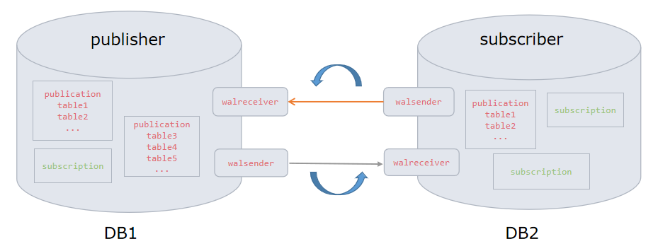

# logical_replication_bi-directional

**作者**

Chrisx

**日期**

2021-12-12

**内容**

逻辑复制双向同步解决方案

ref [Replication Progress Tracking](https://www.postgresql.org/docs/14/replication-origins.html)

---

[toc]

## 双向同步



优点

* 双活对等。均可对外提供服务
* 提高资源利用率
* 故障切换快速，无感知。

问题

* 循环复制

## 复制进度追踪

复制源是为了更容易地在逻辑解码上实现逻辑复制解决方案而设计。它们提供了对两种常见问题的解决方案：

* 如何安全地跟踪复制进度？
* 如何基于一行的来源更改复制行为？例如，阻止双向复制 设置中的循环

可以使用函数 pg_replication_origin_create()创建复制源，使用函数 pg_replication_origin_drop()删除复制源，并且在系统目录 pg_replication_origin中查看复制源。

## 复制源解决方式

所有复制源的重放进度可以在 pg_replication_origin_status 视图中看到。一个源的进度（例如在继续复制时）可以使用 pg_replication_origin_progress()（用于任何源）或者 pg_replication_origin_session_progress() （用于在当前会话中配置的源）获得。

针对复制中的循环，复制源提供了一种可选的机制 来识别和阻止这种问题。在使用前一段提到的函数配置时，每一个被传递 给输出插件回调（见第 49.6 节）的由该会话生成的改变和事务会被标记上该会话的复制源。这使得可以在输出插件中以不同的方式 对待它们，例如忽略除本地生成的行之外的所有行。此外， filter_by_origin_cb回调可以被用来基于来源过滤逻辑解码改变流。虽然灵活性较低，通过这种回调进行过滤比用输出插件过滤效率更高。

## 其他解决方式

pglogical插件

```sql
select pglogical.create_subscription(
        subscription_name := 'subscription_12',
        replication_sets := array ['default'],
        provider_dsn := 'host=192.168.6.11 port=5434 dbname=postgres',
        forward_origins := array []::text []
    );

forward_origins – array of origin names to forward, currently only supported values are empty array meaning don’t forward any changes that didn’t originate on provider node, or “{all}” which means replicate all changes no matter what is their origin, default is “{all}”

表示不转发非源节点的任何更改。实现双向同步。

```

ref [pglogical](./pglogical.md)
