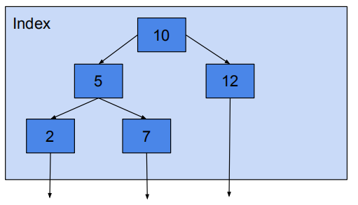

# performance_turning_sql

PostgreSQL部署上之后，经过一段时间的运行，我们比较关心那些SQL运行时间比较长，或者说那些SQL执行的特别慢，拖累的性能，只有找到这些SQL，才能有针对性地对这些SQL进行优化，提升PostgreSQL的性能。

## scan

### Index scan

Fetch one tuple-pointer at a time from the index
● Immediately visits that tuple in the table

### Index Only Scan

Read Index Tree, But Don’t Read Heap Pages

### Sequential Scan

Scans the tuples from one end to another end discarding all unmatched rows

### Bitmap Index or Heap Scan

Bitmap scans are good compromise / middle ground between Sequential Scan and Index scan

1. A bitmap scan fetches all the tuple-pointers from the index in one go
2. Sorts them using an in-memory "bitmap" data structure
3. Then visits the table tuples in physical tuple-location order.
4. Recheck for filtering condition

好处++
The bitmap scan improves locality of reference to the table
坏处--
bookkeeping overhead to manage the "bitmap" data structure
data is no longer retrieved in index order

https://yq.aliyun.com/articles/662100

传统的index scan每次从索引中去取一个tuple的指针，然后立马去表中取数据，每一次会造成一次随机io。如果数据量较多的情况下，会比较低效。而bitmap scan一次性将符合条件的tuple-pointers全部取出来，然后在内存中进行地址（tuple-location）排序，然后去取出数据，这时的读取数据由于进行的地址排序，读取时就变成了顺序的读。其实就是一个随机读转化为顺序读取的过程，但是取出的数据由于进行了地址的排序，就没有顺序。同时，对于limit这种sql，bitmap index scan这种就不适合，因为它一次会取出所有数据。

### Nested loop join

Right relation is scanned once for every row found in the left
relation
● Good strategy if index scan is possible on Right relation

一个大表一个小表

### Hash Joins

● Equi Joins
● In memory
● Generally the fastest

优化器使用两个表中较小（相对较小）的表利用Join Key在内存中建立散列表，然后扫描较大的表并探测散列表，找出与Hash表匹配的行。这种方式适用于较小的表完全可以放于内存中的情况。
这种方式适用于较小的表完全可以放于内存中的情况，这样总成本就是访问两个表的成本之和。但是在表很大的情况下并不能完全放入内存，这时优化器会将它分割成若干不同的分区，不能放入内存的部分就把该分区写入磁盘的临时段，此时要求有较大的临时段从而尽量提高I/O 的性能。它能够很好的工作于没有索引的大表和并行查询的环境中，并提供最好的性能。大多数人都说它是Join的重型升降机。Hash Join只能应用于等值连接(如WHERE A.COL3 = B.COL4)，这是由Hash的特点决定的。

### Merge Joins

● Relations are Sorted on the join attributes
● Equi-Join
● If data to join is too big to fit in memory

通常情况下Hash Join的效果都比排序合并连接要好，然而如果两表已经被排过序，在执行排序合并连接时不需要再排序了，这时Merge Join的性能会优于Hash Join。Merge join的操作通常分三步：
　　1. 对连接的每个表做table access full;
　　2. 对table access full的结果进行排序。
　　3. 进行merge join对排序结果进行合并。
在全表扫描比索引范围扫描再进行表访问更可取的情况下，Merge Join会比Nested Loop性能更佳。当表特别小或特别巨大的时候，实行全表访问可能会比索引范围扫描更有效。Merge Join的性能开销几乎都在前两步。Merge Join可适于于非等值Join（>，<，>=，<=，但是不包含!=，也即<>）

Nested Loop，Hash JOin，Merge Join对比

类别	Nested Loop	Hash Join	Merge Join
使用条件	任何条件	等值连接（=）	等值或非等值连接(>，<，=，>=，<=)，‘<>’除外
相关资源	CPU、磁盘I/O	内存、临时空间	内存、临时空间
特点	当有高选择性索引或进行限制性搜索时效率比较高，能够快速返回第一次的搜索结果。	当缺乏索引或者索引条件模糊时，Hash Join比Nested Loop有效。通常比Merge Join快。在数据仓库环境下，如果表的纪录数多，效率高。	当缺乏索引或者索引条件模糊时，Merge Join比Nested Loop有效。非等值连接时，Merge Join比Hash Join更有效
缺点	当索引丢失或者查询条件限制不够时，效率很低；当表的纪录数多时，效率低。	为建立哈希表，需要大量内存。第一次的结果返回较慢。	所有的表都需要排序。它为最优化的吞吐量而设计，并且在结果没有全部找到前不返回数据。