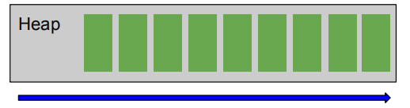
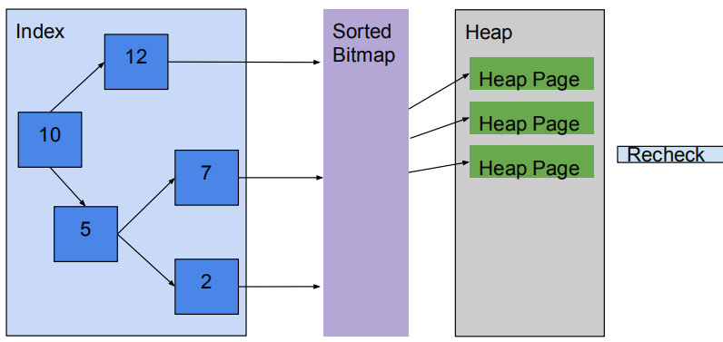

# performance_turning_sql

PostgreSQL部署上之后，经过一段时间的运行，我们比较关心那些SQL运行时间比较长，或者说那些SQL执行的特别慢，拖累的性能，只有找到这些SQL，才能有针对性地对这些SQL进行优化，提升PostgreSQL的性能。

## scan

### Index scan

Fetch one tuple-pointer at a time from the index
● Immediately visits that tuple in the table


### Index Only Scan

Read Index Tree, But Don’t Read Heap Pages


### Sequential Scan

Scans the tuples from one end to another end discarding all unmatched rows



### Bitmap Index or Heap Scan

Bitmap scans are good compromise / middle ground between Sequential Scan and Index scan

1. A bitmap scan fetches all the tuple-pointers from the index in one go
2. Sorts them using an in-memory "bitmap" data structure
3. Then visits the table tuples in physical tuple-location order.
4. Recheck for filtering condition



好处++
The bitmap scan improves locality of reference to the table
坏处--
bookkeeping overhead to manage the "bitmap" data structure
data is no longer retrieved in index order

https://yq.aliyun.com/articles/662100

传统的index scan每次从索引中去取一个tuple的指针，然后立马去表中取数据，每一次会造成一次随机io。如果数据量较多的情况下，会比较低效。而bitmap scan一次性将符合条件的tuple-pointers全部取出来，然后在内存中进行地址（tuple-location）排序，然后去取出数据，这时的读取数据由于进行的地址排序，读取时就变成了顺序的读。其实就是一个随机读转化为顺序读取的过程，但是取出的数据由于进行了地址的排序，就没有顺序。同时，对于limit这种sql，bitmap index scan这种就不适合，因为它一次会取出所有数据。


### Nested loop join

Right relation is scanned once for every row found in the left
relation
● Good strategy if index scan is possible on Right relation

一个大表一个小表

### Hash Joins

● Equi Joins
● In memory
● Generally the fastest

优化器使用两个表中较小（相对较小）的表利用Join Key在内存中建立散列表，然后扫描较大的表并探测散列表，找出与Hash表匹配的行。这种方式适用于较小的表完全可以放于内存中的情况。
这种方式适用于较小的表完全可以放于内存中的情况，这样总成本就是访问两个表的成本之和。但是在表很大的情况下并不能完全放入内存，这时优化器会将它分割成若干不同的分区，不能放入内存的部分就把该分区写入磁盘的临时段，此时要求有较大的临时段从而尽量提高I/O 的性能。它能够很好的工作于没有索引的大表和并行查询的环境中，并提供最好的性能。大多数人都说它是Join的重型升降机。Hash Join只能应用于等值连接(如WHERE A.COL3 = B.COL4)，这是由Hash的特点决定的。

### Merge Joins

● Relations are Sorted on the join attributes
● Equi-Join
● If data to join is too big to fit in memory

通常情况下Hash Join的效果都比排序合并连接要好，然而如果两表已经被排过序，在执行排序合并连接时不需要再排序了，这时Merge Join的性能会优于Hash Join。Merge join的操作通常分三步：
　　1. 对连接的每个表做table access full;
　　2. 对table access full的结果进行排序。
　　3. 进行merge join对排序结果进行合并。
在全表扫描比索引范围扫描再进行表访问更可取的情况下，Merge Join会比Nested Loop性能更佳。当表特别小或特别巨大的时候，实行全表访问可能会比索引范围扫描更有效。Merge Join的性能开销几乎都在前两步。Merge Join可适于于非等值Join（>，<，>=，<=，但是不包含!=，也即<>）

Nested Loop，Hash JOin，Merge Join对比

类别	Nested Loop	Hash Join	Merge Join
使用条件	任何条件	等值连接（=）	等值或非等值连接(>，<，=，>=，<=)，‘<>’除外
相关资源	CPU、磁盘I/O	内存、临时空间	内存、临时空间
特点	当有高选择性索引或进行限制性搜索时效率比较高，能够快速返回第一次的搜索结果。	当缺乏索引或者索引条件模糊时，Hash Join比Nested Loop有效。通常比Merge Join快。在数据仓库环境下，如果表的纪录数多，效率高。	当缺乏索引或者索引条件模糊时，Merge Join比Nested Loop有效。非等值连接时，Merge Join比Hash Join更有效
缺点	当索引丢失或者查询条件限制不够时，效率很低；当表的纪录数多时，效率低。	为建立哈希表，需要大量内存。第一次的结果返回较慢。	所有的表都需要排序。它为最优化的吞吐量而设计，并且在结果没有全部找到前不返回数据。

## 查询优化

ref [analyze]()
vacuum
index or reindex

<!--

# performance Query Optimization

## Does this query perform well enough for your system?

• What is your baseline?
• 607.057 ms can be extremely fast for OLAP
• But 607.057 ms * 10000 parallel queries on OLTP?
• 607.057 ms on 10 y.o. SATA disks vs modern SSD

## How to find the queries to optimize?

• Often it is useless to optimize all queries
• log_min_duration_statement = 100ms
Everything that’s in the logs is due for review
• pg_stat_statements
Lot’s of useful stuff inside
• Monitoring system of choice
Hopefully it has query info accumulated and ranged

nmon+nmon analyze

## Which queries to optimize first?

``` sql
/*总时间*/
SELECT sum(total_time) AS total_time,
sum(blk_read_time + blk_write_time) AS io_time,
sum(total_time - blk_read_time - blk_write_time) AS cpu_time,
sum(calls) AS ncalls,
sum(rows) AS total_rows
FROM pg_stat_statements
WHERE dbid IN (SELECT oid FROM pg_database WHERE datname=current_database())

/*cpu时间占比最高的sql*/
WITH ttl AS (
SELECT sum(total_time) AS total_time, sum(blk_read_time + blk_write_time) AS io_time,
sum(total_time - blk_read_time - blk_write_time) AS cpu_time,
sum(calls) AS ncalls, sum(rows) AS total_rows
FROM pg_stat_statements WHERE dbid IN (
SELECT oid FROM pg_database WHERE datname=current_database())
)
SELECT *,(pss.total_time-pss.blk_read_time-pss.blk_write_time)/ttl.cpu_time*100 cpu_pct
FROM pg_stat_statements pss, ttl
WHERE (pss.total_time-pss.blk_read_time-pss.blk_write_time)/ttl.cpu_time >= 0.05
ORDER BY pss.total_time-pss.blk_read_time-pss.blk_write_time DESC LIMIT 1;
```

编写报告
• Report operates with total_time, io_time and cpu_time, that is a difference
of the first two
• Report also normalizes queries and calculates md5 hash for faster
processing
• Main part of the report includes only those entries, that (any of the
conditions qualifies):

1. used more than 1% of total CPU or total IO time
2. returned more than 2% of all rows
3. had been called more than 2% of all query executions

• all other queries are combined into the other group
• report orders queries by total time spent, longest at the top

报告详细内容展示
total time: 19:59:57 (IO: 16.43%)
total queries: 200, 609, 344 (unique: 2, 342)
report for all databases, version 0.9.5 @ PostgreSQL 9.6.3
tracking top 10000 queries, utilities off, logging 100ms+ queries
=============================================================================================================
pos:1 total time: 05:38:45 (28.2%, CPU: 30.9%, IO: 14.5%) calls: 84, 592, 220 (42.17%) avg_time: 0.24ms (IO: 8.3%)
user: all db: all rows: 198, 391, 036 (24.34%) query:
other
=============================================================================================================
pos:2 total time: 04:59:15 (24.9%, CPU: 24.0%, IO: 29.9%) calls: 5, 610 (0.00%) avg_time: 3200.60ms (IO: 19.7%)
user: postgres db: --------- rows: 5, 608, 185 (0.69%) query:
WITH _deleted AS (DELETE FROM foos_2rm WHERE id IN (SELECT id FROM foos_2rm ORDER BY id LIMIT ?) RETURNING id)
DELETE FROM foos WHERE id IN (SELECT id FROM _deleted); 
=============================================================================================================
pos:3 total time: 00:45:06 (3.8%, CPU: 2.3%, IO: 11.1%) calls: 853, 864 (0.43%) avg_time: 3.17ms (IO: 48.6%)
user: ---------_background db: --------- rows: 164, 706 (0.02%) query:
SELECT "foo_stats_master".* FROM "foo_stats_master" WHERE (foo_stats_master.created_at >= ?) AND (foo_stats_master.created_at < ?)
AND "foo_stats_master"."action" IN (?, ?, ?, ?) AND ("foo_stats_master"."foo_board_id" IS NOT NULL)
AND "foo_stats_master"."user_ip_inet" = ? AND "foo_stats_master"."employer_id" = ?
ORDER BY "foo_stats_master"."created_at" DESC LIMIT ?

## So, we identified some queries to optimize

## EXPLAIN

• Any query can be prepended with EXPLAIN to see it’s execution plan
• EXPLAIN SELECT * FROM pg_database; 
QUERY PLAN
-----------------------------------------------------------
Seq Scan on pg_database (cost=0.00..0.16 rows=6 width=271)
(1 row)

## What is execution plan?

Query goes through several stages in it’s lifecycle

1. Connection
2. Parser
3. Rewrite system
4. Planner / Optimizer
5. Executor ↔ [Workers]
6. Send results

• Planner prepares a plan for executor

• It is a tree
• Nodes and operations on them
• Planner uses statistics to chose the optimal plan

EXPLAIN SELECT * FROM pg_database; 
QUERY PLAN
-----------------------------------------------------------
Seq Scan on pg_database (cost=0.00..0.16 rows=6 width=271)
(1 row)

Seq Scan type of node operation
on pg_database object of node operation
cost=0.00..0.16 cost of the node
rows=6 estimated rows
width=271 average width of a row

## Types of node operations

• Parallel Seq Scan N parallel sequential scan of whole relation
• Index Scan N targeted random IO (read index + read table)
• Index Only Scan N read only from index2 • Bitmap Index Scan N prepare a map of rows to read from relation, 
possibly combining maps from several indexes
• Bitmap Heap Scan N use map from Bitmap Index Scan and read rows
from relation, always follows Bitmap Index Scan
• CTE Scan - read from Common Table Expression (WITH Block) • Function Scan - read results, returned by a function

## Cost of the node. Startup and total cost.

• A cost of fetching 8K block sequentially
• Cost is a relative value: a cost of 10 is 10× greater than a cost of 1
explain select * from posts order by id limit 5; 
QUERY PLAN
--------------------------------------------------------------------------------------
Limit (cost=0.29..0.46 rows=5 width=28)
-> Index Scan using posts_pkey on posts (cost=0.29..347.29 rows=10000 width=28)
(2 rows)
• 0.29 + (347.29 - 0.29)*5/10000 = 0.4635

## rows×width

• Rows × width of a root node gives a clue of a result size in bytes
• Even if the query is fast, lots of it’s calls can cause a huge traffic between
database and an application
• Thats why SELECT∗ is not a good idea

## Operations on nodes

• join – joins data from two nodes using appropriate join method
• sort – various methods of sorting
• limit – cuts the dataset off 
• aggregate – performs aggregation
• hash aggregate – groups data
• unique – removes duplicates from sorted datasets
• gather – gather data from different workers

## Options of EXPLAIN command

EXPLAIN [ ANALYZE ] [ VERBOSE ] statement
EXPLAIN [ ( option [, ...] ) ] statement
• ANALYZE executes statement and shows execution details
• VERBOSE verbose output
• COSTS show plan costs
• BUFFERS show information about buffers operated by the query
• TIMING show time spent
• SUMMARY show totals at the end of output
• FORMATTEXT|XML|JSON|YAML output in selected format

## Analyzing query

EXPLAIN (analyze) SELECT relname, relpages, reltuples FROM pg_class WHERE reltuples>10000; 
QUERY PLAN
---------------------------------------------------------------------------------------------------
Seq Scan on pg_class (cost=0.00..5.55 rows=6 width=72) (actual time=0.069..0.073 rows=6 loops=1)
Filter: (reltuples > ’10000’::double precision)
Rows Removed by Filter: 334
Planning time: 0.102 ms
Execution time: 0.087 ms
(5 rows)
actual time=0.069..0.073 startup and total time of node execution
rows=6 actual rows
loops=1 number of times node had been executed
Rows Removed by Filter: 334 node processing details

EXPLAIN (analyze, buffers) SELECT r.relname, a.attname FROM pg_class r JOIN pg_attribute a ON a.attrelid=r.oid
WHERE a.attnum>0 AND NOT attisdropped; 
QUERY PLAN
----------------------------------------------------------------------------------------------------------------------
Hash Join (cost=8.95..66.58 rows=1770 width=128) (actual time=0.215..2.246 rows=2039 loops=1)
Hash Cond: (a.attrelid = r.oid)
Buffers: shared hit=59 read=2
I/O Timings: read=0.270
-> Seq Scan on pg_attribute a (cost=0.00..33.29 rows=1770 width=68) (actual time=0.009..1.148 rows=2039 loops=1)
Filter: ((NOT attisdropped) AND (attnum > 0))
Rows Removed by Filter: 587
Buffers: shared hit=46 read=2
I/O Timings: read=0.270
-> Hash (cost=4.70..4.70 rows=340 width=68) (actual time=0.198..0.198 rows=340 loops=1)
Buckets: 1024 Batches: 1 Memory Usage: 42kB
Buffers: shared hit=13
-> Seq Scan on pg_class r (cost=0.00..4.70 rows=340 width=68) (actual time=0.002..0.095 rows=340 loops=1)
Buffers: shared hit=13
Planning time: 0.202 ms
Execution time: 2.554 ms
(16 rows)

## Now we have all we need to optimize

• We know what we want in terms of performance
• We know what query to optimize
• We have all the tools (EXPLAIN ANALYZE) • Now we only need to minimize the time executor spends on each node
• Or actually try to figure out what the query should do:
**Never optimize a SQL-query itself, try to optimize the operation it does**

## Simplest B-tree indexing

EXPLAIN ANALYZE SELECT * FROM test WHERE val=10; 
QUERY PLAN
---------------------------------------------------------------------------------------------------
Seq Scan on test (cost=0.00..160.59 rows=37 width=16) (actual time=0.036..1.640 rows=18 loops=1)
Filter: (val = 10)
Rows Removed by Filter: 8900
Planning time: 0.163 ms
Execution time: `2.037 ms` 
(5 rows)

=> create index CONCURRENTLY test_val_idx on test using btree (val); 
CREATE INDEX
=> EXPLAIN ANALYZE SELECT * FROM test WHERE val=10; 
QUERY PLAN
----------------------------------------------------------------------------------------------------------
Bitmap Heap Scan on test (cost=4.42..41.22 rows=18 width=16) (actual time=0.041..0.062 rows=18 loops=1)
Recheck Cond: (val = 10)
Heap Blocks: exact=12
-> Bitmap Index Scan on test_val_idx (cost=0.00..4.42 rows=18 width=0)
(actual time=0.033..0.033 rows=18 loops=1)
Index Cond: (val = 10)
Planning time: 1.136 ms
Execution time: `0.240 ms`
(7 rows)

## Sort

explain analyze select distinct f1 from test_ndistinct ; 
QUERY PLAN
-------------------------------------------------------------------------------------------
Unique (cost=1571431.43..1621431.49 `rows=100000` width=4)
(actual time=4791.872..7551.150 `rows=90020` loops=1)
-> Sort (cost=1571431.43..1596431.46 rows=10000012 width=4)
(actual time=4791.870..6893.413 rows=10000000 loops=1)
Sort Key: f1
`Sort Method: external merge Disk: 101648kB` 
-> Seq Scan on test_ndistinct (cost=0.00..135314.12 rows=10000012 width=4)
(actual time=0.041..938.093 rows=10000000 loops=1)
Planning time: 0.099 ms
Execution time: `7714.701 ms` 

`set work_mem = ’8MB’;` 
SET

explain analyze select distinct f1 from test_ndistinct ; 

QUERY PLAN
-------------------------------------------------------------------------------------------
HashAggregate (cost=160314.15..161314.15 `rows=100000` width=4)
(actual time=2371.902..2391.415 `rows=90020` loops=1)
Group Key: f1
-> Seq Scan on test_ndistinct (cost=0.00..135314.12 rows=10000012 width=4)
(actual time=0.093..871.619 rows=10000000 loops=1)
Planning time: 0.048 ms
Execution time: `2396.186 ms` 

## Optimizing long IN

1. SELECT * FROM test WHERE id<10000
1.2ms
2. SELECT * FROM test WHERE id<10000 AND val IN (a list from 1 to 10)
2.1ms
3. SELECT * FROM test WHERE id<10000 AND val IN (a list from 1 to 100)
6ms
4. SELECT * FROM test WHERE id<10000 AND val IN (a list from 1 to 1000)
38ms
5. SELECT * FROM test WHERE id<10000 AND val IN (a list from 1 to 10000)
380ms


explain analyze select * from test where id<10000 and val IN (1,...,100);
QUERY PLAN
------------------------------------------------------------------------
Index Scan using test_pkey on test (cost=0.43..1666.85 rows=10
width=140) (actual time=0.448..5.602 rows=16 loops=1)
Index Cond: (id < 10000)
Filter: (val = ANY (’1,...,100’::integer[]))
Rows Removed by Filter: 9984


explain select count(*) from test JOIN (VALUES (1),...,(10)) AS
v(val) USING (val) where id<10000;
QUERY PLAN
------------------------------------------------------------------------
Aggregate (cost=497.65..497.66 rows=1 width=0)
->
Hash Join
(cost=0.69..497.65 rows=1 width=0)
Hash Cond: (test.val = "*VALUES*".column1)
-> Index Scan using test_pkey on test (cost=0.43..461.22
rows=9645 width=4)
Index Cond: (id < 10000)
-> Hash (cost=0.12..0.12 rows=10 width=4)
-> Values Scan on "*VALUES*" (cost=0.00..0.12 rows=10
width=4)

1. SELECT * FROM test WHERE id<10000
1.2ms
2. JOIN (VALUES (1),...,(10))
1.6ms (was 2.1ms)
3. JOIN (VALUES (1),...,(100))
2ms (was 6ms)
4. JOIN (VALUES (1),...,(1000))
3.9ms (was 38ms)
5. JOIN (VALUES (1),...,(10000))
10ms (was 380ms)

## DISTINCT authors

EXPLAIN (analyze) SELECT DISTINCT author_id FROM blog_post;
QUERY PLAN
---------------------------------------------------------------------------------------------------------------
Unique (cost=0.42..32912.78 rows=1001 width=4) (actual time=0.019..347.327 `rows=1001` loops=1)
-> Index Only Scan using u_bp_author_ctime on blog_post (cost=0.42..30412.72 `rows=1000020` width=4)
(actual time=0.018..268.112 rows=1000000 loops=1)
Heap Fetches: 0
Planning time: 0.068 ms
Execution time: `347.495 ms`
(5 rows)

## Alternative: Loose index scan

EXPLAIN (analyze) WITH RECURSIVE t AS (
-- start from least author_id -- anchor
(SELECT author_id AS _author_id FROM blog_post ORDER BY author_id LIMIT 1)
UNION ALL
-- find the next author_id > "current" author_id -- iterator
SELECT author_id AS _author_id
FROM t, LATERAL (SELECT author_id FROM blog_post WHERE author_id>t._author_id
ORDER BY author_id LIMIT 1) AS a_id
)
-- return found values
SELECT _author_id FROM t;

QUERY PLAN
---------------------------------------------------------------------------------------------------------------------
CTE Scan on t (cost=52.27..54.29 rows=101 width=4) (actual time=0.017..11.176 rows=1001 loops=1)
CTE t
-> Recursive Union (cost=0.42..52.27 rows=101 width=4) (actual time=0.016..10.154 rows=1001 loops=1)
-> Limit (cost=0.42..0.46 rows=1 width=4) (actual time=0.015..0.015 rows=1 `loops=1`)
-> Index Only Scan using u_bp_author_ctime on blog_post (cost=0.42..30412.72 rows=1000020 width=4)
(actual time=0.014..0.014 rows=1 loops=1)
Heap Fetches: 0
-> Nested Loop (cost=0.42..4.98 rows=10 width=4) (actual time=0.009..0.010 rows=1 loops=1001)
-> WorkTable Scan on t t_1 (cost=0.00..0.20 rows=10 width=4) (actual time=0.000..0.000 rows=1 loops=1001)
-> Limit (cost=0.42..0.46 rows=1 width=4) (actual time=0.009..0.009 rows=1 `loops=1001`)
-> Index Only Scan using u_bp_author_ctime on blog_post blog_post_1 (cost=0.42..10973.87 rows=333340 width=4)
(actual time=0.009..0.009 rows=1 loops=1001)
Index Cond: (author_id > t_1._author_id)
Heap Fetches: 0
Planning time: 0.143 ms
Execution time: `11.301 ms`
(14 rows)

## Queries which cannot be optimized

• NOT IN (query) instead of EXISTS
• JOIN instead IN/EXISTS
• unordered LIMIT 
• ORDER BY random()
• `Avoid them!`

## Takeaways

• Do not optimize all the queries - start with most critical for your
production system
• Find your baseline
• Do not tune the query, try to figure out how to do what it does more
effectively!

ik@dataegret.com

[查询优化](PostgreSQL_Query_Optimization)

-->