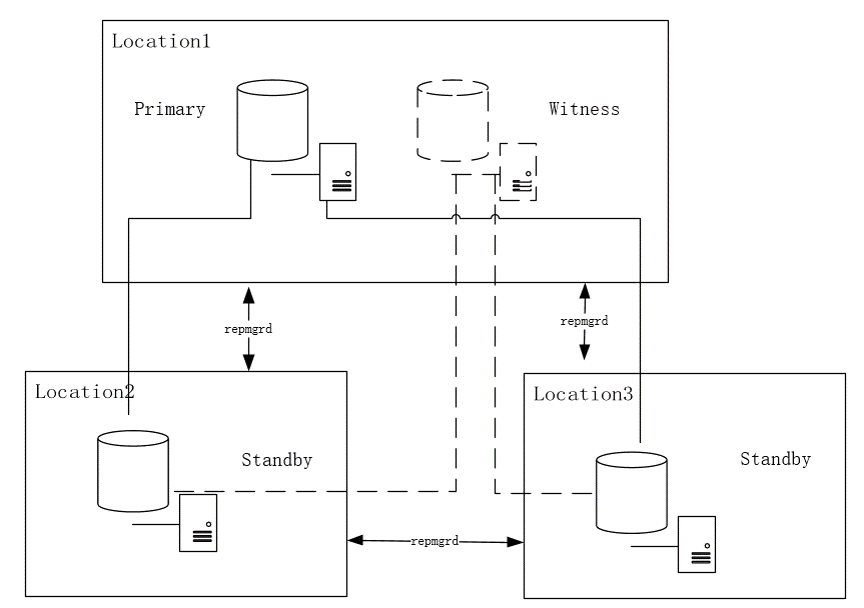

# repmgr

**作者**

chrisx

**日期**

2021-05-17

**内容**

repmgr配置和使用

reference [repmgr](https://repmgr.org/docs/)
https://repmgr.org/

----

[toc]

## 什么是repmgr

repmgr由2ndQuadrant推出的PostgreSQL高可用工具，repmgr 是一个开源工具套件，用于管理 PostgreSQL 服务器群集中的复制和故障转移。它通过设置备用服务器、监视复制和执行管理任务（如故障转移或手动切换操作）的工具增强了 PostgreSQL 的内置热备用功能。
repmgr增强了PostgreSQL内置复制功能，repmgr 5 支持 PostgreSQL 9.3 ~ PostgreSQL 12



```shell
$ repmgr -f /etc/repmgr.conf service status
 ID | Name  | Role    | Status    | Upstream | repmgrd | PID   | Paused? | Upstream last seen
----+-------+---------+-----------+----------+---------+-------+---------+--------------------
 1  | node1 | primary | * running |          | running | 27259 | no      | n/a
 2  | node2 | standby |   running | node1    | running | 27272 | no      | 1 second(s) ago
 3  | node3 | standby |   running | node1    | running | 27282 | no      | 0 second(s) ago
 4  | node4 | witness | * running | node1    | running | 27298 | no      | 1 second(s) ago

```

### 概念

replication cluster，流复制集群
upstream node，备用服务器连接到的节点，以便接收流式复制。这是主服务器，或在级联复制的情况下，另一个备用服务器。
failover，repmgrd daemon支持自动故障转移，以减小宕机时间
switchover，由于主库应急或系统维护，手动角色转换。
fencing，为防止脑裂，失败的主需要被隔离
witness server，为防止脑裂，当集群分裂成多个location时，实行强制投票机制。以确定是否执行failover操作。

### 组成

repmgr增强了pg内置的流复制功能，流复制可以提供一个读写主，一个或多个只读备架构。可实现读写分离。

repmgr主要组成包括
repmgr，命令行管理工具。可配置备库，promote备库、switchover、查看流复制集群状态
repmgrd，一个守护进程。可监控流复制集群，实现autofailover，通知功能

### repmgr用户和元数据

为了管理集群，repmgr需要存储相关信息。repmgr会在数据库中创建repmgr schema，并包括以下的对象

Tables
repmgr.events: records events of interest
repmgr.nodes: connection and status information for each server in the replication cluster
repmgr.monitoring_history: historical standby monitoring information written by repmgrd
Views
repmgr.show_nodes: based on the table repmgr.nodes, additionally showing the name of the server's upstream node
repmgr.replication_status: when repmgrd's monitoring is enabled, shows current monitoring status for each standby.

## 安装

repmgr支持二进制包和源码安装

repmgr兼容兼容矩阵[repmgr compatibility matrix](https://repmgr.org/docs/5.0/install-requirements.html#INSTALL-COMPATIBILITY-MATRIX)

### 需求

repmgr兼容支持的数据库
主板本需要一致，建议小版本也一致
需要在所有节点安装repmgr

### 二进制包安装

下载地址[public repository](https://dl.2ndquadrant.com/default/release/site/)

### 源码包安装

1. 首先需要安装pg

Important
Select the appropriate PostgreSQL version for your target repmgr version.

2. 下载[源码包](https://repmgr.org/)

3. Installation of repmgr from source
To installing repmgr from source, simply execute:

```bash
./configure && make install

```

Ensure pg_config for the target PostgreSQL version is in $PATH.

4. Building repmgr documentation

To build the documentation as HTML, execute:

```bash
./configure && make doc

```

The generated HTML files will be placed in the doc/html subdirectory of your source tree.

## 快速部署指导

1. 需求
以下的软件必须被安装

* PostgreSQL
* repmgr (matching the installed PostgreSQL major version)

2. primary节点参数配置

max_wal_senders = 10
max_replication_slots = 10
wal_level = 'hot_standby'
hot_standby = on
archive_mode = on
archive_command = '/bin/true'
wal_log_hints = on
wal_level = 'replica'

3. 创建复制用户和数据库

createuser -s repmgr
createdb repmgr -O repmgr

用来存储repmgr元数据

<!--
repmgr will install the repmgr extension, which creates a repmgr schema containing the repmgr's metadata tables as well as other functions and views. We also recommend that you set the repmgr user's search path to include this schema name, e.g.

       ALTER USER repmgr SET search_path TO repmgr, "$user", public;
-->

4. 配置连接认证pg_hba.conf

确保repmgr有连接权限和连接复制（replication）权限

```bash
local   replication   repmgr                              trust
host    replication   repmgr      127.0.0.1/32            trust
host    replication   repmgr      192.168.1.0/24          trust
local   repmgr        repmgr                              trust
host    repmgr        repmgr      127.0.0.1/32            trust
host    repmgr        repmgr      192.168.1.0/24          trust

```

5. 准备standby

standby不需要创建实例（不执行initdb），但需要确认好data目录，data目录属组是postgres系统用户且权限为0700
确认主库的连通性

```bash
psql 'host=node1 user=repmgr dbname=repmgr connect_timeout=2'

```

6. repmgr的配置

在主端配置repmgr参数，自定义参数文件的位置即可

```bash
node_id=1
node_name='node1'
conninfo='host=node1 user=repmgr dbname=repmgr connect_timeout=2'
data_directory='/var/lib/postgresql/data'

#日志参数
log_level=INFO
log_file='/repmgr/repmgr.log'
ssh_options='-p 3582'
```

7. 注册主节点
   
```bash
$ repmgr -f /etc/repmgr.conf primary register
$ repmgr -f /etc/repmgr.conf cluster show

```

```sql
repmgr=# SELECT * FROM repmgr.nodes;
```

8. 克隆备节点

备节点配置repmgr参数

```shell
node_id=2
node_name='node2'
conninfo='host=node2 user=repmgr dbname=repmgr connect_timeout=2'
data_directory='/var/lib/postgresql/data'
```

用--dry-run 选项检查是否可以被克隆

```bash
$ repmgr -h node1 -U repmgr -d repmgr -p 5433 -f /etc/repmgr.conf standby clone --dry-run
```

克隆

```bash
$ repmgr -h node1 -U repmgr -d repmgr -p 5433 -f /etc/repmgr.conf standby clone
```

9. 确认复制正常

```sql
repmgr=# SELECT * FROM pg_stat_replication;
repmgr=# SELECT * FROM pg_stat_wal_receiver;
```

10. 注册备库

注册备库

```shell
$ repmgr -f /etc/repmgr.conf standby register

```

查看注册状态

```sql
$ repmgr -f /etc/repmgr.conf cluster show
 ID | Name  | Role    | Status    | Upstream | Location | Priority | Timeline | Connection string
----+-------+---------+-----------+----------+----------+----------+----------+--------------------------------------
 1  | node1 | primary | * running |          | default  | 100      | 1        | host=node1 dbname=repmgr user=repmgr
 2  | node2 | standby |   running | node1    | default  | 100      | 1        | host=node2 dbname=repmgr user=repmgr
```

## repmgr管理

1. repmgr配置文件（repmgr.conf），repmgr配置参数均写到配置文件中。可以指定配置文件的位置
2. 克隆备库可以使用复制槽，克隆可基于级联复制的备库
3. 支持手动提升备节点被新主库（repmgr standby promote）
4. 支持务器跟随，使"孤立"备用服务器遵循新的主服务器并赶上其当前状态（repmgr standby follow）
5. 实现switchover，switchover不同于其他操作，还需要在其他服务器上执行操作。如follow操作。这意味着服务器之间访问需要配置ssh免密
6. 事件通知。每次 repmgr 或 repmgrd 执行重大事件时，该事件的记录会写入 repmgr.events 表中，并写入时间戳、失败或成功指示以及进一步详细信息（如果适用）。
7. 支持repmgr升级

## 使用repmgrd

支持自动故障转移（autofailover）

repmgrd（"复制管理器守护进程"）是一个管理和监视守护进程，它运行在复制群集中的每个节点上。它可以自动执行故障转移（autofailover）和更新备用服务器等操作，以跟踪新的主服务器，以及提供有关每个备用服务器状态的监视信息。
repmgrd 设计为易于设置，不需要额外的外部基础结构。

> 注意，repmgr选举备节点的顺序为LSN，priority，node_id ？
优先选举LSN较大的节点，如LSN一致，依据priority配置优选顺序，优先级一致，则选择node_id较小者。

priority

    Indicates a preferred priority (default: 100) for promoting nodes; a value of zero prevents the node being promoted to primary.

    Note that the priority setting is only applied if two or more nodes are determined as promotion candidates; in that case the node with the higher priority is selected. 

只有一个备节点是否可以设置

## repmgrd配置

To use repmgrd, its associated function library must be included via postgresql.conf with:

```shell
shared_preload_libraries = 'repmgr'

```

Required configuration for automatic failover

```shell
failover=automatic
promote_command='/usr/bin/repmgr standby promote -f /etc/repmgr.conf --log-to-file'
follow_command='/usr/bin/repmgr standby follow -f /etc/repmgr.conf --log-to-file --upstream-node-id=%n'

```

### 处理脑裂

复制群集设置的常见模式是将服务器分散到多个数据中心。这可以提供一些好处，如读写分离和灾难恢复。但是，这也意味着数据中心位置之间存在网络级别断开连接的风险，如果二级数据中心的服务器不再能够看到主数据中心中的主服务器，备节点进行了提升（autofailover），则会导致大脑分裂的情况。

repmgr 允许提供"见证服务器"（witness server）来人为地创建特定位置的服务器仲裁，从而避免脑裂问题。
repmgr 中定义位置（location）字符串。每个节点关联location字符串。在故障转移情况下，repmgrd 将检查与当前主节点位于同一位置的任何服务器是否可见。如果没有，repmgrd 将假定网络中断，并且不会在任何其他位置升级任何节点

### 级联复制支持

repmgr 和 repmgrd 通过跟踪备用服务器之间的关系支持级联复制。在主节点发生故障并提升顶级备用服务器时，连接到另一个备用服务器的备用服务器将不受影响并继续正常工作（即使它连接到的上游备用服务器成为主节点）。但是，如果节点的直接上游发生故障，"级联备用服务器"将尝试重新连接到该节点的父节点

## repmgr高可用优化

自定义开发vip功能
jdbc分发实现负载
dml转发
......

repmgr primary register -F
repmgr standby register -F