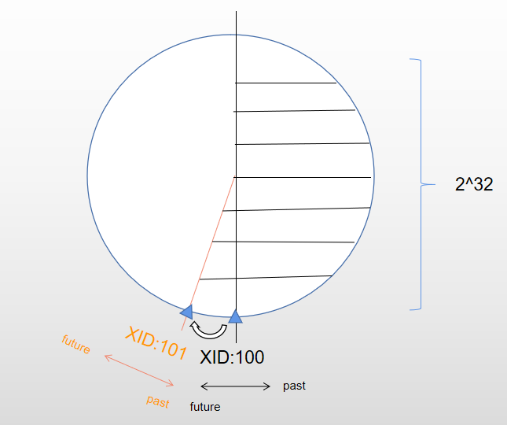
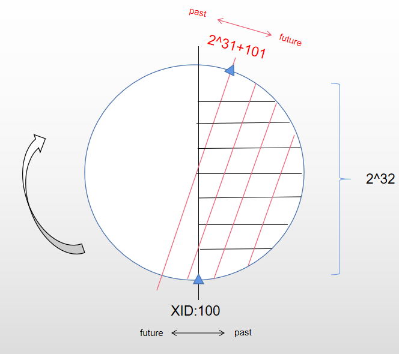

# txidwrap

**作者**

Chrisx

**日期**

2021-06-01

**内容**

事务回卷浅析

---

[TOC]

在这里，我们描述事务ID回卷问题。

## 事务ID（txid）

每当事务开始时，由事务管理器分配一个唯一标识符 **事务id(txid)**。PostgreSQL的txid是一个32位无符号整数，约为42亿。如果在事务开始后调用内部函数 txid_current()，则返回当前的txid，如下所示。

```sql
testdb=# BEGIN;
BEGIN
test=> SELECT txid_current();
 txid_current
--------------
          592
(1 row)
```

PostgreSQL保留以下三个特殊的 txid：

* **0** 表示 **Invalid** txid，无效txid。
* **1** 表示 **Bootstrap** txid, 它仅用于数据库集群的初始化。
* **2** 表示 **Frozen** txid, 用来描述冻结状态。

> 所以数据库系统的第一个正常的事务ID是从3开始的，然后不停递增，达到4字节整数的最大值后，再从3开始。事务ID为0、1、2的始终保留。

<!--思考，pg为什么限制使用32位？注意，没有为BEGIN命令分配一个txid。在PostgreSQL中，当执行BEGIN命令后执行第一个命令时，事务管理器将分配一个tixd，然后开始事务处理。-->

## 事务可比较

PostgreSQL的 MVCC 依赖于能够进行时间比较的事务 ID（XID）：mvcc是基于 Timestamp Ordering（T/O）的多版本并发，PostgreSQL采用了事物 ID（XID），事物ID是严格按照时间顺序产生的，因此满足 T/O 的基本要求。

如果一个行版本的插入 XID 大于当前事务的 XID，它就是“属于未来的”并且不应该对当前事务可见。

例如，从txid 100的角度看，大于100的txid表示“将来的”，并且它们在txid 100中不可见; 小于100的txid表示"过去的"并且可见

| --- | --- | --- | --- | --- | --- | --- | --- |
| --- | --- | --- | --- | --- | --- | --- | --- |
| ... | 97  | 98  | 99  | 100 | 101 | 102 | ... |

## 事务空间

事务 ID 的尺寸是有限的（32位），只能存放约 42 亿个事务。为了能够循环使用事务空间，提供了一种机制，普通 XID 使用模-2^32算法来比较。这意味着对于每一个普通 XID都有 21 亿个 XID “更老” 并且有 21 亿个“更新”，另一种解释的方法是普通 XID 空间是没有端点的环。 因此，一旦一个行版本创建时被分配了一个特定的普通 XID，该行版本将成为接下来 21 亿个事务的“过去”（与我们谈论的具体哪个普通 XID 无关）。如果在 21 亿个事务之后该行版本仍然存在，它将突然变得好像在未来。



## 事务回卷

**事务回卷问题(transaction wraparound problem)** 是指本来属于过去的事务突然间就变成了属于未来 — 这意味着它们的输出变成不可见。简而言之，就是灾难性的数据丢失（实际上数据仍然在那里，但是如果你不能得到它也无济于事）。为了避免发生这种情况，必要至少每 21 亿个事务就清理每个数据库中的每个表。

假定 txid 100 插入元组 Tuple_1，即 Tuple_1 的 普通t_xmin 为 100。服务器运行了很长时间，Tuple_1 没有被修改。当前 txid 为21亿+100，并执行 SELECT 命令。此时，Tuple_1 可见，因为 txid 100 是过去（可见的）。然后，执行相同的SELECT 命令; 此时，目前的 txid 为21亿+101。然而，Tuple_1 不再可见，因为 txid 100 在未来(如下图)。



## 防止事务回卷

周期性的清理能够解决该问题，pg数据库提供了VACUUM清理机制。VACUUM会把行标记为 `冻结 FREEZE`，这表示它们是被一个在足够远的过去提交的事务所插入， 这样从 MVCC 的角度来看，效果就是该插入事务对所有当前和未来事务来说当然都是可见的。PostgreSQL保留了一个特殊的 XID （FrozenTransactionId），这个 XID 并不遵循普通 XID 的比较规则 并且总是被认为比任何普通 XID 要老。要阻止事务回卷的发生，被冻结行版本会被看成其插入 XID 为FrozenTransactionId， 这样它们对所有普通事务来说都是“在过去”，而不管回卷问题。并且这样 的行版本将一直有效直到被删除，不管它有多旧。

<!--
思考，为什么要回卷

因为txid逻辑上可以无限增加，而实际系统中txid空间是不够的（只能存放约42亿个），

tps是1000，42亿可以使用多长时间
4200000000 ÷ ( 24 × 3600 × 1000 ) =‬ ？
48.6天

因此PostgreSQL需要回卷，重复使用txid空间。
-->