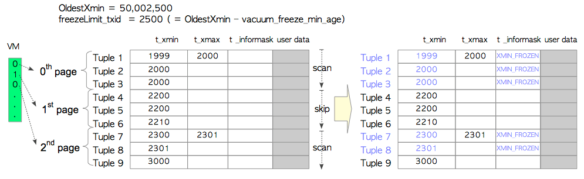
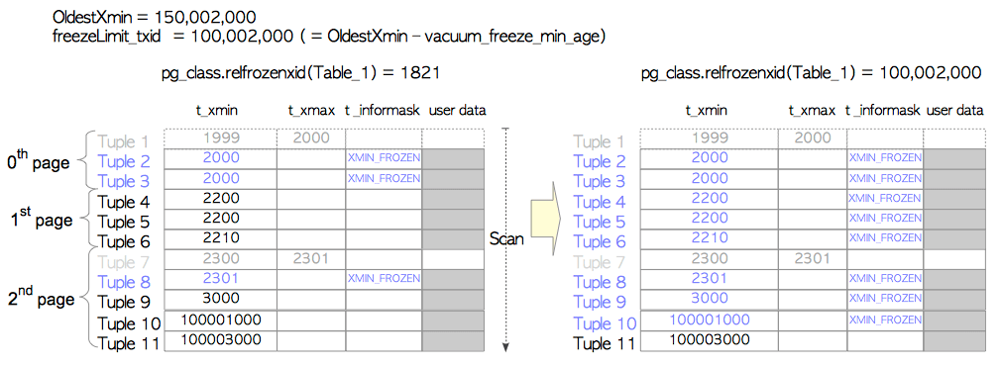

# vacuum

**作者**

Chrisx

**日期**

2021-04-26

**内容**

再谈vacuum

清理过程

---

[TOC]

## vacuum概述

vacuum处理是一个维护过程，有助于PostgreSQL的持续运行。它的两个主要任务是 `清理 dead tuples` 和 `冻结事务ID`

为了清理 dead tuple，vacuum提供了两种模式，即 `Concurrent VACUUM` 和 `Full VACUUM`。Concurrent VACUUM(通常简称为VACUUM)为表文件的每个页清理 dead tuple，其他事务可以在此过程运行时读取表。相比之下，Full VACUUM 清理 dead tuple 并且整理文件的 live tuple 碎片，而其他事务无法在 Full VACUUM 运行时访问表。

pg已实现了autovacuum

pg引入了可见性映射（Visibility Map，VM）提高了移除死元组的效率，改善了冻结过程的表现。

vacuum处理有如下内容

* Visibility Map
* Freeze processing
* Removing unnecessary clog files
* Autovacuum daemon
* Full VACUUM

## Concurrent VACUUM

vacuum处理对指定的表或数据库中的所有表执行以下操作

(1) 从指定的表中获取每个表。
(2) 获取表的ShareUpdateExclusiveLock锁。该锁允许从其他事务中读取。
(3) 扫描所有页以获取所有dead tuple，并在必要时冻结dead tuple。
(4) 删除指向相应dead tuple的索引元组(如果存在的话)。
(5) 为表的每个页执行以下处理，步骤(6)和(7)。
(6) 删除dead tuple并重新分配页中的live tuple。
(7) 更新目标表的相应FSM和VM。
(8) 如果最后一页没有任何元组，则截断最后一页。
(9) 更新与vacuum处理的表相关的统计数据和系统目录。
(10) 更新与vacuum处理相关的统计数据和系统目录。
(11) 如果可能，删除不必要的文件和clog。

以上的步骤执行的任务

1. 扫描目标表，构建死元组列表，死元组列表存放在maintenance_work_mem里。如果可能还会冻结元组（maintenance_work_mem已满怎会知心个后续任务，待有内存空间时返回继续扫描）
2. 扫描完成后，更具死元组列表删除索引元组。
3. 移除死元组，逐页更新FSM和VM
4. 更新与清理相关的统计信息（pg_stat_all_tables）和系统视图（pg_database，pg_class）
5. 如果可能，移除不必要的CLOG

**清理过程依据的是定位dead tuple**

## 可见性映射

清理过程代价高昂。引入`可见性映射（VM）`，用于减少清理的开销。

VM的基本概念，用于保存标文件中每个页面的可见性。页面的可见性确定了每个页面是否包含死元组。清理过程会跳过没有死元组的页面

vm文件

| 0th    | 1th  | 2th    |
| ------ | ---- | ------ |
| 0      | 1    | 0      |
| vacuum | skip | vacuum |

第0和2页包含死元组，标记为0，
第1也不包含死元组，标记为1，扫描时跳过。

每个vm由一个或多个8KB页面组成。文件后缀_vm保存。

VM除了显示页面可见性之外，还包含了页面中元组是否全部冻结的信息。

## 冻结处理

冻结处理有两种模式，根据特定条件在任一模式下执行。为了方便，这些模式被称为 `lazy 模式` 和 `eager 模式`。

### 1、Lazy 模式

Concurrent VACUUM在内部通常被称为“lazy vacuum”。这里讨论的是冻结处理的lazy模式
启动冻结处理时，PostgreSQL计算FreezeLimittxid并冻结t_xmin小于FreezeLimittxid的元组。
freezeLimit txid定义如下

```bash
freezeLimit_txid =(OldestXmin-vacuum_freeze_min_age)
```

OldestXmin是当前正在运行的事务中最老的txid。例如，如果执行VACUUM命令时有三个事务(txids 100,101和102)正在运行，则OldestXmin为100.如果不存在其他事务，则OldestXmin是执行此VACUUM命令的txid。这里，[vacuum_freeze_min_age] 是一个配置参数(默认50,000,000)。
在这里，Table_1由三个页组成，每个页有三个元组。当执行VACUUM命令时，当前的txid是50,002,500，并且没有其他事务。在这种情况下，OldestXmin是5,002,500;因此，freezeLimit txid是2500.冻结处理执行如下。



- 0th page
由于所有t_xmin值都小于freezeLimit txid，因此三个元组被冻结。另外，在这个vacuum过程中，由于Tuple_1是dead tuple，所以被清理。
- 1st page:
通过引用VM来跳过此页。
- 2nd page:
Tuple_7和Tuple_8被冻结; Tuple_7被清理。

但是看上面的参数，很明显不能绝对保证这个约束，为了解决这个问题，PostgreSQL 引入了[autovacuum_freeze_max_age] 参数。默认值为2亿
如果当前最新的tXID 减去元组的t_xmin 大于等于autovacuum_freeze_max_age，则元组对应的表会强制进行autovacuum，即使PostgreSQL已经关闭了autovacuum。

**也就是说，在事务时间轴上，事务相差超过autovacuum_freeze_max_age，2亿，强制执行冻结**

这也就避免了事务回卷，同时也保证事务清理，使可用事务空间足够大。保证事务的增长。

**freeze 操作会消耗大量的IO，对于不经常更新的表，可以合理地增大autovacuum_freeze_max_age和vacuum_freeze_min_age。**

### 2、Eager 模式

eager模式弥补了lazy模式的缺陷。它扫描所有页以检查表中的所有元组，更新相关的系统目录，并在可能的情况下删除不必要的文件和clog页。
当满足以下条件时执行eager模式。

```bash
pg_database.datfrozenxid <(OldestXmin-vacuum_freeze_table_age)
```

在上面的条件中，pg_database.datfrozenxid表示[pg_database]系统目录的列，并保存每个数据库的最早的冻结txid。[Vacuum_freeze_table_age]是一个配置参数(默认值为150,000,000)。

在下面的事例中，Tuple_1和Tuple_7都已被清理。Tuple_10和Tuple_11已经被插入第二页。当执行VACUUM命令时，当前txid是150,002,000，并且没有其他事务。因此，OldestXmin是150,002,000，freezeLimit txid是100,002,000。在这种情况下，由于'1821（假设当前数据库的datfrozenxid都是1821） < (150002000 - 150000000)'，因此满足上述条件。因此，在eager模式中冻结处理如下执行。



- 0th page
即使所有元组都已被冻结，Tuple_2和Tuple_3也被检查。
- 1st page:
此页中的三个元组都会被扫描并冻结，因为所有t_xmin值都小于freezeLimit txid（eager模式）。请注意，在lazy模式此页会跳过。
- 2nd page:
Tuple_10已被冻结（lazy模式）。Tuple_11没有。

冻结每个表后，目标表的pg_class.relfrozenxid被更新。
在完成vacuum处理之前，必要时更新pg_database.datfrozenxid。每个pg_database.datfrozenxid列在相应的数据库中保存最小pg_class.relfrozenxid。

查看每个表的pg_class.relfrozenxid

> 注意：手动vacuum带有freeze选项时，是egaer模式，且lazy模式中freezeLimit_txid等于oldestxmin

## autovacuum

pg早期本中，需要手动执行vacuum操作。现在已经增加了autovacuum功能。autovacuum守护进程已经使vacuum处理自动化; 因此，PostgreSQL的操作变得非常简单。
autovacuum守护进程定期调用版几个autovacuum_worker进程。默认情况下，它每1分钟唤醒一次(由[autovacuum_naptime]定义，并调用三个worker由[autovacuum_max_workers]定义
触发条件

```bash
vacuum threshold = autovacuum_vacuum_threshold + autovacuum_vacuum_scale_factor * number of tuples
```
<!--思考：为什么要有vacuum base threshold。-->

优化时可适当调整以上参数

## Full VACUUM

虽然Concurrent VACUUM至关重要，但这还不够。例如，即使删除了许多dead tuple，它也不能减小表的大小。
vacuum会使dead tuple空间可重用，而不是申请新的空间继续膨胀。（不会降低高水位线），dead tuple被清理; 但是，表大小并未减少。这既浪费磁盘空间，也会对数据库性能产生负面影响。
当对表执行VACUUM FULL命令时，
1. PostgreSQL首先获取表的AccessExclusiveLock锁并创建一个大小为8 KB的新表文件。AccessExclusiveLock锁不允许访问。
2. 将live tuple复制到新表中
3. 删除旧文件，重建索引，并更新统计信息，FSM和VM


什么时候做VACUUM FULL？
不幸的是，当执行'VACUUM FULL'时没有最佳时机。但是，扩展[pg_freespacemap]可能会给你很好的建议。

```sql
testdb=# CREATE EXTENSION pg_freespacemap;
CREATE EXTENSION
testdb=# SELECT count(*) as "number of pages",
pg_size_pretty(cast(avg(avail) as bigint)) as "Av. freespace size",
round(100 * avg(avail)/8192 ,2) as "Av. freespace ratio"
FROM pg_freespace('accounts');
number of pages | Av. freespace size | Av. freespace ratio
-----------------+--------------------+---------------------
1640 | 99 bytes | 1.21
(1 row)
```

在执行VACUUM FULL之后，会发现表文件已被收缩。高水位线下降。
